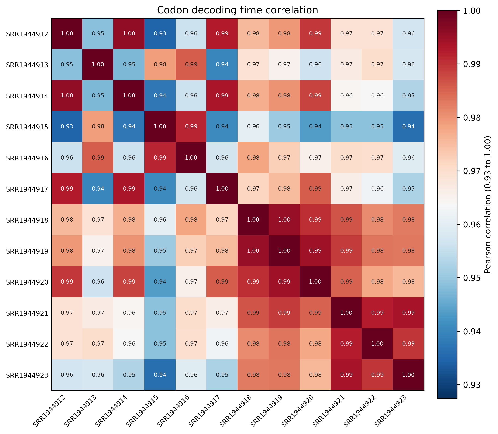
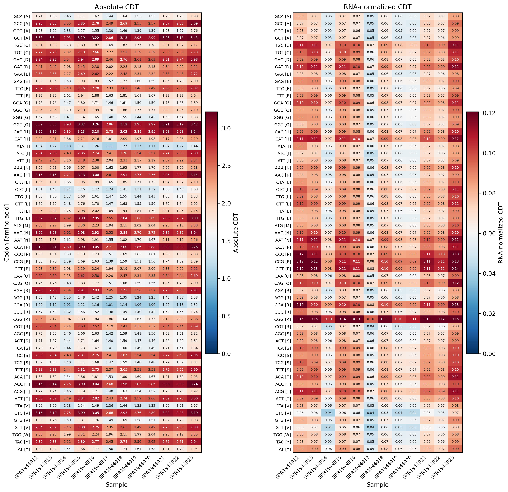

# 4.7.3 Codon decoding time

## Purpose

`rpf_CDT` calculates **sample-specific codon decoding time (CDT)** from a pair of density files produced by `rpf_Merge`: one RPF density file and one RNA density file (both JSONL/JSONL.GZ or the legacy TXT table). For each CDS codon, the raw RPF density is first normalized by the RNA abundance (RPKM) of the same gene and sample, which removes the transcript expression and library size effects; CDT is then the mean of these RNA-normalized values over all occurrences of each codon. The result estimates the average dwell time of ribosomes at each codon and is summarized by codon and visualized as correlation, heatmap, and rank plots.

Key features:

- **Two-channel input** – `rpf_CDT` takes a paired RPF density file (`--rpf`) and RNA density file (`--rna`); each sample is internally matched between the two files, and the RNA density is used to compute gene RPKMs for normalization.
- **Gene-internal RNA normalization** – every RPF position is divided by the RPKM of its gene in the paired RNA sample, removing both transcript expression level and sample library size effects.
- **Sample-specific filtering** – for each sample pair, only transcripts with at least `--min` CDS RPFs and `--min-rna` CDS RNA reads are retained.
- **Always excludes stop codons** – the termination codon is never part of the calculation or the figures; there is no `--stop` switch.
- **Optional outlier removal** – isolated extreme density pileups can be detected and removed before CDT calculation (`--remove-outlier`).

For transcript `g`, codon `c` and sample pair `s`:

```text
absolute_cdt[c, s]     = mean(density[g, i, s]) over all occurrences of codon c
normalized_cdt[c, s]   = mean(density[g, i, s] / RNA_RPKM[g, s]) over all occurrences of codon c
```

The analysis is performed in six steps:

1. **Argument check and file validation** – check the input arguments and the RPF/RNA density files.
2. **Data import** – load the compact JSONL records (or the TXT tables), filter by `-l`, apply the TIS/TTS trimming (`--tis`/`--tts`), and shift the RPF density to the requested ribosomal site (`-s`).
3. **Sample-wise CDT calculation** – match the paired samples, select high-expression transcripts per pair, optionally remove outliers, and compute the RNA-normalized CDT of every CDS codon.
4. **Table export** – write the codon-level summary, and (with `--all`) the position-level and per-gene per-codon tables.
5. **Plotting** – draw the sample correlation heatmap, the CDT heatmap, and the per-sample codon rank plot.
6. **Summary** – write `_cdt.summary.json` with the run parameters and per-sample statistics.

```text
rpf_CDT   # Calculate sample-specific codon decoding time
```

## Step 1: Run `rpf_CDT`

The inputs are the merged density files produced by `rpf_Merge` (see [4.5.5 Merge density](../../quality-control/merge-density.md)) for the RPF and RNA channels. Both the compact JSONL format and the plain TXT table are supported.

### 1.1 Parameters

| Parameter                 | Required | Description                                                                                                               |
| ------------------------- | -------- | ------------------------------------------------------------------------------------------------------------------------- |
| `--rpf`                   | Yes      | Input RPF density file (JSONL/JSONL.GZ/TXT) produced by `rpf_Merge`.                                                      |
| `--rna`                   | Yes      | Input RNA density file (JSONL/JSONL.GZ/TXT) produced by `rpf_Merge`; used to compute gene RPKMs for normalization.         |
| `-o`                      | Yes      | Output prefix.                                                                                                             |
| `-l`, `--list`            | No       | Optional transcript filter table (TXT). The `transcript_id` column is used when available, otherwise the first column. If omitted, all transcripts in the files are used. |
| `--min`                   | No       | Minimum sample-specific CDS RPF count required for a transcript to be included. Default `30`.                              |
| `--min-rna`               | No       | Minimum sample-specific CDS RNA read count required for a transcript to be included. Default `30`.                         |
| `--tis`                   | No       | Discard this number of CDS codons after the translation initiation site. Default `15` (amino acids).                       |
| `--tts`                   | No       | Discard this number of CDS codons before the translation termination site. Default `5` (amino acids).                      |
| `-s`, `--site`            | No       | Ribosomal site used for the RPF channel. Choices `E`, `P`, `A`. Default `P`.                                                |
| `-f`, `--frame`           | No       | Reading frame used for CDT calculation. Choices `0`, `1`, `2`, `all`. Default `all`.                                        |
| `--thread`                | No       | Number of sample-pair worker threads (capped at the sample count automatically). Default `1`.                              |
| `--remove-outlier`        | No       | Remove isolated extreme RPF-density pileups before CDT calculation. Disabled by default.                                   |
| `--outlier-iqr`           | No       | IQR multiplier for the global extreme-pileup detection. Default `8.0`.                                                     |
| `--outlier-window`        | No       | Neighboring codons on each side used to confirm an isolated outlier. Default `5`.                                          |
| `--outlier-local-fold`    | No       | Minimum fold over the local background required for a pileup to be removed as an outlier. Default `10.0`.                   |
| `--scale`                 | No       | Sample-wise scaling applied to the relative CDT. Choices `none`, `minmax`, `zscore`. Default `minmax`.                      |
| `--plot-transform`        | No       | Transform applied to the absolute CDT for plotting only (output tables are unchanged). Choices `none`, `sqrt`, `log`, `log1p`, `log2`, `log10`. `log` is an alias of `log1p`. Default `none`. |
| `--all`                   | No       | Output the detailed transcript-position and transcript-codon CDT tables in addition to the default tables. Disabled by default. |

### 1.2 Example

```bash
rpf_CDT \
    --rpf ../05.merge/sce_rpf_merged.jsonl.gz \
    --rna ../../rna/05.merge/sce_rna_merged.jsonl.gz \
    -o sce \
    -s P \
    -f all \
    --min 30 \
    --min-rna 1 \
    --tis 15 \
    --tts 5 \
    --thread 8 \
    --remove-outlier \
    --outlier-iqr 8 \
    --outlier-window 5 \
    --outlier-local-fold 10 \
    --scale minmax \
    --plot-transform log1p \
    &> sce_cdt.log
```

### 1.3 Output

All output files are written to the current working directory with the given prefix:

| Output                                        | Description                                                                                                                                |
| --------------------------------------------- | ------------------------------------------------------------------------------------------------------------------------------------------ |
| `<prefix>_cdt.txt`                            | Codon-level CDT summary: one row per codon and sample with counts, RPF/RNA values, and absolute/relative CDT.                              |
| `<prefix>_cdt_corr.txt`                       | Sample correlation matrix computed from RNA-normalized CDT.                                                                                |
| `<prefix>_cdt_corrplot.pdf` / `.png`          | Sample correlation heatmap (Pearson, based on RNA-normalized CDT).                                                                        |
| `<prefix>_cdt_heatmap.pdf` / `.png`           | Two-panel heatmap: **Absolute CDT** (left) and **RNA-normalized CDT** (right).                                                             |
| `<prefix>_cdt_rankplot.pdf` / `.png`          | Per-sample codon rank plot of RNA-normalized CDT, with the top 6 codons highlighted in red.                                                  |
| `<prefix>_cdt.outliers.txt`                   | Records of the removed outlier positions. Generated only with `--remove-outlier`.                                                          |
| `<prefix>_cdt_position.txt`                   | Filtered position-level density table. Generated only with `--all`.                                                                        |
| `<prefix>_gene_codon_cdt.txt`                 | Per-gene and per-codon CDT table. Generated only with `--all`.                                                                             |
| `<prefix>_cdt.summary.json`                   | Run parameters and per-sample summary (high-expression genes, outliers, valid positions).                                                  |

The codon-level table `<prefix>_cdt.txt` is a long-format table with one row per codon and sample:

```text
codon  AA  Abbr  Sample  CodonCount  ValidCodonCount  RPFCount  NormalizedRPFSum  AbsoluteCDT  NormalizedCDT  RelativeCDT  NormalizedRelativeCDT
```

- `CodonCount` – number of CDS codon positions observed for this codon in the sample.
- `ValidCodonCount` – number of positions with detected RPF used for the calculation.
- `RPFCount` – summed raw RPF density assigned to the codon.
- `NormalizedRPFSum` – summed RPF density divided by the gene RPKM of each transcript.
- `AbsoluteCDT` – mean raw RPF density (RPF count per valid position).
- `NormalizedCDT` – mean RNA-normalized RPF density, the recommended decoding time metric.
- `RelativeCDT` / `NormalizedRelativeCDT` – the same values after the sample-wise `--scale` transform.

### Example output figures

**1. Sample correlation heatmap (`_cdt_corrplot.png`)**

{ width="600" }

The correlation heatmap shows the Pearson correlation of the RNA-normalized CDT profiles between all pairs of samples, with an adaptive color scale that keeps highly correlated replicates distinguishable. High correlations between biological replicates and lower correlations between different conditions support the reproducibility of the decoding time signal.

**2. CDT heatmap (`_cdt_heatmap.png`)**

{ width="700" }

The heatmap consists of two side-by-side panels, both with one row per sense codon (labeled `Codon [amino acid]` on the left panel) and one column per sample: the left panel shows the **Absolute CDT** and the right panel the **RNA-normalized CDT**. Values are clipped to the 98th percentile for the color scale, and cell values are annotated when the sample number is small. The right panel is the recommended metric for comparing decoding time between samples.

**3. Per-sample codon rank plot (`_cdt_rankplot.png`)**

{ width="700" }

The rank plot contains one panel per sample. Within each panel, codons are sorted in ascending order of RNA-normalized CDT and drawn as a scatter plot with the codon on the x-axis (rotated 90 degrees, labeled `Codon [amino acid]`); the top 6 codons with the highest CDT are highlighted in red. By default each panel occupies a full row, and the number of panels per row can be increased with `--rankplot-ncol` (e.g. `2` for a two-column layout). A codon consistently ranking near the top across samples has a slow decoding time in all conditions.

## Notes

- CDT values reflect codon-specific ribosome density **after RNA normalization** (RPF density divided by the gene RPKM of the paired RNA sample), so a higher value means the codon accumulates more ribosomes per unit of transcript expression and is decoded more slowly relative to other codons.
- Stop codons are **always** excluded from the calculation and the figures; there is no `--stop` parameter.
- High-expression transcript filtering (`--min`/`--min-rna`) is performed independently for each sample pair, so the set of transcripts underlying the summary may differ between samples.
- The heatmap contains two panels: **Absolute CDT** and **RNA-normalized CDT**; with the default `--scale minmax`, sample-wise scaling is applied to the relative CDT only, not to the absolute panel.
- `--plot-transform` only affects figures, while `--scale` changes the relative CDT columns of the output tables.
- The outlier removal (`--remove-outlier`) is recommended for samples with strong 3'-end pileups or run-off artifacts; verify the flagged positions in `<prefix>_cdt.outliers.txt` before trusting them as biological signals.
- A valid RNA density file must cover the same transcripts and samples as the RPF file; samples present in only one channel are skipped with a warning.

## Merge related results

Use `merge_cdt` to merge multiple codon decoding time tables (e.g. from different sites or datasets) into one combined table:

```bash
merge_cdt -l *_cdt.txt -o RIBO
```

