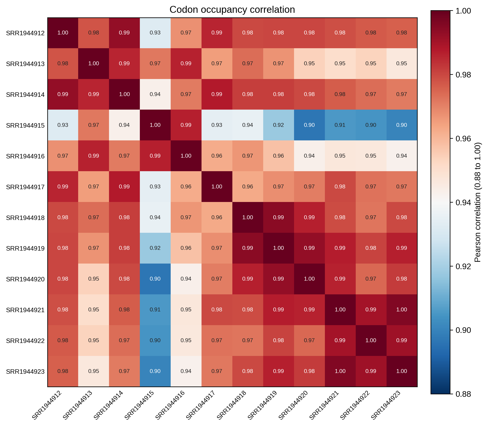
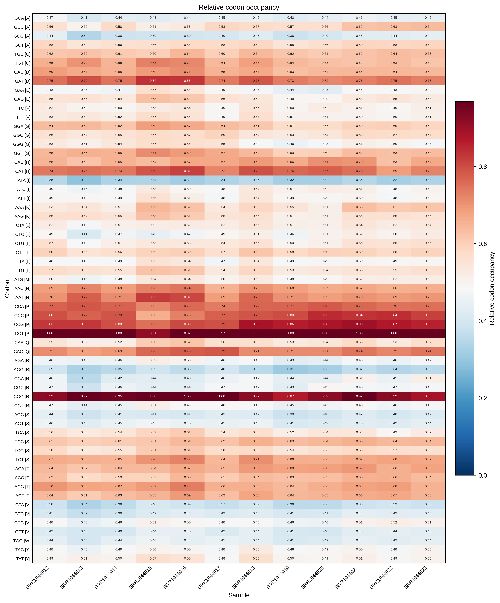

# 4.7.2 Codon occupancy

## Purpose

`rpf_Occupancy` calculates **sample-specific codon occupancy** from the merged density file produced by `rpf_Merge` (JSONL/JSONL.GZ or the legacy TXT table). For each CDS position, the raw RPF density is first normalized by the mean CDS density of the same gene and sample; codon occupancy is then the mean of these gene-normalized values across all occurrences of each codon. The result measures how strongly each codon is occupied relative to the gene average, and is summarized by gene and by codon, and visualized as correlation, heatmap, and rank plots.

Key features:

- **Gene-internal normalization** – the raw density of each position is divided by the mean CDS density of the same gene and sample, removing gene expression level and sample library size effects.
- **Sample-specific filtering** – for each sample, only transcripts with at least `-m` CDS RPFs are retained.
- **Always excludes stop codons** – the termination codon is never part of the calculation or the figures; there is no `--stop` switch.
- **Optional outlier removal** – isolated extreme density pileups can be detected and removed before normalization (`--remove-outlier`).

For transcript `g` and codon position `i` in sample `s`:

```text
normalized_density[g, i, s] = density[g, i, s] / mean_CDS_density[g, s]
codon_occupancy[c, s]       = mean(normalized_density[g, i, s]) over all occurrences of codon c
```

The analysis is performed in six steps:

1. **Argument check and file validation** – check the input arguments and the RPF density file.
2. **Data import** – load the compact JSONL records (or the TXT table), filter by `-l`, apply the TIS/TTS trimming (`--tis`/`--tts`), and shift the density to the requested ribosomal site (`-s`).
3. **Sample-wise occupancy calculation** – select high-expression transcripts per sample, optionally remove outliers, and compute the gene-normalized occupancy of every CDS codon.
4. **Table export** – write the codon-level summary, and (with `--all`) the position-level and per-gene per-codon tables.
5. **Plotting** – draw the sample correlation heatmap, the codon occupancy heatmap, and the per-sample codon rank plot.
6. **Summary** – write `_occupancy.summary.json` with the run parameters and per-sample statistics.

```text
rpf_Occupancy   # Calculate sample-specific codon occupancy
```

## Step 1: Run `rpf_Occupancy`

The input is the merged density file produced by `rpf_Merge` (see [4.5.5 Merge density](../../quality-control/merge-density.md)). Both the compact JSONL format and the plain TXT table are supported.

### 1.1 Parameters

| Parameter                 | Required | Description                                                                                                               |
| ------------------------- | -------- | ------------------------------------------------------------------------------------------------------------------------- |
| `-r`, `--rpf`             | Yes      | Input RPF density file (JSONL/JSONL.GZ/TXT) produced by `rpf_Merge`.                                                      |
| `-o`, `--output`          | Yes      | Output prefix.                                                                                                             |
| `-l`, `--list`            | No       | Optional transcript filter table (TXT). The `transcript_id` column is used when available, otherwise the first column. If omitted, all transcripts in the file are used. |
| `-m`, `--min`             | No       | Minimum sample-specific CDS RPF count required for a transcript to be included. Default `30`.                              |
| `--tis`                   | No       | Discard this number of CDS codons after the translation initiation site. Default `15` (amino acids).                       |
| `--tts`                   | No       | Discard this number of CDS codons before the translation termination site. Default `5` (amino acids).                      |
| `-s`, `--site`            | No       | Ribosomal site used for occupancy calculation. Choices `E`, `P`, `A`. Default `P`.                                          |
| `-f`, `--frame`           | No       | Reading frame used for occupancy calculation. Choices `0`, `1`, `2`, `all`. Default `all`.                                  |
| `--thread`                | No       | Number of sample-level worker threads (capped at the sample count automatically). Default `1`.                              |
| `-n`, `--normal`          | No       | Normalize density to RPM before occupancy calculation. The occupancy ratio is unchanged within a sample, but the normalized raw density is retained in detailed outputs. Disabled by default. |
| `--remove-outlier`        | No       | Remove isolated extreme raw-density pileups before occupancy calculation. Disabled by default.                             |
| `--outlier-iqr`           | No       | IQR multiplier for the global extreme-pileup detection. Default `8.0`.                                                     |
| `--outlier-window`        | No       | Neighboring codons on each side used to confirm an isolated outlier. Default `5`.                                          |
| `--outlier-local-fold`    | No       | Minimum fold over the local background required for a pileup to be removed as an outlier. Default `10.0`.                   |
| `--scale`                 | No       | Sample-wise scaling applied to the relative codon occupancy. Choices `none`, `minmax`, `zscore`. Default `minmax`.          |
| `--plot-transform`        | No       | Transform applied to the absolute occupancy for plotting only (output tables are unchanged). Choices `none`, `sqrt`, `log`, `log1p`, `log2`, `log10`. `log` is an alias of `log1p`. Default `none`. |
| `--rankplot-ncol`         | No       | Number of sample panels per row in the codon rank plot. Every codon is labeled on the x-axis (rotated 90 degrees), so `1` gives one wide panel per row and `2` gives two narrower panels per row. Default `1`. |
| `--all`                   | No       | Output the detailed transcript-position and transcript-codon occupancy tables in addition to the default tables. Disabled by default. |

### 1.2 Example

```bash
rpf_Occupancy \
    -r ../05.merge/sce_rpf_merged.jsonl.gz \
    -o sce \
    -s P \
    -f all \
    -m 50 \
    --tis 10 \
    --tts 5 \
    --remove-outlier \
    --outlier-iqr 8 \
    --outlier-window 5 \
    --outlier-local-fold 10 \
    --scale minmax \
    --plot-transform log1p \
    --rankplot-ncol 2 \
    --thread 10 \
    &> sce_occupancy.log
```

### 1.3 Output

All output files are written to the current working directory with the given prefix:

| Output                                        | Description                                                                                                                                |
| --------------------------------------------- | ------------------------------------------------------------------------------------------------------------------------------------------ |
| `<prefix>_codon_occupancy.txt`                | Codon-level occupancy summary: one row per codon with counts, density, and absolute/relative occupancy per sample.                         |
| `<prefix>_occupancy_corr.txt`                 | Sample correlation matrix computed from absolute codon occupancy.                                                                          |
| `<prefix>_occupancy_corrplot.pdf` / `.png`    | Sample correlation heatmap (Pearson).                                                                                                      |
| `<prefix>_occupancy_heatmap.pdf` / `.png`     | Codon occupancy heatmap — titled **Relative codon occupancy** when `--scale` is used (default), otherwise **Absolute codon occupancy**.     |
| `<prefix>_occupancy_rankplot.pdf` / `.png`    | Per-sample codon rank plot of absolute occupancy, with every codon labeled on the x-axis and the top-scoring codons highlighted.           |
| `<prefix>_occupancy.outliers.txt`             | Records of the removed outlier positions. Generated only with `--remove-outlier`.                                                          |
| `<prefix>_rpf_density.txt`                    | Filtered position-level density table. Generated only with `--all`.                                                                        |
| `<prefix>_codon_density.txt`                  | Per-gene and per-codon density table. Generated only with `--all`.                                                                         |
| `<prefix>_occupancy.summary.json`             | Run parameters and per-sample summary (high-expression genes, outliers, valid positions).                                                  |

The codon-level table `<prefix>_codon_occupancy.txt` contains `Codon`, `AA`, `Abbr` followed by five per-sample columns for every sample:

```text
<sample>_codon_count  <sample>_valid_codon  <sample>_density  <sample>_absolute_occupancy  <sample>_relative_occupancy
```

- `<sample>_codon_count` – number of codon occurrences counted in the sample.
- `<sample>_valid_codon` – number of occurrences with detected RPF.
- `<sample>_density` – summed RPF density assigned to the codon.
- `<sample>_absolute_occupancy` – mean raw gene-normalized occupancy.
- `<sample>_relative_occupancy` – the same mean occupancy after the sample-wise `--scale` transform.

### Example output figures

**1. Sample correlation heatmap (`_occupancy_corrplot.png`)**

{ width="600" }

The correlation heatmap shows the Pearson correlation of the absolute codon occupancy profiles between all pairs of samples, with an adaptive color scale that keeps highly correlated replicates distinguishable. High correlations between biological replicates and lower correlations between different conditions support the reproducibility of the occupancy signal.

**2. Codon occupancy heatmap (`_occupancy_heatmap.png`)**

{ width="800" }

The heatmap has one row per sense codon (labeled `Codon [amino acid]`) and one column per sample. With the default `--scale minmax` it shows the relative codon occupancy (per-sample min-max scaled); with `--scale none` it shows the absolute occupancy after the requested `--plot-transform`.

**3. Per-sample codon rank plot (`_occupancy_rankplot.png`)**

{ width="900" }

Each panel of the rank plot shows one sample: the x-axis lists all codons (rotated labels) and the y-axis is the absolute occupancy, so the most occupied codons appear on the right. The six top-scoring codons are highlighted in red (legend: **Top 6 occupied codons**), which makes sample-consistent codon hotspots easy to spot.

## Notes

- Occupancy values reflect codon-specific ribosome density **after gene-level normalization**: a value larger than 1 means the codon is more occupied than the gene average, and smaller than 1 means it is less occupied.
- Stop codons are **always** excluded from the calculation and the figures; there is no `--stop` parameter.
- High-expression transcript filtering (`-m`) is performed independently for each sample, so the set of transcripts underlying the summary may differ between samples.
- The heatmap is a single figure: with `--scale` (default) it displays the relative occupancy, with `--scale none` the absolute occupancy (optionally transformed by `--plot-transform`).
- `--plot-transform` only affects figures, while `--scale` changes the relative occupancy columns of the output tables.
- The outlier removal (`--remove-outlier`) is recommended for samples with strong 3'-end pileups or run-off artifacts; verify the flagged positions in `<prefix>_occupancy.outliers.txt` before trusting them as biological signals.

## Merge related results

Use `merge_occupancy` to merge multiple codon occupancy tables (e.g. from different sites or datasets) into one combined table:

```bash
merge_occupancy -l *_codon_occupancy.txt -o RIBO
```
