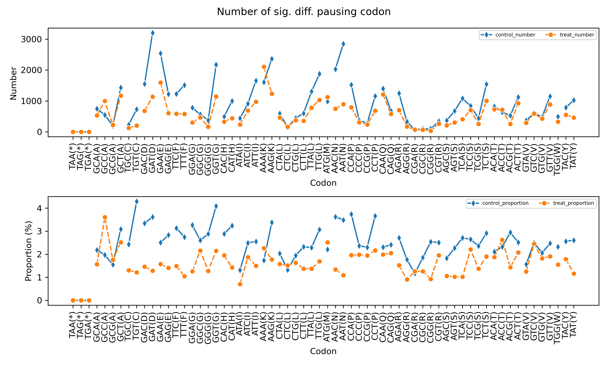
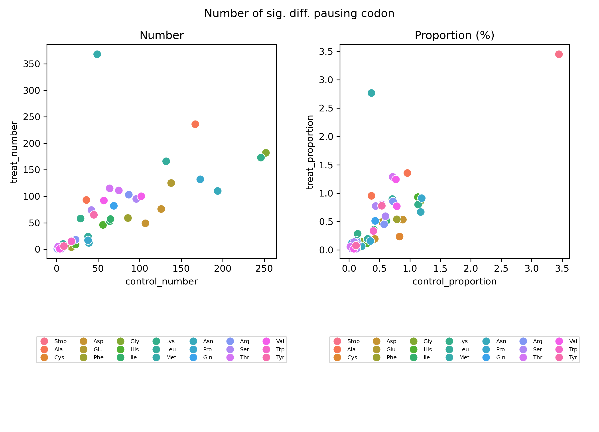

# 4.7.8 Codon odds ratio

## Purpose

`rpf_Odd_Ratio` compares codon-associated RPF enrichment between a **control** and a **treatment** sample group. For every codon position of every retained transcript it builds a 2×2 table, tests whether the signal at that single site is enriched or depleted in the treatment group relative to the rest of its transcript, and corrects the p-values with the Benjamini-Hochberg procedure. The significant sites are written to a site-level table, and a codon-level summary plus two figures are generated.

Key features:

- **Site-level analysis** – each row of the result table is one codon position of one transcript (`name` + `now_nt` / `from_tis` / `from_tts` + `codon`), so the statistics report the stalling status of a **single site**, not of a codon across the genome.
- **Within-transcript normalization** – the signal of each site is compared with the remaining signal of its own transcript, which removes transcript-level expression differences between the two groups.
- **Statistical testing** – a 2×2 chi-square test is performed per site (`statsmodels.Table2x2`), followed by BH multiple-testing correction.
- **Flexible significance filtering** – choose whether the significant sites are filtered by the raw `pvalue` or the corrected `bhfdr`.
- **Codon-level summary** – significant sites are aggregated by codon to count and quantify enrichment/depletion directions.
- **Two figures** – a line plot and a scatter plot that visualize the codon-level counts and proportions.

The analysis is performed in seven steps:

1. **Argument check and file validation** – check the input arguments and the RPF density file.
2. **Data import** – import the density file with `RPFs.import_rpf` (P-site coordinates, reading-frame filter, TIS/TTS trimming, optional transcript list, high-expression filter, optional RPM normalization), keep only known codons, and drop positions without RPF coverage.
3. **Build 2×2 tables** – for each site, sum the control and treatment signals; for each transcript, sum the control and treatment totals.
4. **Calculate odds ratios** – `odd = (treat / treat_delta) / (control / control_delta)`.
5. **Statistical tests** – parallel chi-square tests per site, BH correction to obtain `bhfdr` and the significance `flag`.
6. **Output** – filter the sites and write the site-level table; aggregate by codon and write the summary table.
7. **Draw figures** – line plot and scatter plot of the codon-level summary.

## Algorithm

For each codon position of each retained transcript the following 2×2 table is constructed:

```text
              | site signal | transcript remainder
--------------+-------------+----------------------
control group | control    | control_delta
treatment     | treat      | treat_delta
```

where

```text
control       = sum of the site signal over the control samples
treat         = sum of the site signal over the treatment samples
control_sum   = total signal of the transcript over the control samples
treat_sum     = total signal of the transcript over the treatment samples
control_delta = control_sum - control
treat_delta   = treat_sum - treat
```

The odds ratio is the ratio of the two within-transcript proportions:

```text
odd = (treat / treat_delta) / (control / control_delta)
```

- `odd > 1` – the site is relatively more occupied (stalled) in the treatment group than in the control group.
- `odd < 1` – the site is relatively depleted in the treatment group.
- `odd = 1` – no change in the relative signal at the site.

Because `control_delta` and `treat_delta` are the transcript totals minus the site signal, the comparison is made *within each transcript*: a highly expressed transcript no longer dominates the test, and the statistic reflects the relative redistribution of ribosomes at the single site.

The p-value of each site is obtained from a chi-square test on its 2×2 table, computed in parallel with `--thread` workers. The raw p-values are then corrected with the Benjamini-Hochberg method (`multipletests`, `fdr_bh`):

- `pvalue` – raw chi-square p-value of the site.
- `bhfdr` – BH-corrected FDR value.
- `flag` – Boolean significance marker (`bhfdr < 0.05`).

By default (`--fdr bhfdr`) sites are filtered on `bhfdr`; with `--fdr pvalue` they are filtered on the raw `pvalue`.

## Step 1: Run `rpf_Odd_Ratio`

The input is the frame-resolved RPF density file produced by `rpf_Merge` (see [4.5.5 Merge density](../quality-control/merge-density.md)), either the TXT table or the JSONL/JSONL.GZ format. The control and treatment sample names must exactly match the sample columns in the density file.

### 1.1 Parameters

| Parameter       | Required | Description                                                                                                                      |
| --------------- | -------- | -------------------------------------------------------------------------------------------------------------------------------- |
| `-r`, `--rpf`   | Yes      | Input frame-resolved RPF density file (JSONL/JSONL.GZ/TXT).                                                                       |
| `-o`, `--output`| Yes      | Output file prefix.                                                                                                               |
| `-c`, `--control` | Yes    | Comma-separated control sample names.                                                                                             |
| `-t`, `--treat` | Yes      | Comma-separated treatment sample names.                                                                                           |
| `-l`, `--list`  | No       | Optional transcript ID list (TXT). If omitted, all transcripts are used.                                                          |
| `-s`, `--site`  | No       | Ribosome site used for coordinate assignment. Choices `E`, `P`, `A`. Default `P`.                                                   |
| `-f`, `--frame` | No       | Reading frame used for calculation. Choices `0`, `1`, `2`, `all`. Default `all`.                                                    |
| `-m`, `--min`   | No       | Minimum RPF count required for retained transcripts. Default `50`.                                                                |
| `--tis`         | No       | Number of codons removed after TIS. Default `0`.                                                                                  |
| `--tts`         | No       | Number of codons removed before TTS. Default `0`.                                                                                 |
| `--stop`        | No       | Remove stop codons from the analysis. Disabled by default.                                                                        |
| `--thread`      | No       | Number of worker processes for the p-value calculation. Default `1`.                                                              |
| `-n`, `--normal`| No       | Normalize RPF counts to RPM before the analysis. Disabled by default.                                                             |
| `-z`, `--zero`  | No       | Retain zero-density positions by adding `0.01 * minimal RPM` to every position. Disabled by default (positions with zero coverage are dropped). |
| `--fdr`         | No       | Significance field used for filtering. Choices `bhfdr`, `pvalue`. Default `bhfdr`.                                                  |
| `-v`, `--value` | No       | Significance threshold for the selected field. Default `0.05`.                                                                    |
| `--scale`       | No       | Scaling method used for the relative summary values. Choices `zscore`, `minmax`. Default `minmax`.                                 |

### 1.2 Example

```bash
cd ./sce/4.ribo-seq/18.odd_ratio/

rpf_Odd_Ratio \
    -r ../05.merge/sce_rpf_merged.jsonl.gz \
    -c SRR1944912,SRR1944913,SRR1944914 \
    -t SRR1944921,SRR1944922,SRR1944923 \
    --fdr pvalue \
    -o sce \
    -n \
    --thread 8 \
    &> sce_codon_odd_ratio.log
```

In this example, three control samples (`SRR1944912–14`) are compared with three treatment samples (`SRR1944921–23`). RPF counts are normalized to RPM (`-n`), sites are filtered by the raw p-value (`--fdr pvalue`) at the default threshold `0.05`, and eight worker processes are used for the chi-square tests.

### 1.3 Output

All output files are written to the current working directory with the given prefix:

| Output                                        | Description                                                                                          |
| --------------------------------------------- | ---------------------------------------------------------------------------------------------------- |
| `<prefix>_codon_odd_ratio.txt`                | Site-level table of the significant codon positions after the selected p-value/FDR filtering.        |
| `<prefix>_codon_local_pause.txt`              | Site-level table of the detected local pause sites; used as the input of `rpf_PSplot` (see [4.7.9 Pause site plot](pause-site-plot.md)). |
| `<prefix>_sum_codon_odd_ratio.txt`            | Codon-level summary table with counts, proportions, and relative values.                             |
| `<prefix>_odd_lineplot.pdf` / `.png`          | Two-panel line plot of the significant codon counts and proportions.                                 |
| `<prefix>_odd_scatter.pdf` / `.png`           | Two-panel scatter plot of the control-vs-treatment counts and proportions.                           |

**Site-level table `<prefix>_codon_odd_ratio.txt`** – one row per significant site:

```text
name  now_nt  from_tis  from_tts  region  codon  SRR1944912  SRR1944913  SRR1944914  SRR1944921  SRR1944922  SRR1944923  control  treat  control_sum  treat_sum  odd  pvalue  bhfdr  flag
```

> **Important**: every row of this table represents the stalling status of a **single site** – the codon position of a single transcript. The columns `name`, `now_nt`, `from_tis`, `from_tts`, and `codon` identify exactly where the site is located. `odd`, `pvalue`, and `bhfdr` describe the enrichment at that individual site only, and must be cross-checked against the original density file (for example the merged file given to `-r` or the per-transcript profiles extracted with `rpf_Retrieve`) at the reported position before biological interpretation.

- `name` – transcript ID.
- `now_nt` – nucleotide position of the site.
- `from_tis` / `from_tts` – codon offset from the translation initiation / termination site (negative values are upstream of the TTS).
- `region` – `cds` for CDS positions.
- `codon` – codon at the site.
- Sample columns – the (RPM-normalized) density of each control and treatment sample at this site.
- `control` / `treat` – the site signal summed over the control / treatment samples.
- `control_sum` / `treat_sum` – the transcript total signal in the control / treatment group.
- `odd` – the odds ratio defined in the Algorithm section.
- `pvalue` – chi-square p-value of the site.
- `bhfdr` – BH-corrected FDR of the site.
- `flag` – whether the site is significant after BH correction (`bhfdr < 0.05`).

Note that with `--fdr pvalue` all rows of this table satisfy `pvalue < 0.05`, but `flag` is always computed from the BH-corrected value.

**Summary table `<prefix>_sum_codon_odd_ratio.txt`** – one row per codon:

```text
Codon  AA  Abbr  codon_sum  control_codon_sum  treat_codon_sum  control_mean_odd_ratio  treat_mean_odd_ratio  control_number  treat_number  control_proportion  treat_proportion  control_number_relative  treat_number_relative  control_proportion_relative  treat_proportion_relative  control_group  treat_group
```

- `codon_sum` – number of sites carrying this codon.
- `control_codon_sum` / `treat_codon_sum` – total signal of this codon over the control / treatment group.
- `control_mean_odd_ratio` / `treat_mean_odd_ratio` – average signal of the sites with `odd < 1` (control side) / `odd > 1` (treatment side).
- `control_number` / `treat_number` – number of significant sites with `odd < 1` / `odd > 1`.
- `control_proportion` / `treat_proportion` – `number / codon_sum * 100`.
- `*_relative` – the number / proportion columns rescaled with `--scale` (`minmax` divides by the maximum; `zscore` standardizes).
- `control_group` / `treat_group` – the sample names of the two groups.

### Example output figures

**1. Line plot (`sce_odd_lineplot.png`)**

{ width="900" }

Two panels are shown: the top panel plots the number of significant differential-pausing sites per codon for the control and treatment groups, and the bottom panel plots the same as percentages. Codons are grouped and colored by their amino acid.

**2. Scatter plot (`sce_odd_scatter.png`)**

{ width="800" }

The left panel plots the treatment number against the control number of significant sites per codon, and the right panel plots the corresponding proportions. Points are colored by amino acid; codons above the diagonal have more significant treatment-enriched sites.

## Notes

- The sample names provided to `-c` and `-t` must exactly match sample columns in the merged density file.
- The analysis is site-level: `odd > 1` means that this specific codon position of this specific transcript is relatively more occupied in the treatment group. Before biological interpretation, verify the raw density at the reported `name` / `now_nt` (or `from_tis`) position in the input density file.
- By default (`--stop` off) stop codons are included; enable `--stop` to remove `TAA`, `TAG`, and `TGA` from the analysis.
- Use `--fdr bhfdr` for Benjamini-Hochberg FDR filtering or `--fdr pvalue` for raw p-value filtering.
- The command generates line and scatter plots. An internal barplot function exists but is not called by the command-line workflow.
- Interpret the odds-ratio results together with pausing, occupancy, and read-depth information.
- To visualize the detected local pause sites on the raw RPF profiles, use `rpf_PSplot` (see [4.7.9 Pause site plot](pause-site-plot.md)); its input is the `<prefix>_codon_local_pause.txt` table produced by this command.

## Merge related results

Use `merge_odd_ratio` to merge multiple codon odds-ratio summary tables:

```bash
merge_odd_ratio -l *_sum_codon_odd_ratio.txt -o RIBO
```

The merged table is written to `<output>_sum_codon_odd_ratio.txt`.
