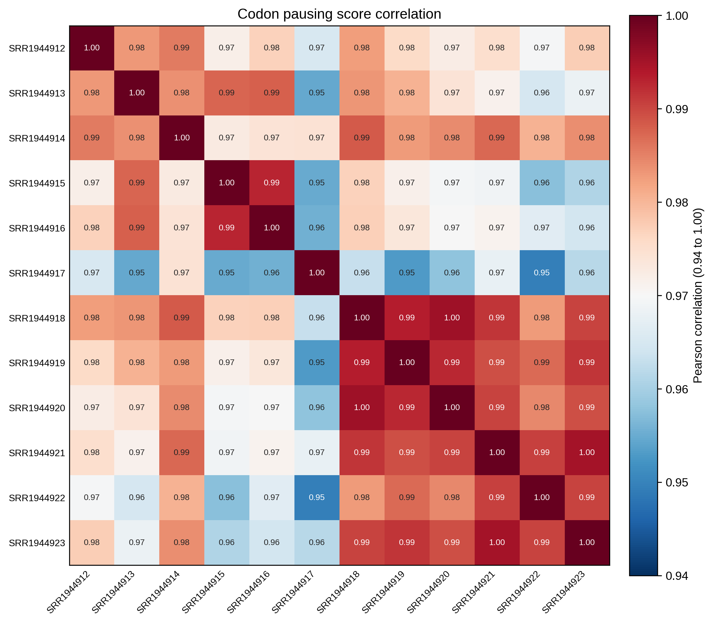
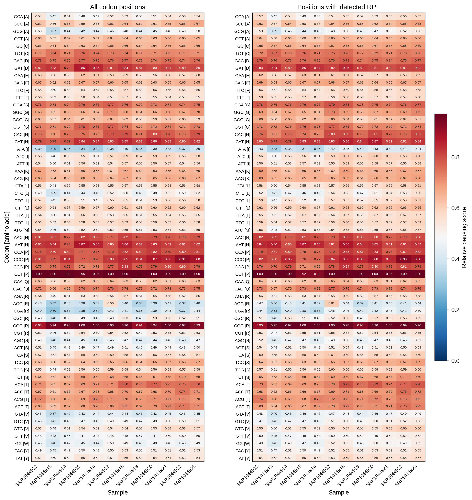

# 4.7.1 Codon pausing score

## Purpose

`rpf_Pausing` calculates **sample-specific codon pausing scores** from the merged density file produced by `rpf_Merge` (JSONL/JSONL.GZ or the legacy TXT table). For each CDS codon, the pausing score compares its RPF density with a background expectation — either the gene/sample mean CDS density (`-b 0`) or a local window of flanking codons (`-b N`). The per-codon scores are then summarized by gene and by codon, and visualized as correlation, heatmap, and rank plots.

Key features:

- **Sample-specific filtering** – for each sample, only transcripts with at least `-m` CDS RPFs are retained.
- **Always excludes stop codons** – the termination codon is never part of the summary; there is no `--stop` switch.
- **Optional outlier removal** – isolated extreme density pileups can be detected and removed before the background and scores are calculated (`--remove-outlier`).
- **Absolute and relative scores** – the summary table stores both the raw (absolute) pausing score and the sample-wise scaled (relative) score for all codon positions and for positions with detected RPF.

The analysis is performed in five steps:

1. **Argument check and file validation** – check the input arguments and the RPF density file.
2. **Data import** – load the compact JSONL records (or the TXT table) and rebuild the codon-resolved density per sample.
3. **Sample-wise pausing calculation** – filter transcripts, optionally remove outliers, compute the pausing score of every CDS codon against the chosen background.
4. **Table export** – write the gene-level, codon-level, and (with `--all`) position-level tables.
5. **Plotting** – draw the sample correlation heatmap, the combined codon pausing heatmap, and the per-sample codon rank plot, and write `_pausing.summary.json`.

```text
rpf_Pausing   # Calculate sample-specific codon pausing scores
```

## Step 1: Run `rpf_Pausing`

The input is the merged density file produced by `rpf_Merge` (see [4.5.5 Merge density](../quality-control/merge-density.md)). Both the compact JSONL format and the plain TXT table are supported.

### 1.1 Parameters

| Parameter                 | Required | Description                                                                                                               |
| ------------------------- | -------- | ------------------------------------------------------------------------------------------------------------------------- |
| `-r`, `--rpf`             | Yes      | Input RPF density file (JSONL/JSONL.GZ/TXT) produced by `rpf_Merge`.                                                      |
| `-o`, `--output`          | Yes      | Output prefix.                                                                                                             |
| `-l`, `--list`            | No       | Optional transcript filter table (TXT). The `transcript_id` column is used when available, otherwise the first column. If omitted, all transcripts in the file are used. |
| `-m`, `--min`             | No       | Minimum sample-specific CDS RPF count required for a transcript to be included. Default `50`.                              |
| `--tis`                   | No       | Discard this number of CDS codons after the translation initiation site. Default `10` (amino acids).                       |
| `--tts`                   | No       | Discard this number of CDS codons before the translation termination site. Default `5` (amino acids).                      |
| `-s`, `--site`            | No       | Ribosomal site used for pausing calculation. Choices `E`, `P`, `A`. Default `P`.                                           |
| `-f`, `--frame`           | No       | Reading frame used for pausing calculation. Choices `0`, `1`, `2`, `all`. Default `all`.                                    |
| `-b`, `--background`      | No       | Number of neighboring codons on each side used as local background. Default `0` (use the mean CDS density of each gene and sample). The focal codon is excluded from the local window. |
| `--thread`                | No       | Number of sample-level worker threads (capped at the sample count automatically). Default `1`.                              |
| `-n`, `--normal`          | No       | Normalize density to RPM before pausing calculation. Ratios are mathematically unchanged within a sample, but the normalized density is retained in exported intermediate tables. Disabled by default. |
| `--ind`                   | No       | For valid-codon summaries, require positive RPF density independently within each sample. Disabled by default.             |
| `--remove-outlier`        | No       | Remove isolated extreme raw-density pileups before background and pausing-score calculation. Disabled by default.          |
| `--outlier-iqr`           | No       | IQR multiplier for the global extreme-pileup detection. Default `8.0`.                                                     |
| `--outlier-window`        | No       | Neighboring codons on each side used to confirm an isolated outlier. Default `5`.                                           |
| `--outlier-local-fold`    | No       | Minimum fold over the local background required for a pileup to be removed as an outlier. Default `10.0`.                   |
| `--scale`                 | No       | Sample-wise scaling applied to the relative codon pausing scores. Choices `none`, `minmax`, `zscore`. Default `minmax`.      |
| `--plot-transform`        | No       | Transform applied to the absolute pausing scores for plotting only (output tables are unchanged). Choices `none`, `sqrt`, `log`, `log1p`, `log2`, `log10`. `log` is an alias of `log1p`. Default `none`. |
| `--all`                   | No       | Output the detailed transcript-position and transcript-codon pausing tables in addition to the default tables. Disabled by default. |

### 1.2 Example

```bash
cd ./sce/4.ribo-seq/11.pausing_score/

rpf_Pausing \
    -r ../05.merge/sce_rpf_merged.jsonl.gz \
    -o sce \
    -s P \
    -f all \
    -b 4 \
    -m 50 \
    --tis 10 \
    --tts 5 \
    --remove-outlier \
    --outlier-iqr 8 \
    --outlier-window 5 \
    --outlier-local-fold 10 \
    --scale minmax \
    --plot-transform log1p \
    --thread 10 \
    &> sce_pausing.log
```

### 1.3 Output

All output files are written to the current working directory with the given prefix:

| Output                                          | Description                                                                                                                                  |
| ----------------------------------------------- | -------------------------------------------------------------------------------------------------------------------------------------------- |
| `<prefix>_cds_pausing_score.txt`                | Gene-level CDS pausing summary: one row per gene-sample pair.                                                                                |
| `<prefix>_sum_codon_pausing_score.txt`          | Codon-level summary: one row per codon, with counts, RPF density, and absolute/relative pausing scores per sample.                            |
| `<prefix>_cds_codon_pausing_score.txt`          | Per-gene and per-codon pausing score table. Generated only with `--all`.                                                                     |
| `<prefix>_all_pausing_score.txt`                | Detailed transcript-position/transcript-codon pausing table. Generated only with `--all`.                                                    |
| `<prefix>_pausing_corr.txt`                     | Sample correlation matrix computed from absolute codon pausing scores.                                                                       |
| `<prefix>_pausing_corrplot.pdf` / `.png`        | Sample correlation heatmap.                                                                                                                  |
| `<prefix>_codon_pausing_heatmap.pdf` / `.png`   | Combined codon pausing heatmap: left panel **All codon positions**, right panel **Positions with detected RPF**.                             |
| `<prefix>_codon_pausing_rankplot.pdf` / `.png`  | Per-sample codon rank plot of absolute valid pausing scores, with the top-scoring codons labeled.                                            |
| `<prefix>_pausing.outliers.txt`                 | Records of the removed outlier positions. Generated only with `--remove-outlier`.                                                            |
| `<prefix>_pausing.summary.json`                 | Run parameters and per-sample summary (transcripts, valid scores, outlier counts).                                                           |

The gene-level table `<prefix>_cds_pausing_score.txt` contains:

```text
name  Sample  CDSCodonCount  ValidCodonCount  PausingScoreSum  PausingScoreMean  PausingScoreMedian  PausingScoreMax
```

The codon-level table `<prefix>_sum_codon_pausing_score.txt` contains `Codon`, `AA`, `Abbr`, `TotalCodon` followed by six per-sample columns for every sample:

```text
<sample>_valid_codon  <sample>_rpf_count  <sample>_absolute_total_ps  <sample>_absolute_valid_ps  <sample>_relative_total_ps  <sample>_relative_valid_ps
```

- `*_valid_codon` – number of genes where the codon is included in the summary.
- `*_rpf_count` – total RPF counts assigned to the codon.
- `*_absolute_*_ps` – mean raw pausing score over all codon positions (`total`) or over positions with detected RPF (`valid`).
- `*_relative_*_ps` – the same mean scores after the sample-wise `--scale` transform.

### Example output figures

**1. Sample correlation heatmap (`_pausing_corrplot.png`)**

{ width="600" }

The correlation heatmap shows the Pearson (or Spearman) correlation of the absolute codon pausing profiles between all pairs of samples. High correlations between biological replicates and lower correlations between different conditions support the reproducibility of the pausing signal.

**2. Combined codon pausing heatmap (`_codon_pausing_heatmap.png`)**

{ width="900" }

The combined heatmap contains two panels, rows being the 64 sense codons (labeled `Codon [amino acid]`) and columns being the samples. The left panel uses all CDS codon positions, the right panel only positions with detected RPF. The color bar reports the pausing score (relative after `--scale`, or absolute with the requested `--plot-transform` when `--scale none`).

**3. Per-sample codon rank plot (`_codon_pausing_rankplot.png`)**

{ width="900" }

Each panel of the rank plot shows one sample: the x-axis lists the codons (rotated 90 degrees) ordered by their absolute valid pausing score, from lowest on the left to highest on the right, and the y-axis is the score itself. Because every codon is labeled on the x-axis, one panel is placed per row by default so that all 61 sense-codon labels fit without overlapping. The six top-scoring codons are highlighted in red, which makes it easy to spot sample-consistent pausing hotspots.

Use `--rankplot-ncol` to change the number of sample panels per row (default `1`; e.g. `2` places two narrower panels per row and gives a more compact figure at the cost of a smaller label font).

## Notes

- A pausing score larger than 1 indicates RPF enrichment of the codon relative to the chosen background; scores are computed per sample and per transcript and then summarized.
- Stop codons are **always** excluded from the calculation; the termination context is not part of the summary tables or figures.
- `-b 0` uses the gene-sample mean CDS density as background, which highlights codons that pause relative to the gene average; positive `-b` values use a local window and are better for detecting sharp single-codon stalls.
- The outlier removal (`--remove-outlier`) is recommended for samples with strong 3'-end pileups or run-off artifacts; verify the flagged positions in `<prefix>_pausing.outliers.txt` before trusting them as biological pauses.
- Candidate pausing codons should be interpreted together with RPF coverage, digestion bias, periodicity, and replicate consistency.
- `--plot-transform` only affects figures, while `--scale` changes the relative score columns of the output tables.

## Merge related results

Use `merge_pausing` to merge multiple codon pausing summary tables (e.g. from different sites or datasets) into one combined table:

```bash
merge_pausing -l *_sum_codon_pausing_score.txt -o RIBO
```
