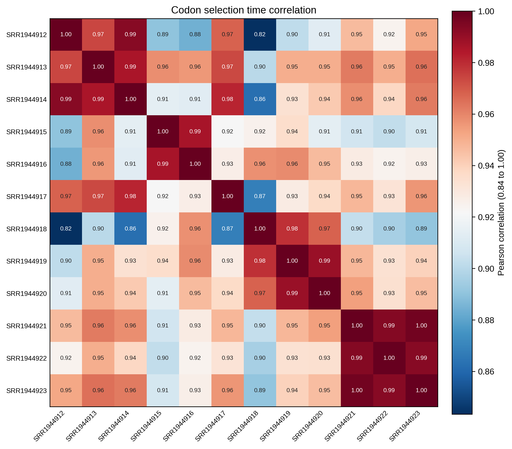
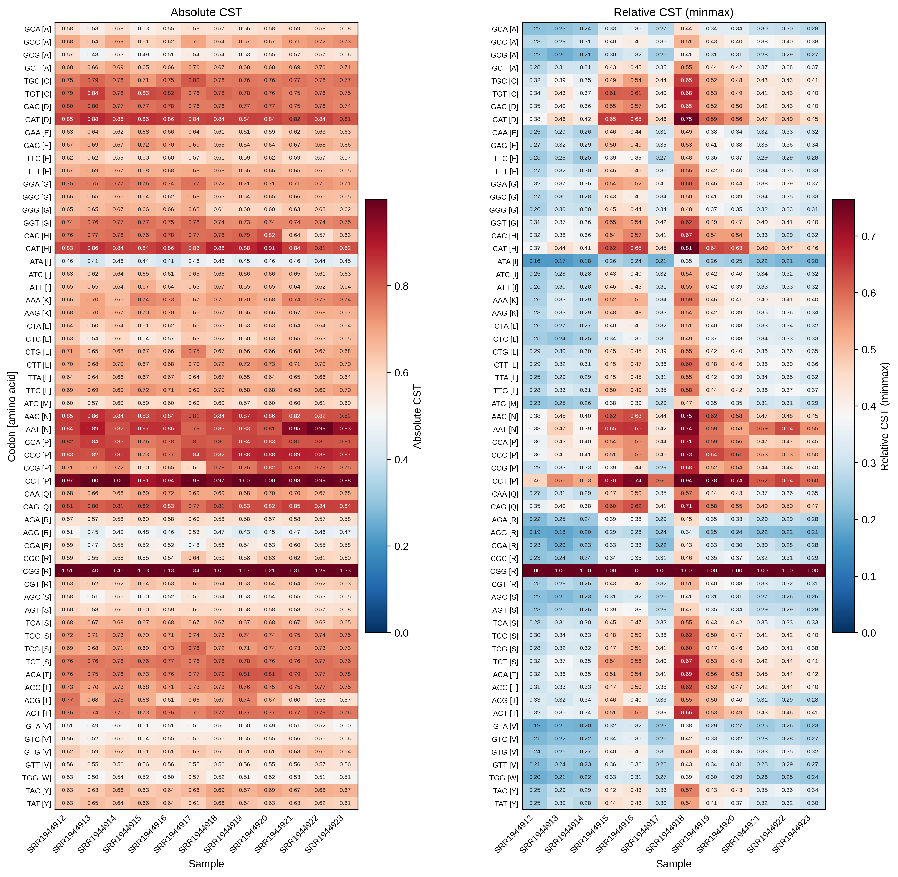
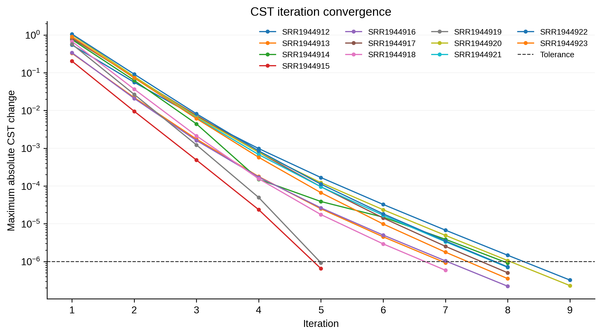

# 4.7.4 Codon selection time

## Purpose

`rpf_CST` calculates **sample-specific codon selection time (CST)** from a pair of density files produced by `rpf_Merge`: one RPF density file and one RNA density file (both JSONL/JSONL.GZ or the legacy TXT table). For each CDS codon, CST measures how the RPF density of a codon deviates from its RNA abundance: the initial value is the ratio of the RPF codon proportion to the RNA codon proportion, and it is then refined by an iterative algorithm that estimates gene-specific elongation and initiation rates and reweights the RNA codon proportions. This removes the effects of transcript expression and translation-initiation rate differences, and estimates the relative time ribosomes spend at each codon (slow codons show a CST above 1 after scaling).

Key features:

- **Two-channel input** – `rpf_CST` takes a paired RPF density file (`--rpf`) and RNA density file (`--rna`); each sample is matched between the two files by name when possible and otherwise by column order.
- **Iterative estimation** – the CST vector is updated iteratively: gene-specific elongation and initiation rates are estimated from the current CST, the RNA codon proportions are reweighted by the estimated initiation rates, and the CST is recomputed until the maximum absolute CST change drops below `--tolerance` or `-t` iterations are reached.
- **Sample-specific filtering** – for each sample pair, only transcripts with at least `--min` CDS RPFs and `--min-rna` CDS RNA reads are retained.
- **Always excludes stop codons** – the termination codon is never part of the calculation or the figures; there is no `--stop` switch.
- **Optional outlier removal** – isolated extreme density pileups can be detected and removed before CST calculation (`--remove-outlier`).
- **Convergence tracking** – the CST value of every iteration is saved and plotted, so convergence can be inspected in the convergence plot.

For codon `c` and sample pair `s`:

```text
CST_0[c, s] = RPF_proportion[c, s] / RNA_proportion[c, s]
```

The analysis is performed in six steps:

1. **Argument check and file validation** – check the input arguments and the RPF/RNA density files.
2. **Data import** – load the compact JSONL records (or the TXT tables), filter by `-l`, apply the TIS/TTS trimming (`--tis`/`--tts`), and shift the RPF density to the requested ribosomal site (`-s`). The RNA channel is not shifted.
3. **Sample-wise CST calculation** – match the paired samples, select high-expression transcripts per pair, optionally remove outliers, and estimate the CST of every CDS codon with the iterative algorithm until convergence.
4. **Table export** – write the codon-level summary, the per-iteration CST trajectories, and (with `--all`) the per-gene CST metrics.
5. **Plotting** – draw the sample correlation heatmap, the CST heatmap, the per-sample codon rank plot, and the iteration convergence plot.
6. **Summary** – write `_cst.summary.json` with the run parameters and per-sample statistics.

```text
rpf_CST   # Calculate sample-specific codon selection time
```

## Step 1: Run `rpf_CST`

The inputs are the merged density files produced by `rpf_Merge` (see [4.5.5 Merge density](../../quality-control/merge-density.md)) for the RPF and RNA channels. Both the compact JSONL format and the plain TXT table are supported.

### 1.1 Parameters

| Parameter                 | Required | Description                                                                                                               |
| ------------------------- | -------- | ------------------------------------------------------------------------------------------------------------------------- |
| `--rpf`                   | Yes      | Input RPF density file (JSONL/JSONL.GZ/TXT) produced by `rpf_Merge`.                                                      |
| `--rna`                   | Yes      | Input RNA density file (JSONL/JSONL.GZ/TXT) produced by `rpf_Merge`; used as the baseline codon usage for the CST ratio.  |
| `-o`                      | Yes      | Output prefix.                                                                                                             |
| `-l`, `--list`            | No       | Optional transcript filter table (TXT). The `transcript_id` column is used when available, otherwise the first column. If omitted, all transcripts in the files are used. |
| `--min`                   | No       | Minimum sample-specific CDS RPF count required for a transcript to be included. Default `30`.                              |
| `--min-rna`               | No       | Minimum sample-specific CDS RNA read count required for a transcript to be included. Default `1`.                          |
| `--tis`                   | No       | Discard this number of CDS codons after the translation initiation site. Default `0` (amino acids).                        |
| `--tts`                   | No       | Discard this number of CDS codons before the translation termination site. Default `0` (amino acids).                       |
| `-s`, `--site`            | No       | Ribosomal site used for the RPF channel. Choices `E`, `P`, `A`. Default `P`.                                                |
| `-f`, `--frame`           | No       | Reading frame used for CST calculation. Choices `0`, `1`, `2`, `all`. Default `all`.                                        |
| `-t`, `--times`           | No       | Maximum number of CST iterations. Default `10`.                                                                            |
| `--tolerance`             | No       | Stop iterations when the maximum absolute CST change is below this value. Default `1e-6`.                                  |
| `--thread`                | No       | Number of sample-pair worker threads (capped at the sample count automatically). Default `1`.                              |
| `--remove-outlier`        | No       | Remove isolated extreme RPF-density pileups before CST calculation. Disabled by default.                                   |
| `--outlier-iqr`           | No       | IQR multiplier for the global extreme-pileup detection. Default `8.0`.                                                     |
| `--outlier-window`        | No       | Neighboring codons on each side used to confirm an isolated outlier. Default `5`.                                          |
| `--outlier-local-fold`    | No       | Minimum fold over the local background required for a pileup to be removed as an outlier. Default `10.0`.                   |
| `--scale`                 | No       | Sample-wise scaling applied to the relative CST. Choices `none`, `minmax`, `zscore`. Default `minmax`.                      |
| `--plot-transform`        | No       | Transform applied to the absolute CST for plotting only (output tables are unchanged). Choices `none`, `sqrt`, `log`, `log1p`, `log2`, `log10`. `log` is an alias of `log1p`. Default `none`. |
| `--rankplot-ncol`         | No       | Number of panels per row in the rank plot. Set to `2` for a more compact two-column layout. Default `1`.                    |
| `--all`                   | No       | Output the detailed per-gene CST metrics table in addition to the default tables. Disabled by default.                     |

### 1.2 Example

```bash
cd ./sce/4.ribo-seq/14.codon_selection_time/

rpf_CST \
    --rpf ../05.merge/sce_rpf_merged.jsonl.gz \
    --rna ../../rna/05.merge/sce_rna_merged.jsonl.gz \
    -o sce \
    -s P \
    -f all \
    --min 30 \
    --min-rna 1 \
    -t 10 \
    --tolerance 1e-6 \
    --tis 15 \
    --tts 5 \
    --thread 8 \
    --remove-outlier \
    --outlier-iqr 8 \
    --outlier-window 5 \
    --outlier-local-fold 10 \
    --rankplot-ncol 2 \
    --scale minmax \
    --plot-transform log1p \
    &> sce_cst.log
```

### 1.3 Output

All output files are written to the current working directory with the given prefix:

| Output                                        | Description                                                                                                                                |
| --------------------------------------------- | ------------------------------------------------------------------------------------------------------------------------------------------ |
| `<prefix>_codon_selection_time.txt`           | Codon-level CST summary: one row per codon and sample with counts, proportions, final CST, convergence status, and relative CST.           |
| `<prefix>_iterative_codon_selection_time.txt` | CST value and adjusted RNA proportion of every iteration, used to trace the convergence of each sample.                                    |
| `<prefix>_cst_gene_metrics.txt`               | Per-gene CST metrics (translation efficiency, elongation and initiation rates). Generated only with `--all`.                               |
| `<prefix>_cst.outliers.txt`                   | Records of the removed outlier positions. Generated only with `--remove-outlier`.                                                          |
| `<prefix>_cst_corr.txt`                       | Sample correlation matrix computed from the absolute CST.                                                                                  |
| `<prefix>_cst_corrplot.pdf` / `.png`          | Sample correlation heatmap (Pearson, based on the absolute CST).                                                                           |
| `<prefix>_cst_heatmap.pdf` / `.png`           | Two-panel heatmap: **Absolute CST** (left) and **Relative CST** (right).                                                                   |
| `<prefix>_cst_rankplot.pdf` / `.png`          | Per-sample codon rank plot of the absolute CST, with the top 6 codons highlighted in red.                                                  |
| `<prefix>_cst_convergence.pdf` / `.png`       | Iteration convergence plot showing the maximum absolute CST change per iteration and the tolerance line.                                   |
| `<prefix>_cst.summary.json`                   | Run parameters and per-sample summary (high-expression genes, outliers, iterations, convergence).                                          |

The codon-level table `<prefix>_codon_selection_time.txt` is a long-format table with one row per codon and sample:

```text
Codon  Sample  CodonCount  ValidCodonCount  RPFCount  RNACount  RPFProportion  InitialRNAProportion  AbsoluteCST  IterationsCompleted  Converged  RelativeCST  AA  Abbr
```

- `CodonCount` – number of CDS codon positions observed for this codon in the sample.
- `ValidCodonCount` – number of positions with detected RPF used for the calculation.
- `RPFCount` / `RNACount` – summed RPF and RNA density assigned to the codon.
- `RPFProportion` / `InitialRNAProportion` – the RPF and RNA proportions of the codon before the iteration reweighting.
- `AbsoluteCST` – the final CST after iterative estimation; values above 1 indicate codons enriched in RPF relative to RNA.
- `IterationsCompleted` / `Converged` – number of iterations performed and whether the maximum absolute CST change dropped below `--tolerance`.
- `RelativeCST` – the absolute CST after the sample-wise `--scale` transform.

### Example output figures

**1. Sample correlation heatmap (`_cst_corrplot.png`)**

{ width="600" }

The correlation heatmap shows the Pearson correlation of the absolute CST profiles between all pairs of samples, with an adaptive color scale that keeps highly correlated replicates distinguishable. High correlations between biological replicates and lower correlations between different conditions support the reproducibility of the selection time signal.

**2. CST heatmap (`_cst_heatmap.png`)**

{ width="700" }

The heatmap consists of two side-by-side panels, both with one row per sense codon (labeled `Codon [amino acid]`) and one column per sample: the left panel shows the **Absolute CST** and the right panel the **Relative CST** (with the chosen `--scale`, labeled accordingly). Values are clipped to the 98th percentile for the color scale, and cell values are annotated when the sample number is small. The right panel is the recommended metric for comparing selection time between samples.

**3. Per-sample codon rank plot (`_cst_rankplot.png`)**

{ width="800" }

The rank plot contains one panel per sample. Within each panel, codons are sorted in ascending order of absolute CST and drawn as a scatter plot with the codon on the x-axis (rotated 90 degrees, labeled `Codon [amino acid]`); the top 6 codons with the highest CST are highlighted in red. `--rankplot-ncol` controls how many panels are placed per row (e.g. `2` for a two-column layout, as in the example). A codon consistently ranking near the top across samples is selected for slowly in all conditions.

**4. Iteration convergence plot (`_cst_convergence.png`)**

{ width="700" }

The convergence plot shows, for every sample, the maximum absolute CST change of each iteration on a log scale, together with the `--tolerance` line. Samples whose trajectories fall below the tolerance line have converged; a flat trajectory above the line indicates that `-t` was reached before convergence and more iterations may be needed.

## Notes

- CST is defined as the ratio of the RPF codon proportion to the RNA codon proportion, not a mean density; the iterative refinement reweights the RNA codon proportions by the estimated gene initiation rates, so CST reflects the relative dwell time of ribosomes on each codon after removing transcript-expression and initiation-rate effects. A value above 1 means the codon accumulates more ribosomes per unit of RNA than the average codon.
- Stop codons are **always** excluded from the calculation and the figures; there is no `--stop` parameter.
- High-expression transcript filtering (`--min`/`--min-rna`) is performed independently for each sample pair, so the set of transcripts underlying the summary may differ between samples.
- The default values of `--min-rna` (`1`) and `--tis`/`--tts` (`0`) differ from `rpf_CDT`; if you want to remove the initiation/termination ramps, set `--tis`/`--tts` explicitly (e.g. `15`/`5` as in the example).
- The RPF channel is shifted to the requested ribosomal site (`-s`), while the RNA channel is used as-is and is never shifted.
- `--scale` changes the `RelativeCST` columns of the output tables, while `--plot-transform` only affects the figures (absolute CST panel of the heatmap and the rank plot).
- Inspect the convergence plot before interpreting the results: samples that did not converge (trajectory still above the tolerance line after `-t` iterations) should be re-run with a larger `-t` or a looser `--tolerance`.
- The outlier removal (`--remove-outlier`) is recommended for samples with strong 3'-end pileups or run-off artifacts; verify the flagged positions in `<prefix>_cst.outliers.txt` before trusting them as biological signals.
- A valid RNA density file must cover the same transcripts and samples as the RPF file; samples present in only one channel are paired by column order with a warning when the counts are equal.

## Merge related results

Use `merge_cst` to merge multiple codon selection time tables (e.g. from different sites or datasets) into one combined table:

```bash
merge_cst -l *_codon_selection_time.txt -o RIBO
```

The combined table keeps the `Codon`, `AA` and `Abbr` columns of the first file and adds the `AbsoluteCST` and `RelativeCST` columns of every sample, written to `RIBO_codon_selection_time.txt`.
