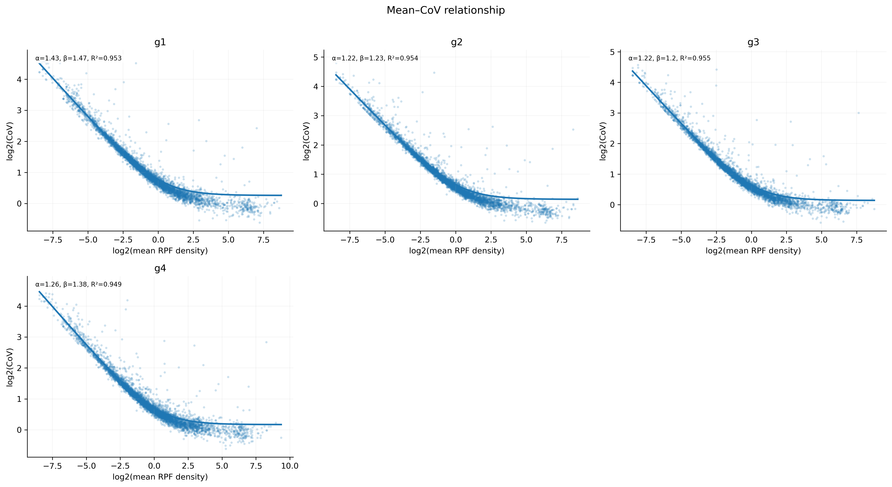
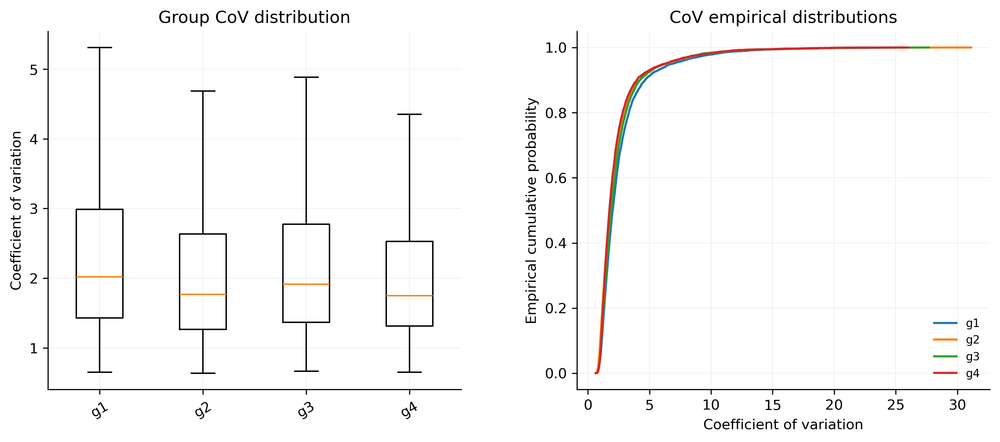

# 4.7.5 Coefficient of Variation

## Purpose

The coefficient-of-variation module evaluates variability in RPF density across CDS regions. `rpf_CoV` calculates **transcript-level CoV** values from CDS RPF density, compares CoV distributions between sample groups, and fits the coverage-dependent mean-CoV relationship. The cumulative CoV along the CDS is described separately in [4.7.6 Cumulative of CoV](cumulative-of-cov.md).

For a given transcript, the CoV is the ratio of the standard deviation to the mean of its CDS positional densities:

```text
CoV = SD / Mean
```

Because the CoV is scale invariant, it measures the *shape* of the ribosome profile — how unevenly ribosomes are distributed along a CDS — rather than its absolute level. It is therefore often used as a proxy for translation efficiency: highly and uniformly translated transcripts show a low CoV, while inefficiently or irregularly translated transcripts show a high CoV. The coverage-dependent relationship fitted by `rpf_CoV` follows the negative-binomial model:

```text
CV = sqrt(alpha + beta / mean)
```

where `CV` is the coefficient of variation, `mean` is the mean CDS density of the transcript, and `alpha` / `beta` are the fitted parameters.

Key features of `rpf_CoV`:

- **Transcript-level CoV** – one CoV value per transcript per sample, computed from the CDS positional densities (shifted to a chosen ribosomal site).
- **Sample-specific filtering** – only transcripts with at least `-m` sample-specific CDS RPFs are used; the transcript set can be restricted with `-l`.
- **Group comparison** – with an optional sample-group table (`-g`), group-level CoV distributions are compared pairwise using a paired t-test, the Wilcoxon signed-rank test, and the two-sample KS test.
- **Mean-CoV fitting** – fits `CV = sqrt(alpha + beta / mean)` per group with constrained non-negative least squares after symmetric tail trimming (`--fit-quantile`).
- **Optional outlier removal** – isolated extreme RPF pileups can be detected and removed before CoV calculation (`--remove-outlier`).
- **Distribution diagnostics** – both the fitted mean-CoV curves and the per-group CoV distributions are plotted.

The `rpf_CoV` analysis is performed in nine steps:

1. **Argument check and file validation** – check the input arguments and the RPF density file.
2. **Data import** – load the JSONL records (or the TXT table) and shift the density to the requested ribosomal site (`-s`).
3. **Sample-group selection** – read the optional group table and keep only the listed samples.
4. **Transcript CoV calculation** – per sample, select the high-expression transcripts and compute the CDS sum, mean, SD, and CoV.
5. **Group-level comparison** – compare the CoV distributions of every group pair.
6. **Mean-CoV fitting** – fit the coverage-dependent relationship per group.
7. **Table export** – write the transcript CoV tables and the comparison/fitting tables.
8. **Plotting** – draw the mean-CoV fit plot and the CoV distribution plot.
9. **Summary** – write `<prefix>_CoV.summary.json`.

## Step 1: Run `rpf_CoV`

The input is a density file produced by `rpf_Merge` (see [4.5.5 Merge density](../../quality-control/merge-density.md)). Both the compact JSONL format and the plain TXT table are supported.

### 1.1 Parameters

| Parameter                | Required | Description                                                                                                         |
| ------------------------ | -------- | ------------------------------------------------------------------------------------------------------------------- |
| `-r`, `--rpf`            | Yes      | Input RPF density file (JSONL/JSONL.GZ/TXT) produced by `rpf_Merge`.                                                 |
| `-o`                     | Yes      | Output prefix.                                                                                                       |
| `-g`, `--group`          | No       | Optional sample-group table with `Name` and `Group` columns. When provided, only the listed samples are analyzed and group-level comparison/fitting is performed. |
| `-l`, `--list`           | No       | Optional transcript filter table (TXT). The `transcript_id` column is used when available, otherwise the first column. If omitted, all transcripts are used. |
| `-s`, `--site`           | No       | Ribosomal site used for positional density. Choices `E`, `P`, `A`. Default `P`.                                       |
| `-f`, `--frame`          | No       | Reading frame used for CoV calculation. Choices `0`, `1`, `2`, `all`. Default `all`.                                  |
| `-m`, `--min`            | No       | Minimum sample-specific CDS RPF count required for a transcript. Default `5`.                                         |
| `--tis`                  | No       | Discard this many codons after the start codon. Default `15` (codons).                                                |
| `--tts`                  | No       | Discard this many codons before the stop codon. Default `5` (codons).                                                 |
| `-n`, `--normal`         | No       | Convert each selected sample to RPM before reporting sums and means. The CoV itself is scale invariant, so this only changes the reported `Sum`/`Mean`. Disabled by default. |
| `--ddof`                 | No       | Delta degrees of freedom for the positional SD. `1` = sample SD, `0` = population SD. Default `1`.                     |
| `--min-codons`           | No       | Minimum number of non-outlier CDS codon positions required for the CoV. Default `10`.                                 |
| `--thread`               | No       | Number of sample-level worker threads (capped at the sample count automatically). Default `1`.                        |
| `--remove-outlier`       | No       | Remove isolated extreme RPF pileups before CoV calculation. Disabled by default.                                       |
| `--outlier-iqr`          | No       | IQR multiplier for the robust log1p-density cutoff. Default `8.0`.                                                    |
| `--outlier-window`       | No       | Neighboring codons on each side used for the local background. Default `5`.                                           |
| `--outlier-local-fold`   | No       | Minimum fold over the local background required for removal. Default `10.0`.                                          |
| `--fit-model`            | No       | Mean-CoV model. Only `nb` is supported: `CV = sqrt(alpha + beta / mean)`. Default `nb`.                                |
| `--fit-quantile`         | No       | Symmetric tail fraction excluded before fitting; `0` disables trimming. Default `0.01`.                               |
| `--plot-transform`       | No       | Axis transformation for the mean-CoV scatter. Only `log2`. Default `log2`.                                            |

### 1.2 Example

```bash
rpf_CoV \
    -r ../05.merge/sce_rpf_merged.jsonl.gz \
    -f 0 \
    -m 5 \
    --tis 10 \
    --tts 5 \
    --thread 10 \
    -g design.txt \
    -o sce \
    &> sce_cov.log
```

The group design file `design.txt` is a two-column table with a header: `Name` and `Group`. In the example, 12 samples are assigned to 4 groups `g1`–`g4`:

```text
Name	Group
SRR1944912	g1
SRR1944913	g1
SRR1944914	g1
SRR1944915	g2
SRR1944916	g2
SRR1944917	g2
SRR1944918	g3
SRR1944919	g3
SRR1944920	g3
SRR1944921	g4
SRR1944922	g4
SRR1944923	g4
```

### 1.3 Output

All output files are written to the current working directory with the given prefix:

| Output                                        | Description                                                                                          |
| --------------------------------------------- | ---------------------------------------------------------------------------------------------------- |
| `<prefix>_CoV.txt`                            | Wide transcript-level table: one row per transcript, statistics of every sample in separate columns. |
| `<prefix>_CoV.long.txt`                       | Long format of the same table: one row per transcript and sample.                                    |
| `<prefix>_CoV.group_summary.txt`              | Per-group summary (median mean and median/mean CoV). Generated only with `-g`.                       |
| `<prefix>_compared_CoV.txt`                   | Pairwise group comparisons. Generated only with `-g` and at least two groups.                        |
| `<prefix>_CoV.fit_parameters.txt`             | Fitted `alpha` / `beta` / `R2` of the mean-CoV model per group. Generated only with `-g`.            |
| `<prefix>_CoV.outliers.txt`                   | Records of the removed outlier positions. Generated only with `--remove-outlier`.                    |
| `<prefix>_CoV_fitplot.pdf` / `.png`           | Mean-CoV scatter with the fitted curves, one panel per group.                                        |
| `<prefix>_CoV_distribution.pdf` / `.png`      | CoV distribution comparison between the groups.                                                      |
| `<prefix>_CoV.summary.json`                   | Run parameters, samples, group summary, fitting summary, and output file list.                       |

The wide table `<prefix>_CoV.txt` has the `name` column followed by seven statistics per sample:

```text
name  <sample>_CodonCount  <sample>_ObservedCodonCount  <sample>_PositiveCodonCount  <sample>_Sum  <sample>_Mean  <sample>_SD  <sample>_CoV  ...
```

- `CodonCount` – number of CDS codon positions of the transcript.
- `ObservedCodonCount` – positions with a finite density value.
- `PositiveCodonCount` – positions with density greater than 0.
- `Sum` / `Mean` / `SD` – summed, mean, and standard deviation of the CDS positional densities (with `--ddof` and, if `-n` is set, in RPM).
- `CoV` – `SD / Mean`; undefined (missing) when the mean is 0.

The comparison table `<prefix>_compared_CoV.txt` contains one row per group pair:

```text
Group1  Group2  PairedGeneCount  MeanCoVGroup1  MeanCoVGroup2  MeanDifference  PairedTStatistic  PairedTPValue  WilcoxonStatistic  WilcoxonPValue  KSStatistic  KSPValue
```

The fitting table `<prefix>_CoV.fit_parameters.txt` contains the fitted parameters per group:

```text
Group  TotalGeneCount  FitGeneCount  Alpha  Beta  R2  Success  Message  Model
```

### Example output figures

**1. Mean-CoV fit plot (`sce_CoV_fitplot.png`)**

{ width="900" }

The fit plot contains one panel per group (up to three columns). Each transcript is a point on the log2(mean) vs log2(CoV) scatter; the fitted curve `CV = sqrt(alpha + beta / mean)` is drawn and the `alpha`, `beta`, and `R2` values are annotated in each panel. Transcripts with a low mean density show an inflated CoV and fall above the curve, which is why `-m` should be chosen carefully.

**2. CoV distribution plot (`sce_CoV_distribution.png`)**

{ width="800" }

The distribution plot has two side-by-side panels: on the left, the CoV distribution of every group is shown as a box plot; on the right, the empirical cumulative distribution (ECDF) curves of the groups are drawn. The ECDF panel is useful to judge whether one group is consistently shifted toward higher (or lower) CoV across all transcripts.

## Notes

- Low-coverage transcripts often show inflated CoV. Choose `-m` carefully according to the sequencing depth, and inspect the fit plot: the fitted curve is driven by the transcript cloud and can be distorted by a long tail of noisy low-coverage points.
- The CoV is scale invariant: `-n` (RPM normalization) changes only the reported `Sum`/`Mean`, not the CoV itself.
- The calculation is restricted to CDS positions: codons after the TIS (`--tis`) and before the TTS (`--tts`) are discarded, and stop codons are always excluded.
- `-g` selects the samples to analyze as well as enabling the group comparison and fitting; without it, only the per-sample CoV tables and plots are produced.
- The paired tests (paired t-test and Wilcoxon signed-rank test) use inner-joined transcripts present in both groups of each pair; the KS test is applied to the unpaired CoV distributions.
- `--fit-quantile` trims a symmetric tail fraction of the mean-CoV distribution before fitting; the default `0.01` removes the most extreme 1% on each side to reduce the influence of noisy low-coverage transcripts.
- `--plot-transform` currently supports only `log2` for the mean-CoV scatter.
