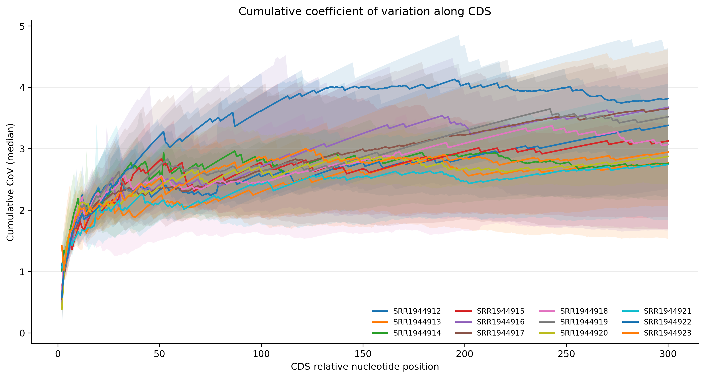
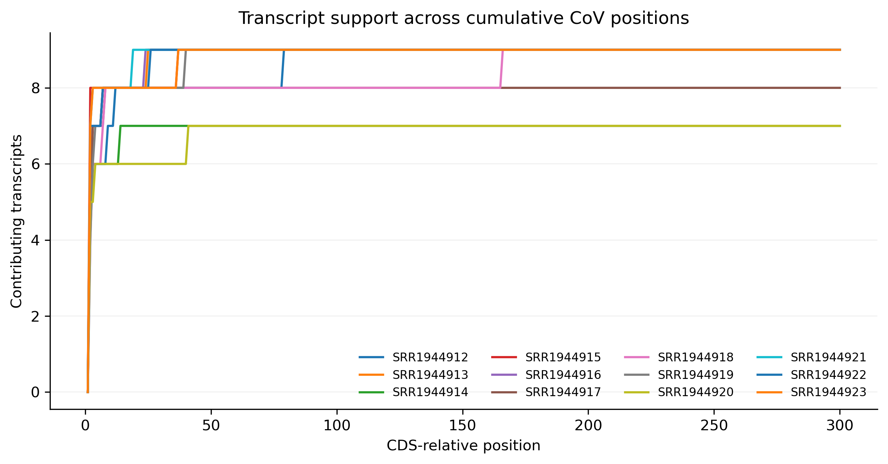
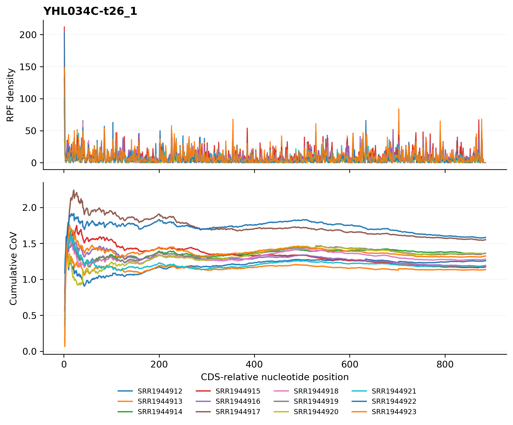

# 4.7.6 Cumulative of CoV

## Purpose

The cumulative CoV module evaluates how the CoV of the ribosome density develops along the CDS. For every retained transcript, the mean, SD, and CoV of the density are accumulated from the CDS start (TIS) to each downstream position:

```text
CumulativeCoV[p] = SD(density[1..p]) / Mean(density[1..p])
```

where `p` is the CDS-relative position at nucleotide or codon resolution. The cumulative CoV starts from a noisy ramp at the very beginning of the CDS (where only a few positions contribute) and typically drops before leveling off, so it visualizes how quickly the profile becomes homogeneous. The transcript-level profiles are then summarized into a meta table for visualization: per sample and position, the distribution of the transcript-level cumulative CoV is described by its center (median or mean) together with a quantile ribbon, and the number of transcripts behind each position is reported separately.

Key features:

- **Cumulative CoV profiles** – for every retained transcript, the mean, SD, and CoV of the density are accumulated from the CDS start to each position (nucleotide or codon resolution).
- **Meta summary** – per sample and position, the distribution of the transcript-level cumulative CoV is summarized by the median (or mean) together with a `--ci-low` / `--ci-high` quantile ribbon.
- **Transcript-support curve** – the number of transcripts contributing at each position is drawn separately so that the reliability of the meta curve can be judged.
- **Per-transcript figures** – a two-panel figure (density profile + cumulative CoV) is generated for every retained transcript.
- **Optional outlier removal** – isolated extreme RPF pileups can be detected and removed before the cumulative statistics are computed (`--remove-outlier`).

The analysis is performed in five steps:

1. **Argument check and file validation** – check the input arguments and the RPF density file.
2. **Data import** – load the JSONL records (or the TXT table), shift the density to the requested ribosomal site (`-s`), apply the `--tis`/`--tts` trimming, and build ordered CDS positions (nucleotide or codon resolution).
3. **Cumulative CoV calculation** – per sample, select the transcripts passing the `-m` filter, detect and remove outliers if requested, and accumulate the mean, SD, and CoV along the CDS of every retained transcript.
4. **Plotting** – draw the meta curve, the transcript-support curve, and one figure per retained transcript.
5. **Output** – write the meta table, the optional detail and outlier tables, and the summary JSON.

## Step 1: Run `rpf_Cumulative_CoV`

The input is a density file produced by `rpf_Merge` (see [4.5.5 Merge density](../quality-control/merge-density.md)). Both the compact JSONL format and the plain TXT table are supported. The command works independently for each sample.

### 1.1 Parameters

| Parameter            | Required | Description                                                                                                           |
| -------------------- | -------- | --------------------------------------------------------------------------------------------------------------------- |
| `-r`, `--rpf`        | Yes      | Input RPF density file (JSONL/JSONL.GZ/TXT) produced by `rpf_Merge`.                                                  |
| `-o`                 | Yes      | Output prefix.                                                                                                         |
| `-l`, `--list`       | No       | Optional transcript filter table (TXT). If omitted, all transcripts are used.                                          |
| `-s`, `--site`       | No       | Ribosomal site used for coordinate assignment. Choices `E`, `P`, `A`. Default `P`.                                      |
| `-f`, `--frame`      | No       | Reading frame(s) included. Choices `0`, `1`, `2`, `all`. Default `all`.                                                 |
| `-m`, `--min`        | No       | Minimum sample-specific CDS RPF count required for a transcript. Default `0`.                                          |
| `--tis`              | No       | Number of codons discarded after the translation initiation site. Default `0`.                                         |
| `--tts`              | No       | Number of codons discarded before the translation termination site. Default `0`.                                       |
| `--min-positions`    | No       | Minimum retained positions required per transcript. Default `10`.                                                     |
| `-t`, `--trim`       | No       | Maximum CDS-relative position included in the meta analysis. Default `150`.                                            |
| `--resolution`       | No       | Position resolution of the cumulative CoV. Choices `nucleotide`, `codon`. Default `nucleotide`.                        |
| `--ddof`             | No       | Delta degrees of freedom for the cumulative SD. `1` = sample SD, `0` = population SD. Default `1`.                     |
| `-n`, `--normal`     | No       | Convert density to RPM before reporting mean and SD. Disabled by default.                                              |
| `--thread`           | No       | Number of sample-level worker threads (capped at the sample count automatically). Default `1`.                         |
| `--remove-outlier`   | No       | Remove extreme local RPF pileups before the cumulative CoV. Disabled by default.                                       |
| `--outlier-iqr`      | No       | IQR multiplier for the global log1p-density cutoff. Default `8.0`.                                                     |
| `--outlier-window`   | No       | Neighboring positions on each side of a candidate outlier. Default `5`.                                                |
| `--outlier-local-fold` | No     | Minimum fold above the local background required for removal. Default `10.0`.                                          |
| `--plot-stat`        | No       | Center statistic of the meta curve. Choices `median`, `mean`. Default `median`.                                        |
| `--plot-transform`   | No       | Transformation applied only to plotted CoV values. Choices `none`, `sqrt`, `log1p`, `log2`, `log10`. Default `none`.    |
| `--ci-low`           | No       | Lower transcript quantile used for the curve ribbon. Default `0.25`.                                                   |
| `--ci-high`          | No       | Upper transcript quantile used for the curve ribbon. Default `0.75`.                                                   |
| `--gene-fig`         | No       | Output format of the per-transcript figures. Choices `png`, `pdf`, `both`. Default `png`.                             |
| `--all`              | No       | Output the transcript-position cumulative CoV detail table. Disabled by default.                                      |

### 1.2 Example

The transcript list `gene.list` is a single-column table with one transcript ID per line:

```text
YHL048W-t26_1
YHL047C-t26_1
YHL044W-t26_1
YHL042W-t26_1
YHL040C-t26_1
YHL039W-t26_1
YHL038C-t26_1
YHL036W-t26_1
YHL035C-t26_1
YHL034C-t26_1
```

```bash
cd ./sce/4.ribo-seq/16.cumulative_of_cov

rpf_Cumulative_CoV \
    -r ../05.merge/sce1_rpf_merged.jsonl.gz \
    -l gene.list \
    -o sce \
    -s P \
    -f all \
    -m 30 \
    --tis 0 \
    --tts 0 \
    --resolution nucleotide \
    --min-positions 30 \
    --trim 300 \
    --ddof 1 \
    --thread 8 \
    --remove-outlier \
    --outlier-iqr 8 \
    --outlier-window 5 \
    --outlier-local-fold 10 \
    --plot-stat median \
    --plot-transform none \
    &> sce_cumulative_CoV.log
```

In the example, 12 samples are analyzed and the transcript set is restricted to the 10 genes listed in `gene.list`; transcripts that do not reach the sample-specific `-m 30` RPF threshold are dropped, so 7–9 transcripts per sample are retained.

### 1.3 Output

All output files are written to the current working directory with the given prefix:

| Output                                                    | Description                                                                                              |
| --------------------------------------------------------- | -------------------------------------------------------------------------------------------------------- |
| `<prefix>_meta<trim>_cumulative_CoV.txt`                  | Meta table: per sample and position, the distribution of the transcript-level cumulative CoV within the first `--trim` positions. |
| `<prefix>_cumulative_CoV.txt`                             | Transcript-position detail table: cumulative mean, SD, and CoV for every retained position. Generated only with `--all`. |
| `<prefix>_cumulative_CoV.outliers.txt`                    | Records of the removed outlier positions. Generated only with `--remove-outlier` and when outliers were found. |
| `<prefix>_cumulative_CoV_curve.pdf` / `.png`              | Meta cumulative CoV curve per sample with the quantile ribbon.                                           |
| `<prefix>_cumulative_CoV_support.pdf` / `.png`            | Number of transcripts contributing at each position.                                                      |
| `<prefix>_cumulative_CoV_geneplots/`                      | Directory with one two-panel figure per retained transcript.                                              |
| `<prefix>_cumulative_CoV.summary.json`                    | Run parameters, per-sample transcript counts, outlier counts, and output file list.                       |

The meta table `<prefix>_meta<trim>_cumulative_CoV.txt` has one row per sample and position:

```text
Sample  Position  Nucleotide  Codon  Frame  TranscriptCount  MeanCoV  MedianCoV  SDCoV  LowerCoV  UpperCoV  Meta
```

- `Position` – CDS-relative position (nucleotide or codon, depending on `--resolution`).
- `Nucleotide` / `Codon` / `Frame` – coordinates of the position in the original CDS.
- `TranscriptCount` – number of transcripts contributing at this position.
- `MeanCoV` / `MedianCoV` / `SDCoV` – across-transcript mean, median, and SD of the cumulative CoV.
- `LowerCoV` / `UpperCoV` – the `--ci-low` / `--ci-high` quantiles of the cumulative CoV.
- `Meta` – always `TIS` (positions are counted from the translation initiation site).

The detail table `<prefix>_cumulative_CoV.txt` (with `--all`) has one row per transcript, sample, and position:

```text
name  Sample  Position  Nucleotide  Codon  Frame  codon  RawDensity  FilteredDensity  CumulativeMean  CumulativeSD  CumulativeCoV  ObservedPositionCount
```

- `RawDensity` / `FilteredDensity` – density before and after outlier removal.
- `CumulativeMean` / `CumulativeSD` / `CumulativeCoV` – expanding statistics from the CDS start to the current position.
- `ObservedPositionCount` – number of non-outlier positions seen so far.

### Example output figures

**1. Meta cumulative CoV curve (`sce_cumulative_CoV_curve.png`)**

{ width="900" }

Each panel corresponds to one sample. The solid line is the center statistic of the transcript-level cumulative CoV (median in the example), and the shaded ribbon spans the `--ci-low` to `--ci-high` quantiles of the transcripts. The curve drops sharply in the first few positions — the unstable ramp where only a few positions contribute to the expanding statistics — and then levels off once enough density has been accumulated.

**2. Transcript support (`sce_cumulative_CoV_support.png`)**

{ width="900" }

For each sample, the support curve shows how many transcripts contribute at each position. Where the support drops, the meta curve and its ribbon are based on fewer transcripts and become unreliable; transcripts that pass `-m` but are shorter than the trim simply end earlier.

**3. Per-transcript figure (`sce_cumulative_CoV_geneplots/YHL034C-t26_1_cumulative_CoV.png`)**

{ width="700" }

One figure is generated for every retained transcript in `<prefix>_cumulative_CoV_geneplots/`. Each figure has two panels sharing the same x-axis (CDS-relative position): the upper panel shows the RPF density profile of the transcript in the sample, and the lower panel shows the expanding cumulative CoV along the CDS. The per-transcript figures let you verify that a transcript with an unusual meta-level behavior is not an artifact.

## Notes

- The cumulative CoV is the expanding `SD / Mean` of the density from the CDS start to each position; at the very beginning of the CDS it is unstable because only a few positions contribute, which is why the curve typically drops and then levels off after a short ramp.
- In `nucleotide` resolution the three reading frames are reordered into contiguous nucleotide positions (frame 0 at `Position = (Codon-1)*3 + 1`); in `codon` resolution each position is one CDS codon.
- The meta table is limited to the first `--trim` positions; transcripts shorter than the trim simply contribute to fewer positions.
- Use the support plot (`_cumulative_CoV_support.*`) to check the number of transcripts behind the meta curve: the ribbon becomes unreliable where the support drops.
- The per-transcript figures (`<prefix>_cumulative_CoV_geneplots/`) can be numerous; restrict the transcript set with `-l` when only a few genes are of interest.
- Stop codons are always excluded and the `--tis`/`--tts` trimming is applied before the CDS positions are built.
