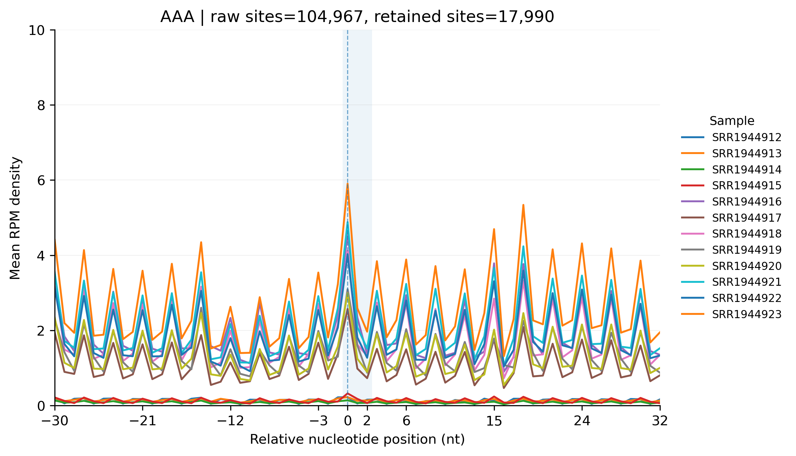
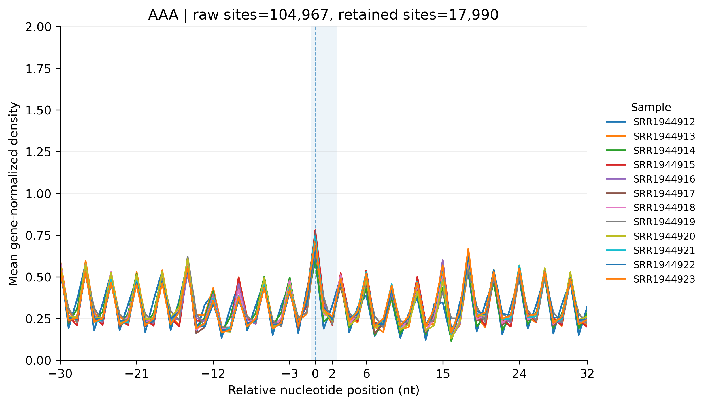

# 4.7.7 Meta-codon analysis

## Purpose

`rpf_Meta_Codon` extracts the average RPF density around selected codons or codon motifs (for example `AAA`, or a multi-codon motif such as `GCTGAA`) across the CDS, and aggregates the same-position sites of all retained transcripts into one meta profile per sample. It supports single codons as well as multi-codon motifs whose length is a multiple of three.

Key features:

- **Streaming input** – reads the same compact RPF density file (JSONL / JSONL.GZ, for example `sce_rpf_merged.jsonl.gz`) used by the other `rpf_*` tools, so no separate TXT table has to be exported.
- **A-site resolved** – density is internally shifted to the A-site before aggregation.
- **Frame- and expression-controlled** – the reading frame can be restricted with `-f`, and only transcripts whose mean CDS RPF count reaches `-m` are retained, which suppresses background from lowly expressed genes.
- **Nucleotide-level meta profiles** – with `--unit nucleotide` the meta profile is expanded to one value per nt while keeping the three frames (`f0`/`f1`/`f2`) separate, so the tri-nucleotide periodicity remains visible in the density table and in the figure.
- **Flexible normalization** – optional RPM normalization (`-n`) and scaling by the gene-level mean density (`-s`), which is useful when comparing samples of different depths.
- **Unique-site option** – `-u` keeps only sites where the target motif occurs once within the retrieval window, reducing inflation of the local background by repeated motifs.

The analysis is performed in seven steps:

1. **Check the input arguments** – validate the input files and parameter combinations.
2. **Import the codon list** – read the target codons/motifs; RNA `U` is converted to DNA `T`.
3. **Import the RPF density file** – stream the density file, keep only the retained transcripts, and apply the optional frame filter, RPM normalization, and gene-mean scaling.
4. **Smooth the RPF density profiles** – apply the optional Savitzky-Golay smoothing (`--smooth`).
5. **Retrieve meta-codon density profiles** – collect the sites of each target motif and average the same-position density across all retained transcripts.
6. **Output meta-codon results** – write one density table and one sequence-context table per target motif.
7. **Draw meta-codon figures** – generate the line plots (only with `--fig`).

## Step 1: Run `rpf_Meta_Codon`

The RPF density input is the same compact file as in the other `rpf_*` analyses (see [4.5.5 Merge density](../quality-control/merge-density.md)). If a TXT density table must be used, the shared reader also accepts it.

### 1.1 Parameters

| Parameter       | Required | Description                                                                                                    |
| --------------- | -------- | -------------------------------------------------------------------------------------------------------------- |
| `-r`, `--rpf`   | Yes      | Input frame-resolved RPF density file (JSONL, JSONL.GZ, or TXT).                                               |
| `-o`, `--output`| Yes      | Output file prefix.                                                                                            |
| `-l`, `--list`  | No       | Optional transcript ID list; only these transcripts are analyzed.                                              |
| `-c`, `--codon` | No       | Optional codon or codon-motif list (one per line). If omitted, all codons of the codon table are used. RNA `U` is converted to DNA `T`. |
| `-f`, `--frame` | No       | Reading frame used for the analysis. Choices `0`, `1`, `2`, `all`. Default `all`.                               |
| `-a`, `--around`| No       | Number of codons retained upstream and downstream of the target motif. Default `10`.                           |
| `-m`, `--min`   | No       | Minimum RPF count required for retained transcripts. Default `50`.                                             |
| `--tis`         | No       | Number of codons removed after the translation initiation site. Default `0`.                                   |
| `--tts`         | No       | Number of codons removed before the translation termination site. Default `0`.                                 |
| `-u`, `--unique`| No       | Only retain sites where the target motif occurs once within the retrieval window. Disabled by default.          |
| `-n`, `--normal`| No       | Normalize RPF counts to RPM before aggregating. Disabled by default.                                           |
| `-s`, `--scale` | No       | Scale the meta-codon density by the gene-level density. Disabled by default.                                   |
| `--smooth`      | No       | Optional Savitzky-Golay smoothing of the density profiles. Disabled by default.                                |
| `--unit`        | No       | X-axis position unit. Choices `codon`, `nucleotide`. Default `codon`. With `nucleotide`, one value per nt is produced while the frames are kept separate, so the tri-nucleotide periodicity remains visible. |
| `--fig`         | No       | Draw the meta-codon line plots. Disabled by default.                                                           |
| `--ylim-scale`  | No       | Compression factor for the y-axis upper limit of the plots. The limit is the data maximum times this factor, rounded up to a clean tick value, flattening the vertical range while staying data-driven. Default `1.5`. |
| `--thread`      | No       | Number of worker processes. Default `1`.                                                                        |

### 1.2 Example

First, move to the working directory:

```bash
cd ./sce/4.ribo-seq/5.riboparser/17.meta_codon/
```

Then run `rpf_Meta_Codon` on the merged RPF density file:

```bash
rpf_Meta_Codon \
    -r ../05.merge/sce_rpf_merged.jsonl.gz \
    -o sce \
    -c codon.list \
    --unit nucleotide \
    --thread 10 \
    -u -n -s --fig \
    &> sce_meta_codon.log
```

In this example, three codons are read from `codon.list` (`AAA`, `CAA`, `GAA`), the density is imported from the compact JSONL file, RPM-normalized (`-n`) and gene-mean scaled (`-s`), repeated motifs within a window are removed (`-u`), and nucleotide-level meta profiles are drawn (`--unit nucleotide --fig`) with 10 worker processes.

### 1.3 Output

All output files are written to the current working directory with the given prefix:

| Output                                                            | Description                                                                 |
| ----------------------------------------------------------------- | --------------------------------------------------------------------------- |
| `<prefix>_<codon>_<raw_sites>_<retained_sites>_meta_density.txt`  | Meta-density table of the target motif (see below).                          |
| `<prefix>_<codon>_<raw_sites>_<retained_sites>_meta_sequence.txt` | Sequence-context table of the target motif (see below).                      |
| `<prefix>_<codon>.pdf` / `.png`                                   | Meta-codon line plot (only with `--fig`).                                    |

The file names record the total number of matched sites (`raw_sites`) and the number of sites retained after filtering (`retained_sites`).

**Density table `<prefix>_<codon>_..._meta_density.txt`** – one row per relative position, one column per sample:

```text
Codon   Nucleotide   Frame   SRR1944912   SRR1944913   ...
-30     -30          0       0.592274     0.602602     ...
```

- `Codon` – relative codon position of the window (e.g. `-30` ... `+30`).
- `Nucleotide` – relative nucleotide position (present when `--unit nucleotide`).
- `Frame` – reading frame of the position (`0`/`1`/`2`); with `--unit nucleotide` the frames are kept separate so that the tri-nucleotide periodicity is retained.
- Remaining columns – the mean density of each sample at that relative position.

**Sequence-context table `<prefix>_<codon>_..._meta_sequence.txt`** – one row per matched site:

```text
Site              name          site_from_tis   -10  -9  ...  0  1  ...  +10
YAL001C-t26_1:146 YAL001C-t26_1  146             GAT CCT ... AAA ATA ... CTG
```

- `Site` – transcript ID and the CDS position of the site.
- `name` – transcript ID.
- `site_from_tis` – codon offset of the site from the translation initiation site.
- Remaining columns – the codon sequence of the `-a` to `+a` context; position `0` is the target motif itself.

### Example output figure

The following example shows the meta profile of the codon `AAA` aggregated over 17,990 retained sites (from 104,967 raw sites) in the 12 samples of the `sce` dataset. The `AAA` motif is drawn at the center; with `--unit nucleotide` the three reading frames are separated so the tri-nucleotide periodicity of the profile is visible:

{ width="800" }


For convenient comparison, the density values were normalized to 1 after scaling prior to plotting.

{ width="800" }

## Notes

- The command imports the A-site density internally from the merged RPF table; no separate A-site table is required.
- Target motifs must have lengths divisible by three; other motifs are skipped.
- The output file name records both the total number of matched sites and the number of valid sites after optional filtering.
- Use `-u` when repeated target codons within the same window may inflate the local background signal.
- With `--scale`, the y-axis of the figures is labeled `Mean gene-normalized density`; with `--normal` (but not `--scale`) it is labeled `Mean RPM density`; otherwise `Mean RPF density`.
- The y-axis upper limit is derived from the data (maximum × `--ylim-scale`, rounded up to a clean tick value) rather than fitted tightly, which avoids exaggerating the tri-nucleotide periodicity.
