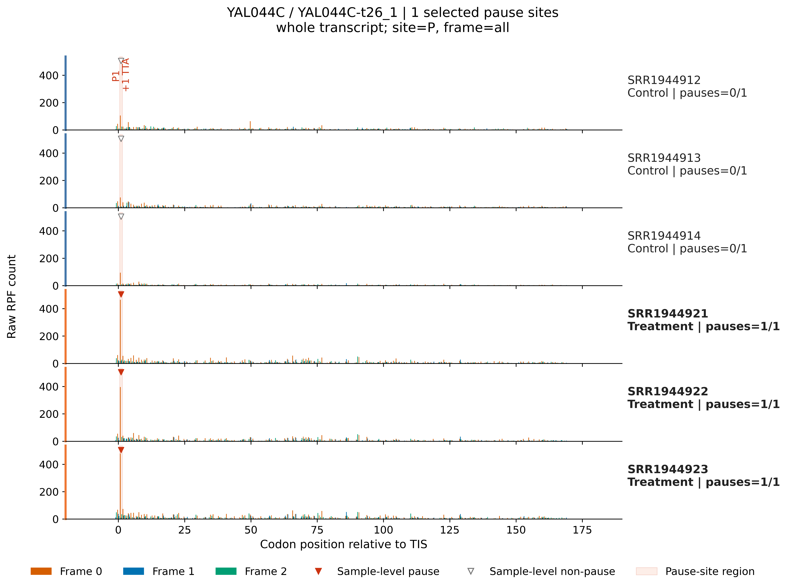
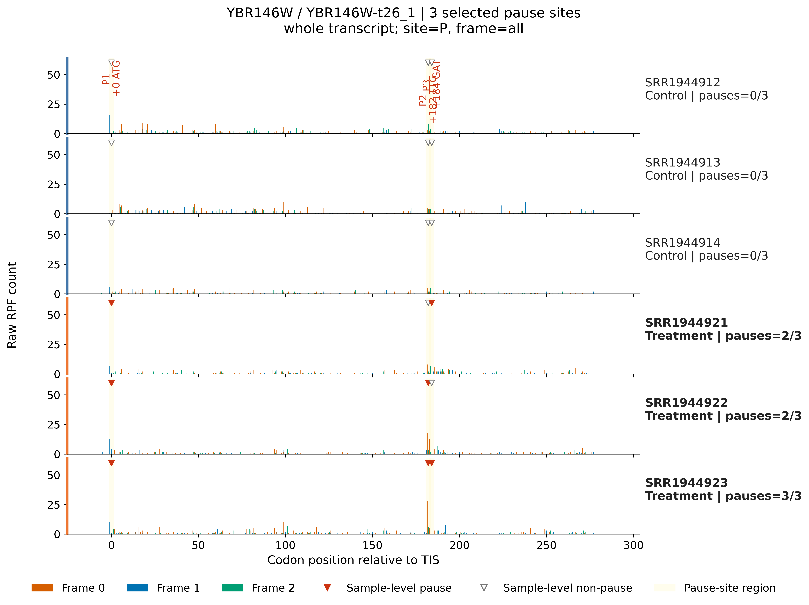

# 4.7.9 Pause site plot

## Purpose

`rpf_PSplot` visualizes the pausing sites detected by `rpf_Odd_Ratio` (see [4.7.8 Codon odds ratio](codon-odds-ratio.md)) directly on the sample-resolved raw RPF profiles of the selected genes. For each target transcript, one sub-plot is drawn per sample; the raw density profile is shown together with the reading frame and the detected pause codons, so that a statistically detected stalling site can be checked against its actual read coverage in every sample.

Key features:

- **Directly plots the `rpf_Odd_Ratio` results** – the input is the site-level table produced by `rpf_Odd_Ratio` (for example `<prefix>_codon_local_pause.txt`), so no separate pause-calling step is required.
- **Sample-resolved profiles** – every control and treatment sample used by `rpf_Odd_Ratio` is drawn as its own sub-plot, with its own y-axis when `--y-scale sample` is used.
- **Frame-aware rendering** – each nucleotide is colored by its reading frame (`0`/`1`/`2`), which makes frame shifts and in-frame pauses easy to recognize.
- **Pause annotation** – the detected pause sites are marked with a triangle and a `P{number} {+offset} {codon}` label; the `--pause-region` option additionally paints a background band over each pause codon.
- **Per-sample pause verification** – for every event and every sample the local metrics (`site_rpf`, `local_mean`, `local_coverage`, `pause_score`) are recomputed from the raw density, and `sample_pause` records whether the site is actually paused in that sample.
- **Optional metrics export** – with `--export-metrics` a per-event, per-sample metrics table is written, which is convenient for summarizing how many samples really pause at each detected site.

The analysis is performed in five steps:

1. **Argument check and file validation** – check the input arguments and the input files.
2. **Import and filter pausing-site events** – read the `rpf_Odd_Ratio` site table, resolve the target transcripts and the control/treatment groups, and keep only the events of the target genes.
3. **Stream the RPF density file** – scan the compact JSONL density file and retrieve only the records of the target transcripts.
4. **Draw pausing-site profiles** – for each target transcript draw one profile per sample and annotate the pause sites.
5. **Export sample-level pause metrics** – write the per-event, per-sample pause metrics table (only with `--export-metrics`).

## Pause-site verification

For each event and each sample, the local statistics are recomputed from the raw density of that sample. A site is considered paused in a sample (`sample_pause = True`) when all of the following conditions hold:

```text
site_rpf      >= min_site_rpf        (default 3, taken from the rpf_Odd_Ratio run)
pause_score   >= pause_score         (site_rpf / local_mean, threshold from the rpf_Odd_Ratio run, default 10)
local_coverage >= min_local_coverage  (fraction of non-zero codons in the local window, default 0.10)
```

- `site_rpf` – RPF count at the pause codon in this sample.
- `local_mean` – mean RPF of the codons in the local window around the site.
- `local_coverage` – fraction of the local-window codons with non-zero RPF.
- `pause_score` – `site_rpf / local_mean`, a measure of how strongly the site stands out from its local background.

Because the pause threshold values are read from the metadata columns of the input table (`pause_score_threshold`, `min_site_rpf_threshold`, `min_local_coverage_threshold`, written by `rpf_Odd_Ratio`), the verification always uses the same criteria as the original detection. In the figure, sites that are paused in a sample are marked with a solid red triangle; sites that do not reach the threshold in that sample are marked with a grey/white triangle.

## Step 1: Run `rpf_PSplot`

The input is the site-level table produced by `rpf_Odd_Ratio` (see [4.7.8 Codon odds ratio](codon-odds-ratio.md)) and the compact RPF density file used by that analysis (see [4.5.5 Merge density](../../quality-control/merge-density.md)). The density file is streamed, so only the target transcripts are kept in memory.

### 1.1 Parameters

| Parameter       | Required | Description                                                                                                        |
| --------------- | -------- | ------------------------------------------------------------------------------------------------------------------ |
| `-i`, `--input` | Yes      | Input `rpf_Odd_Ratio` site-level TXT table (for example `<prefix>_codon_local_pause.txt`).                         |
| `-r`, `--rpf`   | Yes      | Input compact RPF density file (JSONL or JSONL.GZ).                                                                 |
| `-o`, `--output`| Yes      | Output file prefix.                                                                                                |
| `-g`, `--gene`, `--target` | Yes* | Gene ID, transcript ID, or result-table name to plot. Mutually exclusive with `--target-list`.           |
| `--target-list` | Yes*     | Target list file; the first non-empty column is used. Mutually exclusive with `--gene`.                            |
| `-n`, `--normal`| No       | Plot RPM-normalized density. Disabled by default; sample pause metrics always use raw counts.                      |
| `--view`        | No       | Plot view. Choices `region`, `gene`. Default `gene` (whole-gene view). `region` zooms to the pause span with `--flank`. |
| `--flank`       | No       | Upstream/downstream codons shown around the pause span in region view. Default `30`.                               |
| `--plot-transform` | No    | Display-only density transformation. Choices `none`, `sqrt`, `log1p`, `log2`, `log10`. Default `none`.             |
| `--y-scale`     | No       | Y-axis range. Choices `shared` (one range for all samples), `sample` (per-sample range). Default `shared`.          |
| `--y-max`       | No       | Optional fixed y-axis maximum (applied after the transformation).                                                  |
| `--pause-region`| No       | Highlight each pause codon with a background region. Disabled by default.                                          |
| `--output-format` | No     | Figure output format. Choices `pdf`, `png`, `both`. Default `pdf`.                                                 |
| `--export-metrics` | No    | Export the per-event, per-sample pause metrics table. Disabled by default.                                         |
| `--dpi`         | No       | PNG output resolution. Default `300`.                                                                              |
| `--font-size`   | No       | Base figure font size. Default `9.0`.                                                                              |

\* Exactly one of `--gene` / `--target-list` is required.

### 1.2 Example

Prepare the input files:
```bash
$ cat gene.list

YBR156C
YAL044C
YBR146W
YBR217W
...

```


Draw the pasuing-site plots for the four genes in `gene.list`:

```bash
cd ./sce/4.ribo-seq/19.pause_site_plot/

rpf_PSplot \
    -i ../codon_odd_ratio/sce_codon_local_pause.txt \
    -r ../05.merge/sce_rpf_merged.jsonl.gz \
    --target-list gene.list \
    --view gene \
    --output-format both \
    --export-metrics \
    --dpi 600 \
    --font-size 12 \
    -o sce_ps \
    --pause-region \
    &> sce_ps.log
```

In this example, all pausing-site events of the four genes in `gene.list` are drawn on the raw RPF profiles of the same six samples used by `rpf_Odd_Ratio`. The figures are exported both as PDF and as 600-dpi PNG, the pause codons are highlighted with background regions (`--pause-region`), and the per-sample pause metrics are exported (`--export-metrics`).

### 1.3 Output

All output files are written to the current working directory with the given prefix:

| Output                                                         | Description                                                                   |
| -------------------------------------------------------------- | ----------------------------------------------------------------------------- |
| `<prefix>_<gene>_<transcript>_PSplot.pdf` / `.png`            | One figure per target transcript, with one sample-resolved RPF profile panel. |
| `<prefix>_PSplot.metrics.txt`                                  | Per-event, per-sample pause metrics (only with `--export-metrics`).           |

**Figure** – one panel per sample. Each panel shows the raw (or transformed) RPF density along the transcript; nucleotides are colored by reading frame (orange `0`, blue `1`, green `2`). Detected pause sites are marked with a triangle and a `P{number} {+offset} {codon}` label (solid red triangle when the site is paused in that sample, grey/white triangle otherwise). With `--pause-region`, the region of each pause codon is additionally shaded.

**Metrics table `<prefix>_PSplot.metrics.txt`** – one row per event and sample:

```text
event_number  site_number  gene_id  transcript_id  name  from_tis  codon  pause_class  sample  group  analysis_site  analysis_frame  site_rpf  local_mean  local_coverage  pause_score  sample_pause
```

- `event_number` / `site_number` – internal index of the event and of its site.
- `gene_id` / `transcript_id` / `name` – the gene, transcript, and result-table name of the event.
- `from_tis` – codon offset of the pause site from the translation initiation site.
- `codon` – the pause codon.
- `pause_class` – the pause class assigned by `rpf_Odd_Ratio` (for example `treatment_enriched_pause`, `local_pause_without_significant_shift`).
- `sample` / `group` – the sample name and its group (`control` / `treatment`).
- `analysis_site` / `analysis_frame` – the site and frame used by the `rpf_Odd_Ratio` analysis.
- `site_rpf` / `local_mean` / `local_coverage` / `pause_score` – the local statistics recomputed from the raw density of this sample.
- `sample_pause` – whether this site is actually paused in this sample according to the thresholds above.

### Example output figure

The following example plots the treatment-enriched pause at the first codon (`from_tis = 1`, codon `TTA`) of the transcript `YAL044C-t26_1`, which was detected by `rpf_Odd_Ratio` in [4.7.8 Codon odds ratio](codon-odds-ratio.md). The pause is absent in the three control samples (`sample_pause = False`, grey/white triangles) and present in the three treatment samples (`sample_pause = True`, red triangles), showing how the figure is used to confirm a detected site sample by sample:

{ width="800" }

Example transcript `YBR146W-t26_1`
{ width="800" }

## Notes

- `rpf_PSplot` is a visualization companion of `rpf_Odd_Ratio`: run the latter first and use its site-level table (for example `<prefix>_codon_local_pause.txt`) as `-i`.
- The density file is scanned once and only the target transcripts are retained, so plotting a small target list is cheap even for a large genome-wide density file.
- The pause thresholds are taken from the metadata columns of the input table, so the figure always reflects the criteria used by the original detection.
- The figure marks, but does not re-define, the detected sites: use `sample_pause` in the metrics table to summarize in how many samples a site really pauses before interpretation.
- For a whole-gene overview use `--view gene`; for a zoomed view around the pause span use `--view region` with `--flank`.
- With many samples, the figure height grows with the number of samples (one panel each); use `--y-scale sample` when the samples differ strongly in read depth.
