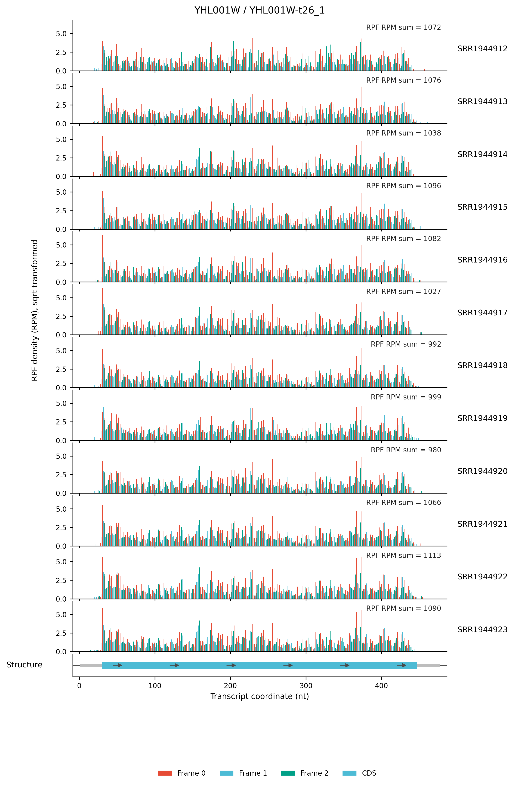
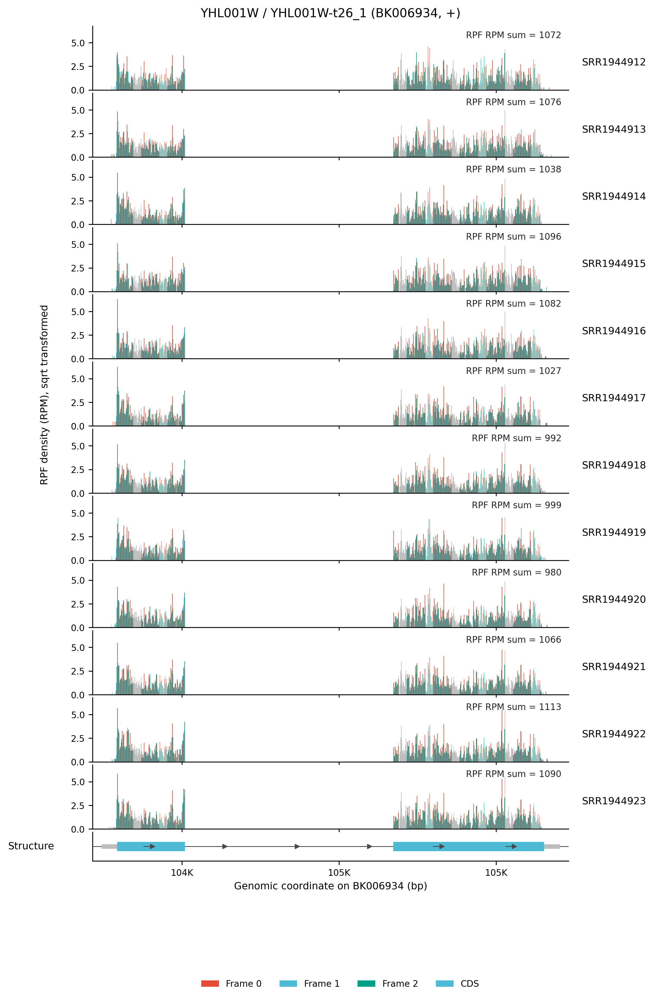

# 4.6.3 Gene density plot

## Purpose

`rpf_Geneplot` draws **IGV-like gene-level density profiles** from the merged density file produced by `rpf_Merge` (JSONL/JSONL.GZ, or the legacy TXT table). For a given gene or transcript, it visualizes the RPF (or RNA) density along the transcript or genome coordinates — one panel per sample, with the codon-frame composition and the gene structure (UTR/CDS) — so that you can inspect translation patterns, frame coloring, and coverage uniformity of a gene of interest.

The analysis is performed in five steps:

1. **Target selection** – load the profile of a single target (`-g`) or a batch of targets from a list file (`--target-list`).
2. **Profile construction** – rebuild a codon-resolved profile from the compact JSONL record, or read it directly from a TXT density table.
3. **Coordinate resolution** – decide whether to draw transcript coordinates, genome coordinates, or both (`--coordinate`).
4. **Plotting** – draw the per-sample density in bar or line mode (`--mode`), apply the optional data transform (`--plot-transform`) and clipping, then draw the gene-structure panel.
5. **Export** – write the raw profile table and the PDF/PNG figures (`--output-format`), optionally a per-sample track table (`--export-track`).

```text
rpf_Geneplot   # Draw IGV-like gene-level RPF/RNA density profiles
```

## Step 1: Run `rpf_Geneplot`

The input is the merged density file produced by `rpf_Merge` (see [4.5.5 Merge density](../quality-control/merge-density.md)). Both the compact JSONL format and the plain TXT table are supported.

### 1.1 Parameters

| Parameter              | Required | Description                                                                                                 |
| ---------------------- | -------- | ----------------------------------------------------------------------------------------------------------- |
| `-r`, `--rpf`          | Yes      | Input merged density file (JSONL/JSONL.GZ/TXT) produced by `rpf_Merge`.                                     |
| `-o`, `--output`       | Yes      | Output prefix.                                                                                               |
| `-g`, `--target`       | Yes*     | Gene or transcript ID to plot. Exactly one of `-g`/`--target-list` must be given.                            |
| `--target-list`        | Yes*     | File with one target per line (first non-empty column is used) for batch plotting.                           |
| `--id-type`            | No       | How to interpret the target ID. Choices `auto`, `gene`, `transcript`. Default `auto` (fall back by a trailing `-t\d+` pattern). |
| `--sample`             | No       | Comma-separated list of samples to plot. By default all samples in the file are drawn.                       |
| `--select-transcript`  | No       | Transcript selection when a gene has several isoforms. Choices `first`, `longest`, `highest`. Default `longest`. |
| `--coordinate`         | No       | Coordinate system of the figure. Choices `auto`, `both`, `genome`, `transcript`. Default `auto` (transcript only, plus genome if genome mapping or `--annotation` is available). |
| `--annotation`         | No       | Optional genome annotation (genePred or the `*.norm.txt` table from `rpf_Percent`) used to resolve genome coordinates. |
| `--data-type`          | No       | Which density to plot. Choices `ribo`, `rna`. Default `ribo`.                                                |
| `-f`, `--frame`        | No       | Reading frame to draw. Choices `all`, `0`, `1`, `2`. Default `all` (three colored frame bars).               |
| `-n`, `--normal`       | No       | Normalize the density to RPM (reads per million) with the sample library size. Enabled by default; use `--raw-count` to disable. |
| `--raw-count`          | No       | Plot raw counts instead of RPM-normalized density.                                                           |
| `--mode`               | No       | Drawing style of the density panel. Choices `bar`, `line`. Default `bar`.                                    |
| `--plot-transform`     | No       | Data transform applied before plotting. Choices `none`, `sqrt`, `log`, `log1p`, `log2`, `log10`. Default `none`. |
| `--utr-gray`           | No       | Paint the 5'/3' UTR regions grey instead of frame colors.                                                     |
| `--line-width`         | No       | Line width for `--mode line`. Default `1.2`.                                                                 |
| `--bar-width`          | No       | Bar width for `--mode bar`. Default `0.85`.                                                                  |
| `--y-max`              | No       | Fixed upper limit of the density y-axis.                                                                     |
| `--spike-clip`         | No       | Clip single-position spikes: the position density is capped at a percentile (`--clip-quantile`, default `0.995`) of all densities. |
| `--clip-quantile`      | No       | Quantile used by `--spike-clip`. Default `0.995`.                                                            |
| `--clip-value`         | No       | Explicit clipping threshold used by `--spike-clip` (overrides `--clip-quantile`).                            |
| `--intron-scale`       | No       | Scale factor of intronic gaps in genome-coordinate plots. Default `1.0` (keep true genomic distance).        |
| `--x-margin`           | No       | Relative margin added to the left/right of the plotted region. Default `0.02`.                               |
| `--export-track`       | No       | Export a per-sample multi-track table (`<prefix>_<coordinate>_geneplot.bedgraph_like.txt`) for external genome browsers. |
| `--output-format`      | No       | Figure format. Choices `pdf`, `png`, `both`. Default `both`.                                                 |
| `--dpi`                | No       | PNG resolution in dots per inch. Default `300`.                                                              |
| `--width`              | No       | Total figure width in inches. Default `11.0`.                                                                |
| `--per-sample-height`  | No       | Height of each sample density panel in inches. Default `1.0`.                                                |
| `--structure-height`   | No       | Height of the gene-structure panel in inches. Default `0.45`.                                                |
| `--max-height`         | No       | Maximum total figure height in inches; the sample panels are re-scaled if exceeded. Default `18.0`.          |
| `--title`              | No       | Custom figure title (replaces the auto-generated one).                                                        |
| `--font-size`          | No       | Base font size. Default `9.0`.                                                                               |

### 1.2 Example

```bash
cd ./sce/04.ribo-seq/23.geneplot

rpf_Geneplot \
    -r ../05.merge/sce1_rpf_merged.jsonl.gz \
    -g YHL001W-t26_1 \
    -o YHL001W-t26_1 \
    --width 8 \
    --plot-transform sqrt \
    &> YHL001W_t26_1_geneplot.log
```

### 1.3 Output

All output files are written to the current working directory with the given prefix. For a single target (`-g`), the file names are:

| Output                                       | Description                                                                                                                                                |
| -------------------------------------------- | ---------------------------------------------------------------------------------------------------------------------------------------------------------- |
| `<prefix>_transcript_geneplot.pdf/.png`      | Transcript-coordinate density figure: one panel per sample with the UTR/CDS structure at the bottom.                                                        |
| `<prefix>_genome_geneplot.pdf/.png`          | Genome-coordinate density figure (only written when genome coordinates can be resolved).                                                                    |
| `<prefix>_transcript_geneplot.profile.txt`   | Raw codon-resolved profile used to draw the transcript figure.                                                                                              |
| `<prefix>_genome_geneplot.profile.txt`       | Raw nucleotide-resolved profile used to draw the genome figure.                                                                                             |
| `<prefix>_<coordinate>_geneplot.bedgraph_like.txt` | Per-sample multi-track table exported with `--export-track`.                                                                                           |

For batch mode (`--target-list`), each target is prefixed separately:

```text
<prefix>_<target>_<coordinate>_geneplot.pdf/.png
<prefix>_<target>_<coordinate>_geneplot.profile.txt
```

The profile table is a flat long-format table with the columns:

```text
Target  GeneID  TranscriptID  Name  Sample  CodonIndex  Frame  TranscriptNt  GenomePos  X  Region  Codon  FromTIS  FromTTS  RawCount  Density
```

- `Target` – the requested target ID; `GeneID`/`TranscriptID` – the resolved gene and transcript.
- `Sample`, `CodonIndex`, `Frame`, `TranscriptNt`, `GenomePos` – coordinate and frame annotation of each position (`GenomePos` is `-` when the genome mapping is missing).
- `Region` – `CDS`, `TIS` (first CDS codon) or `TTS` (last CDS codon); `Codon`, `FromTIS`, `FromTTS` – codon identity and distance (in codons) from the translation start/stop.
- `RawCount`, `Density` – the observed RPF count and the RPM-normalized density per sample.

### Example output figures

**1. Transcript-coordinate gene plot (`YHL001W`, t26_1)**

{ width="900" }

The transcript-coordinate figure draws each sample as a horizontal panel: the x-axis runs from the transcription start site (TSS) to the transcription end site (TES) of `YHL001W-t26_1`, and each bar shows the RPF density (RPM, sqrt-transformed) of one position, colored by its P-site reading frame (`Frame 0/1/2`). Below the sample panels the gene structure is shown, with the 5'/3' UTR in grey and the CDS as the colored bar. The right side reports the sample label and the total RPF counts of the plotted region, which makes it easy to compare the translation level and frame phasing of the same gene across samples.

**2. Genome-coordinate gene plot (`YHL001W`, t26_1)**

{ width="900" }

The genome-coordinate figure shows the same gene in its genomic context: the x-axis is the genomic position of the chromosome, the intron is drawn as a thin line (with the `--intron-scale` factor), and UTR/CDS segments are shown as blocks on the structure panel. This view is useful to check whether the density spans splice junctions or genomic features correctly, and to compare the gene with its neighboring loci.

## Notes

- The recommended input is the compact **JSONL** file from `rpf_Merge`, because it stores the genome mapping and the transcript list directly. The legacy TXT table can also be used, but then genome coordinates may be unavailable.
- The three frame colors are only drawn when `--mode bar --frame all --data-type ribo` are used together; for RNA density or single-frame requests the bars are monochrome.
- Density is normalized to RPM by default. Use `--raw-count` if you want the raw counts, or `--spike-clip` to remove single-position spikes that flatten the y-axis.
- For genes with several isoforms, `--select-transcript` controls which transcript is drawn (default: the longest); use `--id-type` to force gene- or transcript-level lookup when the automatic detection fails.
- To keep figures readable, reduce `--per-sample-height` (or raise `--max-height`) when many samples are plotted.
