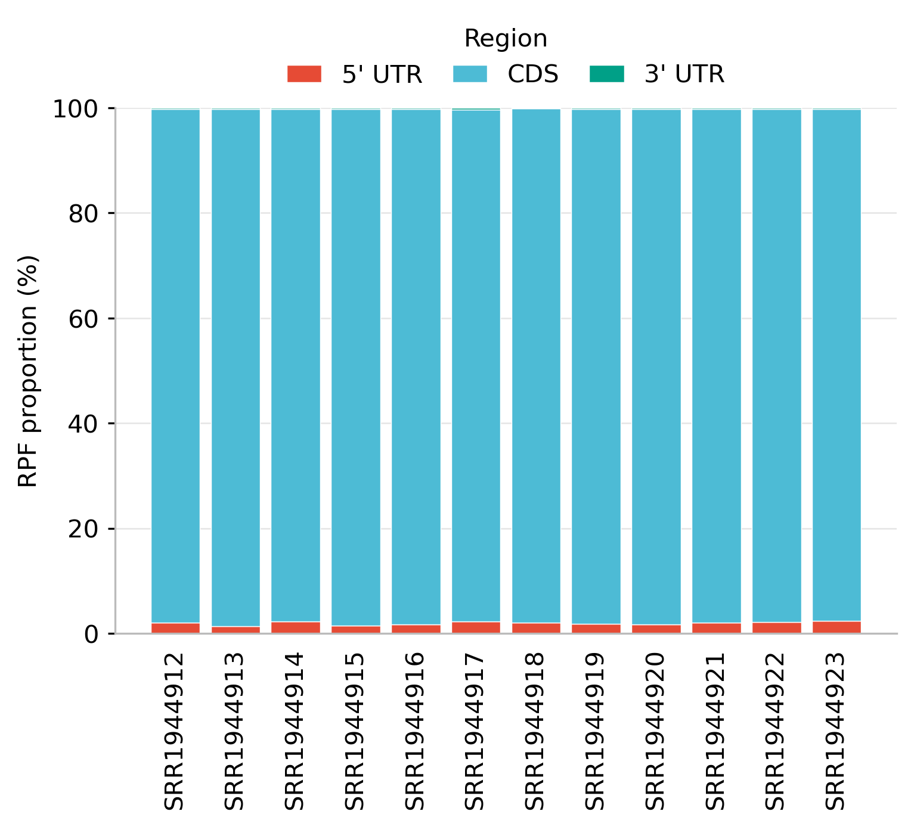
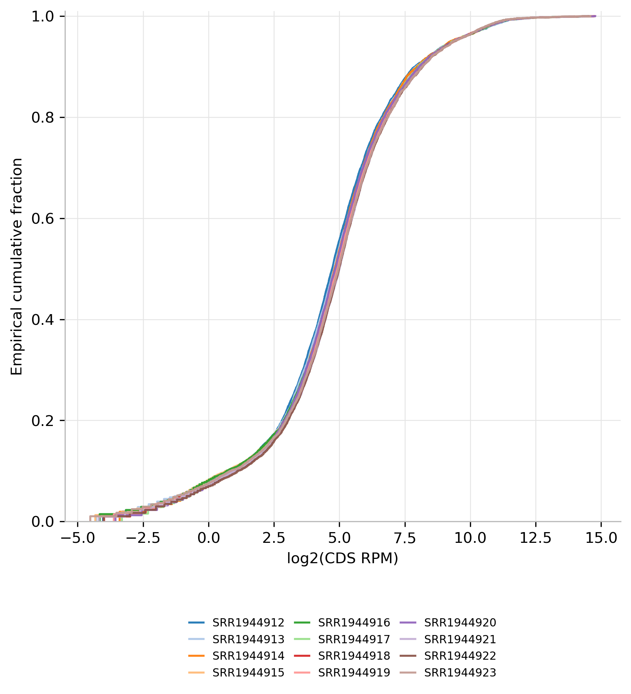
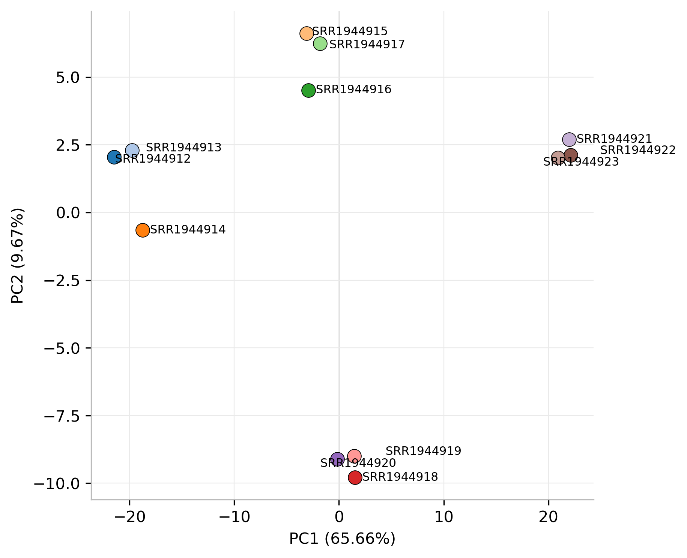
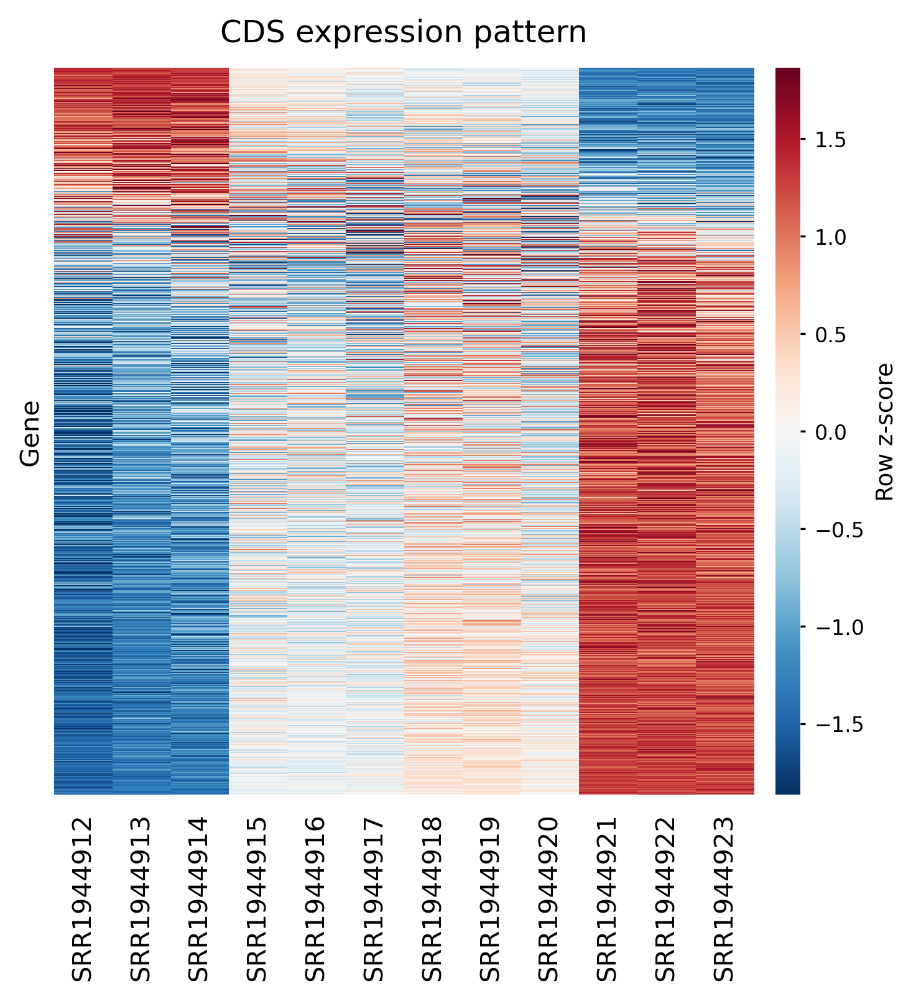

# 4.6.1 Gene quantification

## Purpose

Quantify the RPF density of each transcript (e.g., in the CDS) and normalize it into standard abundance units (RPM, RPKM, TPM) for downstream differential expression or translation efficiency analysis. Gene quantification also reports the total RPF count per sample, the proportion of RPFs mapped to each region, and quality-control plots (CDF, PCA, and heatmap) that help detect sample outliers before statistics.

```text
rpf_Quant     # Quantify transcript-level RPF counts and normalize to RPM/RPKM/TPM, with QC plots
merge_quant   # Merge quantification tables from multiple samples or analyses into one matrix
```

Both current JSONL density files (optionally gzip-compressed) and legacy TXT density files are supported. The workflow quantifies the user-selected region (`--region`, default CDS) for each transcript, summarizes the counts per sample, and outputs raw counts together with RPM/RPKM/TPM-normalized tables and diagnostic figures.

## Step 1: Run `rpf_Quant`

Quantify transcript-level RPF density from a merged density file and generate normalized abundance tables plus QC plots.

### 1.1 Parameters

| Parameter | Required | Description |
|---|---|---|
| `-r`, `--rpf` | Yes | Input RPF density file in JSONL (or JSONL.GZ) or TXT format, usually the merged density file generated by `rpf_Merge`. |
| `-o`, `--output` | Yes | Output prefix. |
| `-t`, `--transcript` | No | Optional transcript filter table in TXT format. When provided, `transcript_id` is used if available. |
| `-f`, `--frame` | No | Reading frame used for quantification. Choices are `0`, `1`, `2`, and `all`. Default is `all`. |
| `--region` | No | Transcript region to quantify. Choices are `cds`, `5utr`, `3utr`, and `all`. Use `all` to quantify 5' UTR, CDS, and 3' UTR in one run. Default is `cds`. |
| `--tis` | No | Number of CDS codons removed after the translation initiation site (TIS). Default is `0`. |
| `--tts` | No | Number of CDS codons removed before the translation termination site (TTS). Default is `0`. |
| `--remove-outlier`, `--outlier` | No | Remove isolated codon-level RPF pileups (e.g., rRNA-like or mis-mapped fragments) before quantification. Disabled by default. |

### 1.2 Example

```bash
cd ./sce/04.ribo-seq/10.quantification/

rpf_Quant \
    -r ../05.merge/sce_rpf_merged.jsonl.gz \
    --tis 0 \
    --tts 0 \
    --remove-outlier \
    -o sce \
    &> sce.log
```

### 1.3 Output

The `<region>` placeholder below is `utr5`, `cds`, or `utr3`, matching the regions quantified in this run.

| Output | Description |
|---|---|
| `<prefix>_total.txt` | Total RPF count per sample. |
| `<prefix>_<region>_rpf_quant.txt` | Raw RPF count per transcript and per sample (integer). |
| `<prefix>_<region>_rpm_quant.txt` | RPM (reads per million) per transcript and per sample. |
| `<prefix>_<region>_rpkm_quant.txt` | RPKM (reads per kilobase per million) per transcript and per sample. |
| `<prefix>_<region>_tpm_quant.txt` | TPM (transcripts per million) per transcript and per sample. |
| `<prefix>_<region>_length.txt` | Length of the quantified region (nt) per transcript. |
| `<prefix>_region_rpf_proportion.txt` | Percentage of RPF counts mapped to each quantified region per sample. |
| `<prefix>_region_rpf_proportion_bar_plot.pdf` / `.png` | Stacked barplot of the region RPF proportion per sample. |
| `<prefix>_cds_rpm_cdf_plot.pdf` / `.png` | Cumulative distribution (eCDF) plot of log2 CDS RPM. Written when the CDS is quantified. |
| `<prefix>_cds_rpm_pca.txt` | PCA coordinates of the samples (log2 CDS RPM), including the variance of PC1 and PC2. |
| `<prefix>_cds_rpm_pca_plot.pdf` / `.png` | PCA scatter plot of the samples. Written when the CDS is quantified. |
| `<prefix>_cds_rpm_heatmap.pdf` / `.png` | Heatmap of the row-scaled CDS RPM for the top variable genes. Written when the CDS is quantified. |
| `<prefix>_quant.outliers.txt` | Outlier table listing removed codon-level pileups. Only written when `--remove-outlier` is enabled. |
| `<prefix>_quant.region_summary.txt` | Per-region summary of the quantification. |
| `<prefix>_quant.summary.json` | Machine-readable summary of the run, including the output file list. |

#### Example output figures

The four figures below are generated by the example command in Step 1.2. They provide an overview of the read allocation across transcript regions, the distribution of CDS expression levels, and the overall sample similarity, and can be used to detect problematic libraries before downstream statistics.

**Region RPF proportion (`<prefix>_region_rpf_proportion_bar_plot.png`)**

{ width="900" }

- Each stacked bar shows the percentage of RPF counts mapped to the 5' UTR, CDS, and 3' UTR of one sample (x-axis: sample, y-axis: RPF proportion in %). In this run, the CDS dominates all samples (97.5–98.4%), while the 5' UTR (1.3–2.3%) and 3' UTR (0.1–0.3%) make only small contributions.
- A CDS-dominated pattern is expected for a well-prepared ribosome footprint library: translating ribosomes are mostly on the coding sequence. The similar proportions across samples indicate that the read allocation is stable between libraries, so normalization-based comparisons are meaningful.
- If one sample shows an abnormally high 5' UTR or 3' UTR proportion, it may contain non-coding contamination, incomplete rRNA depletion, or mis-mapped reads; such a sample should be inspected before being included in the analysis.

**CDS RPM empirical CDF (`<prefix>_cds_rpm_cdf_plot.png`)**

{ width="900" }

- Each step curve is the empirical cumulative distribution of log2(CDS RPM + 1) over the detected genes of one sample (x-axis: log2 CDS RPM, y-axis: cumulative fraction). The curve tells how many genes are expressed at or below a given level.
- In this run, the curves of all samples almost overlap, which means the samples share a very similar CDS expression distribution and therefore have comparable sequencing depth and library complexity.
- A curve that is shifted to the left (lower expression overall) or that rises much faster than the others (excess of lowly expressed genes, i.e., a large fraction of genes with RPM ≈ 0) indicates a weaker library or higher background noise, and is a typical sign of an outlier sample.

**Sample PCA (`<prefix>_cds_rpm_pca_plot.png`)**

{ width="900" }

- PCA is computed on the log2 CDS RPM matrix (centered SVD). Each point is one sample, plotted by its PC1 and PC2 scores; the variance explained by each component is labeled in the axes. In this run PC1 explains 65.7% and PC2 explains 9.7% of the total variance.
- The samples separate into clear groups along PC1: SRR1944912–1944914 and SRR1944915–1944917 cluster on the negative side while SRR1944921–1944923 cluster on the positive side, and SRR1944918–1944920 are further separated by PC2. These groups likely reflect biological conditions (e.g., treatment groups) or batch effects.
- PCA is mainly used to check sample grouping and reproducibility: samples from the same condition should stay close, while an isolated point suggests an outlier library or a strong batch effect that should be accounted for in the downstream differential analysis.

**CDS RPM heatmap (`<prefix>_cds_rpm_heatmap.png`)**

{ width="900" }

- The heatmap shows the row-scaled (z-score) log2 CDS RPM of the top 1,500 most variable genes (selected by RPM variance across samples). Rows are genes and columns are samples, with row and column dendrograms showing hierarchical clustering.
- Gene rows are grouped into co-regulated modules, and the column tree reflects sample similarity. In this run, the column clustering largely agrees with the PCA grouping, confirming the same sample structure from an independent view.
- The heatmap is useful for quickly spotting genes whose expression differs across sample groups (blocks of red/blue) and for verifying that replicates cluster together before proceeding to differential expression analysis.

## Step 2: Run `merge_quant`

Merge quantification tables from multiple samples or analyses into a single matrix.

### 2.1 Parameters

| Parameter | Required | Description |
|---|---|---|
| `-l`, `--list` | Yes | Input quant files, e.g. `*_cds_rpf_quant.txt`. Multiple files can be provided. |
| `-o`, `--output` | Yes | Output prefix. The merged table is written to `<prefix>_rpf_quant.txt`. |

### 2.2 Example

```bash
merge_quant \
    -l sce_cds_rpf_quant.txt other_cds_rpf_quant.txt \
    -o merged
```

### 2.3 Output

| Output | Description |
|---|---|
| `<prefix>_rpf_quant.txt` | Merged quantification table, joined by transcript name (`name`) with an outer join. |

## Notes

- Normalization formulas: RPM = count / total × 10⁶; RPKM = count × 10⁹ / (length × total); TPM = RPK / Σ(RPK) × 10⁶, where RPK = count × 10³ / length and `total` is the total RPF count of the sample.
- `--tis` / `--tts` trim codons near the translation start/stop before quantification; use them to avoid edge artifacts when the CDS boundaries are uncertain.
- `--remove-outlier` is recommended for libraries with rRNA-like or mis-mapped fragments; when enabled, the removed points are recorded in `<prefix>_quant.outliers.txt`.
- The PCA and heatmap are drawn on log2 CDS RPM, so they are only produced when the CDS is included in `--region`.
- For multi-sample comparison, always use the same region, frame, and trimming settings across all runs before calling `merge_quant`.
