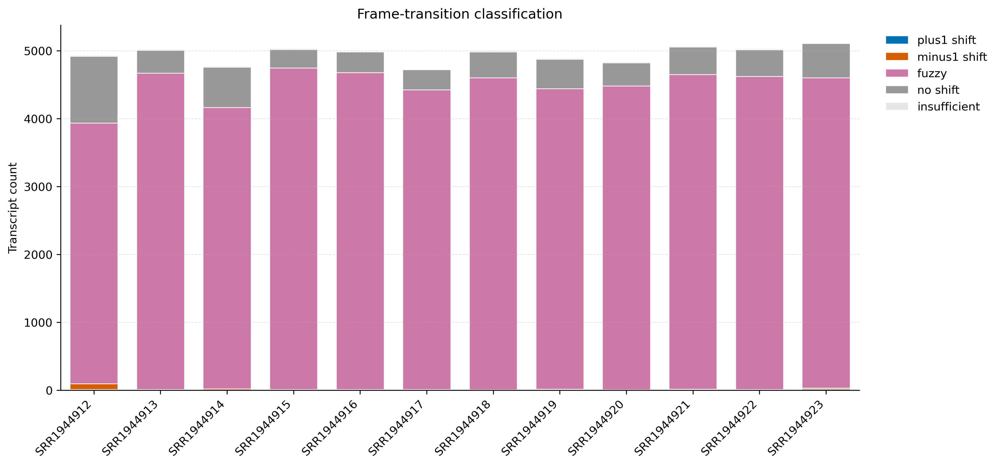
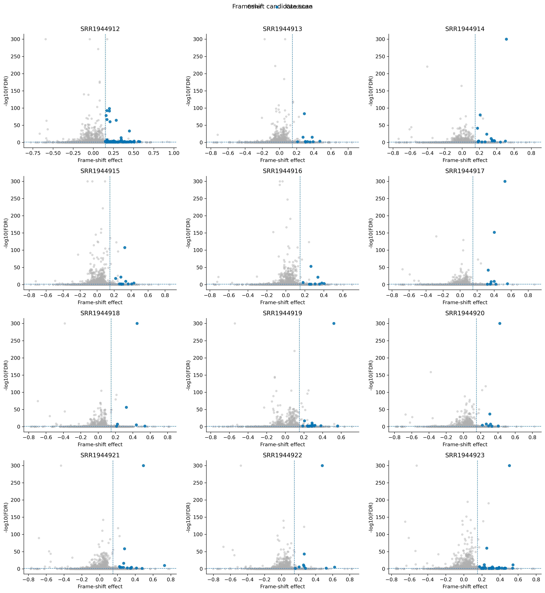
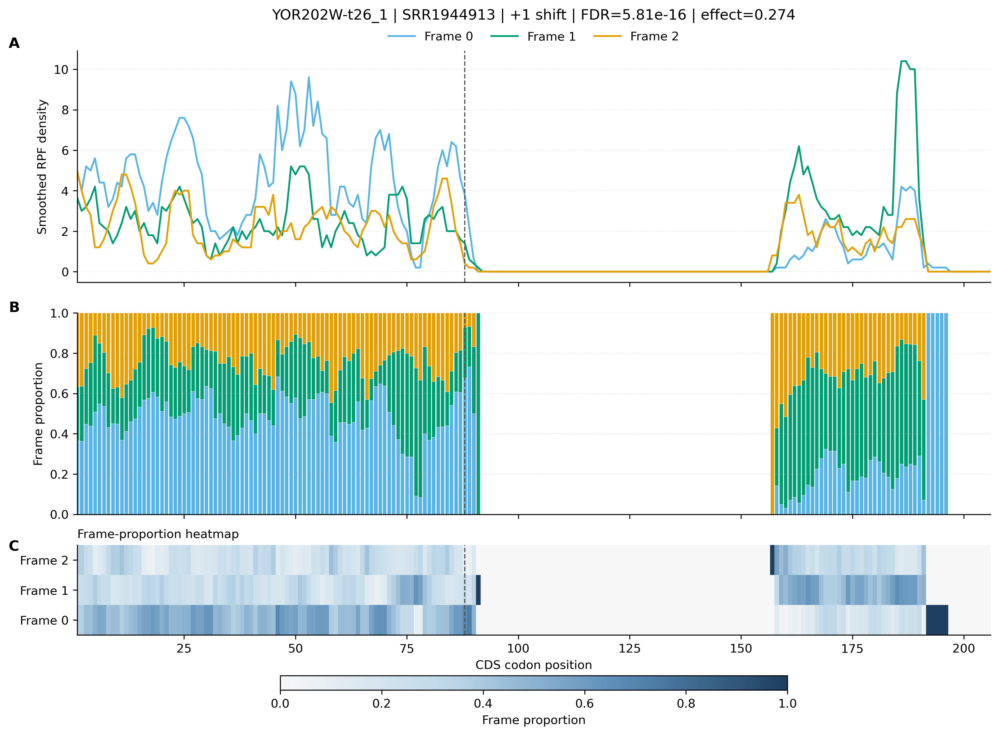

# 4.6.2 Frameshift detection

## Purpose

`rpf_Shift` scans the **merged frame-resolved RPF density file** and detects in-gene reading-frame switches, i.e. positions where the ribosome occupancy abruptly changes from one codon frame to another. Such switches are the signature of **programmed ribosomal frameshifting (PRF)**, but they can also arise from assembly/annotation artefacts, RNA editing, or read-mapping issues, so every candidate should be inspected manually.

The analysis is performed sample by sample in five steps:

1. **Filtering** – keep transcripts with enough RPF density (`--min`) and trim a given number of codons after the TIS (`--tis`) and before the TTS (`--tts`).
2. **Pre-scan** – require a minimum 3-nt periodicity in the upstream region (`--pre-period`) so that only translated transcripts are scanned.
3. **Change-point scan** – for every eligible transcript, walk along the CDS with a codon step (`--scan-step`), test each position for a significant frame switch, and record the best split site.
4. **Candidate calling** – keep switches that satisfy the minimal effect size (`--min-shift`), minimal segment length (`--min-segment`) and RPF count (`--min-segment-reads`), and a significance threshold on the FDR (`--alpha`).
5. **Visualization** – export a classification-count barplot, an effect-size vs significance scatter, and one figure per candidate transcript (`--gene-fig`).

```text
rpf_Shift   # Detect in-gene reading-frame switches (programmed ribosomal frameshifts)
```

## Step 1: Run `rpf_Shift`

The input is the merged frame-resolved density file produced by `rpf_Merge` (see [4.2.1 RPF density merge](../../ribosome/merge.md)).

### 1.1 Parameters

| Parameter            | Required | Description                                                                                            |
| -------------------- | -------- | ------------------------------------------------------------------------------------------------------ |
| `-r`, `--rpf`        | Yes      | Input merged frame-resolved RPF density file (JSONL/JSONL.GZ/TXT).                                     |
| `-o`, `--output`     | Yes      | Output prefix.                                                                                          |
| `-t`, `--transcript` | No       | Optional transcript filter table (TXT).                                                                 |
| `-m`, `--min`        | No       | Minimum CDS RPF count required for a transcript to be scanned. Default `50`.                            |
| `--tis`              | No       | Number of CDS codons discarded after the translation initiation site (TIS). Default `10`.               |
| `--tts`              | No       | Number of CDS codons discarded before the translation termination site (TTS). Default `5`.              |
| `-s`, `--site`       | No       | Ribosomal site used for the frame-density analysis. Choices `E`, `P`, `A`. Default `P`.                 |
| `--pre-period`       | No       | Minimum percentage of reads in frame 0 used in the pre-scan filter. Default `45.0`.                     |
| `-p`, `--period`     | No       | Minimum percentage of reads expected in the shifted frame after the change point. Default `45.0`.       |
| `--min-shift`        | No       | Minimum increase of the shifted-frame proportion at a change point. Default `0.15`.                     |
| `--min-segment`      | No       | Minimum number of codon positions required on each side of a change point. Default `20`.                |
| `--min-segment-reads`| No       | Minimum total RPF count required on each side of a change point. Default `20.0`.                        |
| `--scan-step`        | No       | Codon step between candidate change points. Default `1`.                                                |
| `--alpha`            | No       | Maximum adjusted significance value (FDR) accepted for a candidate. Default `0.05`.                     |
| `--thread`           | No       | Number of sample-level worker threads. Default `1`.                                                     |
| `--remove-outlier`   | No       | Remove isolated extreme density pile-ups before scanning (recommended). Disabled by default.            |
| `--outlier-iqr`      | No       | IQR multiplier used for the global pile-up detection. Default `8.0`.                                    |
| `--outlier-window`   | No       | Number of neighboring codons used for local outlier confirmation. Default `5`.                          |
| `--outlier-local-fold`| No      | Minimum fold over the local background required for outlier removal. Default `10.0`.                    |
| `--smooth-window`    | No       | Centered codon window used for the candidate profile plots. Default `5`.                                |
| `--plot-bin-size`    | No       | Codon bin size used for the stacked frame-composition plots. Default `5`.                               |
| `--gene-plot-mode`   | No       | Layout of the per-candidate figure. Choices `bar`, `heatmap`, `both`. Default `both`.                   |
| `--gene-fig`         | No       | Figure format of the per-candidate plots. Choices `none`, `png`, `pdf`, `both`. Default `png`.          |
| `--max-gene-figures` | No       | Maximum number of candidate figures written; use `0` for all. Default `500`.                            |

### 1.2 Example

```bash
rpf_Shift \
    -r ../05.merge/sce1_rpf_merged.jsonl.gz \
    -o sce \
    -s P \
    -m 50 \
    --tis 10 \
    --tts 5 \
    --pre-period 45 \
    --period 45 \
    --min-shift 0.15 \
    --min-segment 20 \
    --min-segment-reads 20 \
    --scan-step 1 \
    --alpha 0.05 \
    --thread 12 \
    --remove-outlier \
    --smooth-window 5 \
    --plot-bin-size 1 \
    --gene-fig png \
    --max-gene-figures 500 \
    &> sce_frame_shift.log
```

### 1.3 Output

All output files are written to the current working directory with the given prefix (`sce` in the example above).

| Output                                     | Description                                                                                                                             |
| ------------------------------------------ | --------------------------------------------------------------------------------------------------------------------------------------- |
| `<prefix>_gene_periodicity.txt`            | Gene-level 3-nt periodicity table: per-transcript RPF counts and frame ratios (`Sample`, `name`, `PositionCount`, `Frame0/1/2Count`, `Frame0/1/2Ratio`). |
| `<prefix>_frame_shift_scan.txt`            | Per-position statistics of the change-point scan, one row per tested sample–transcript pair, including the best split site and its p-value. |
| `<prefix>_frame_shift_candidates.txt`      | Final frameshift candidates that passed all filters, one row per sample–transcript pair, with the shift site, direction (`+1`/`-1`), `ShiftEffect`, `RawPValue`, `ScanAdjustedPValue` and `FDR`. |
| `<prefix>_frame_shift_count.txt`           | Candidate count per sample and classification (`plus1_shift`, `minus1_shift`, `fuzzy`, `no_shift`, `insufficient`).                        |
| `<prefix>_frame_shift.outliers.txt`        | Outlier positions removed before the scan (`Sample`, `name`, `now_nt`, `codon`, `TotalDensity`, `GlobalCutoff`, ...). Only written with `--remove-outlier`. |
| `<prefix>_frame_shift.summary.json`        | Machine-readable run summary: tool version, parameter settings, per-sample candidate counts and the list of output files.                  |
| `<prefix>_frame_shift_count_plot.pdf/.png` | Stacked barplot of the candidate count by classification, one bar per sample.                                                             |
| `<prefix>_frame_shift_scatter.pdf/.png`    | Per-sample scatter of the frame-shift effect vs `-log10(FDR)` with candidates highlighted.                                                 |
| `<prefix>_frame_shift_geneplots/`          | Per-candidate gene figures (one PNG/PDF per sample–transcript pair) showing the frame-density profiles.                                    |

### Example output figures

**1. Candidate count by shift type**

{ width="900" }

The stacked barplot summarizes, for every sample, how many transcripts were assigned to each class: `plus1_shift`, `minus1_shift` (significant candidates), `fuzzy` (a frame switch was detected but it is ambiguous or below the effect threshold), `no_shift` (no switch found), and `insufficient` (not enough reads/positions to test). In this dataset, the vast majority of transcripts are classified as `fuzzy` (~3,800–4,700 per sample) or `no_shift` (~270–990), while only 6–95 candidates per sample are significant. **SRR1944912 stands out with 95 candidates (86 `minus1_shift` + 9 `plus1_shift`)**, far more than any other sample (6–31). This strongly suggests a systematic bias in that sample (e.g. read-length composition or P-site calibration) rather than real biological frameshifting; such samples should be quality-checked before biological interpretation.

**2. Effect-size vs significance scatter**

{ width="900" }

Each panel corresponds to one sample. The x-axis is the frame-shift effect (increase of the shifted-frame proportion at the change point) and the y-axis is `-log10(FDR)`; the dashed lines mark the `--min-shift` (0.15) and `--alpha` (0.05) thresholds. Candidates (`plus1_shift`/`minus1_shift`) are highlighted in blue and sit in the upper-right region (effect > 0.15 and FDR < 0.05), whereas non-significant switches stay grey in the lower-left region. The plot is a quick way to see how strongly the effect size and significance co-vary per sample.

**3. Per-candidate gene plot (`YOR202W`, HIS3)**

{ width="900" }

For every candidate, `rpf_Shift` writes a three-panel figure: **(A)** smoothed RPF density of the three reading frames along the CDS, **(B)** a 100% stacked barplot of the frame composition (bin size = `--plot-bin-size`), and **(C)** a heatmap of the frame proportion. The vertical dashed line marks the detected shift site. The title reports the transcript, sample, shift direction, FDR and effect. Here `YOR202W` (HIS3) is called as a `+1 shift` in SRR1944913: before the change point (codon ~167) almost all reads are in frame 0, while downstream the occupancy switches to frame +1, with a highly significant adjusted p-value (FDR = 5.8e-16). Because the same `+1` switch is recovered in many other samples of this dataset, this is a reproducible candidate worth biological follow-up (e.g. manual inspection of the read alignments around the site).

## Notes

- The classification `fuzzy` refers to change points that are detected but do not reach the effect or FDR thresholds; increasing `--min-shift` or lowering `--alpha` will make the calling more stringent.
- `--remove-outlier` is recommended: without it, single high-coverage pile-ups (e.g. RT-stops or mis-mapped reads) can create spurious "switches".
- `rpf_Shift` expects a **frame-resolved** density file (each position split by the P-site frame). If the input was generated with `--offset-mode` other than P-site, set `-s` accordingly so the frames are consistent.
- For follow-up analyses (e.g. comparing shift sites across samples), the `ScanAdjustedPValue` and `FDR` columns of `_frame_shift_candidates.txt` already account for multiple testing.
