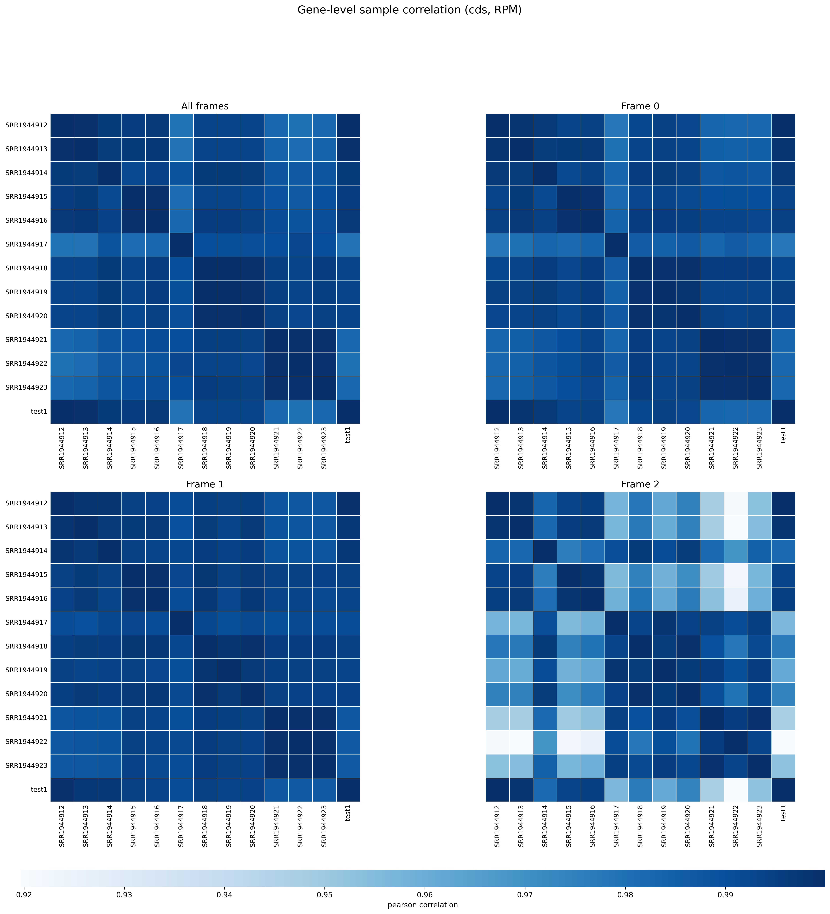
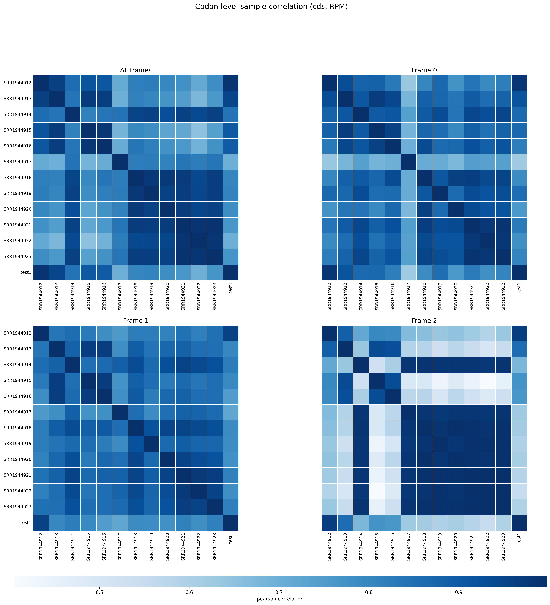

# 4.5.9 Correlation

## Purpose

Calculate sample correlation from a merged density file. Correlation is computed at both gene level and RPF-position (codon-level) level, and reports matrices for all frames combined and for each reading frame (0/1/2) separately.

```text
rpf_Corr    # Calculate gene-level and RPF-position-level sample correlation matrices and draw heatmaps
```

This step is commonly used to evaluate replicate consistency and to detect outlier samples. Both current JSONL density files and the legacy TXT density files are supported.

## Step 1: Run `rpf_Corr`

Calculate sample correlation matrices from a merged density file.

### 1.1 Parameters

| Parameter | Required | Description |
|---|---|---|
| `-r`, `--rpf` | Yes | Input RPF density file in JSONL or TXT format, usually the merged density file generated by `rpf_Merge`. |
| `-o`, `--output` | Yes | Output prefix. |
| `-t`, `--transcript` | No | Optional transcript filter table in TXT format. When provided, `transcript_id` is used if available. |
| `--level` | No | Correlation level to calculate. Choices are `gene`, `rpf`, and `both`. Default is `both`. |
| `-n`, `--normal` | No | Normalize RPF counts to RPM before correlation. Disabled by default. |
| `--method` | No | Correlation method. Choices are `pearson`, `spearman`, and `kendall`. Default is `pearson`. |
| `--region` | No | Transcript region used for both gene-level and codon-level correlation. Choices are `all`, `5utr`, `cds`, and `3utr`. Default is `cds`. |
| `-m`, `--min` | No | Retain genes with total raw RPF count >= this value. Default is `0`. |
| `--cmap` | No | Heatmap colormap. Default is `Blues`. |
| `--figure-width` | No | Optional figure width in inches. The figure width is inferred from the number of samples when omitted. |
| `--figure-height` | No | Optional figure height in inches. The figure height is inferred from the number of samples when omitted. |

### 1.2 Example

First, move to the working directory:

```bash
cd ./sce/4.ribo-seq/5.riboparser/09.correlation/
```

Then run `rpf_Corr` on the merged RPF density file:

```bash
rpf_Corr \
    -r ../05.merge/sce_rpf_merged.jsonl.gz \
    --region cds \
    -m 50 \
    -n \
    -o sce \
    &> sce.log
```

### 1.3 Output

| Output | Description |
|---|---|
| `<prefix>_gene_corr_frame.txt` | Gene-level correlation matrix using all frames combined. |
| `<prefix>_gene_corr_f0.txt` | Gene-level frame 0 correlation matrix. |
| `<prefix>_gene_corr_f1.txt` | Gene-level frame 1 correlation matrix. |
| `<prefix>_gene_corr_f2.txt` | Gene-level frame 2 correlation matrix. |
| `<prefix>_gene_correlation_plot.pdf` / `.png` | Gene-level correlation heatmap with four panels (all frames and frames 0/1/2). |
| `<prefix>_rpf_corr_frame.txt` | RPF-position-level correlation matrix using all frames combined. |
| `<prefix>_rpf_corr_f0.txt` | RPF-position-level frame 0 correlation matrix. |
| `<prefix>_rpf_corr_f1.txt` | RPF-position-level frame 1 correlation matrix. |
| `<prefix>_rpf_corr_f2.txt` | RPF-position-level frame 2 correlation matrix. |
| `<prefix>_rpf_correlation_plot.pdf` / `.png` | RPF-position-level correlation heatmap with four panels (all frames and frames 0/1/2). |
| `<prefix>_corr.feature_summary.txt` | Per-level, per-frame summary of input and filtered feature counts. |
| `<prefix>_corr.summary.json` | Machine-readable summary of the run, including tool version, samples, and settings. |

#### Example output figures

The two heatmaps below are generated by the example command in Step 1.2. Each figure is a 2×2 panel grid: the top-left panel is the correlation matrix using all frames combined, and the remaining panels are the matrices for reading frames 0, 1, and 2. Each row and column corresponds to one sample, and the color depth of each cell indicates the correlation coefficient between the two samples (default `Blues` colormap, darker = higher correlation; the diagonal is the sample correlated with itself and is 1.0 by definition).

**Gene-level correlation (`<prefix>_gene_correlation_plot.png`)**

{ width="900" }

- The color depth of each cell indicates the correlation coefficient between the corresponding pair of samples across all retained genes (here run with `--method pearson`); the dark cells on the diagonal are samples correlated with themselves (always 1.0).
- This run contains 13 samples (SRR1944912–SRR1944923 plus test1). Gene-level correlations are very high overall: every pairwise coefficient is above 0.98, indicating that the samples are highly consistent at the whole-gene density level, i.e. good biological replicate agreement.
- If a whole row is visibly lighter than the others, that sample correlates weakly with all other samples at the gene level and is a potential outlier; we recommend checking it further with PCA/clustering.

**RPF-position-level (codon-level) correlation (`<prefix>_rpf_correlation_plot.png`)**

{ width="900" }

- Unlike gene-level correlation, this level first aligns the RPF density of each gene by codon position and then correlates the position-wise density vectors, so it captures local density differences and is stricter and more noise-sensitive than the gene level.
- In this run, rpf-level correlations are generally lower than gene-level ones: most pairwise coefficients fall between 0.7 and 0.99. SRR1944917 and SRR1944922 correlate relatively weakly with the other samples (about 0.65–0.71), suggesting that their RPF position distributions differ somewhat from the rest.
- When the rpf-level heatmap is visibly lighter than the gene-level one, the samples differ in their codon-position-level distributions; we recommend combining Periodicity / Metaplot results to determine whether this is caused by read shifting, frame offset, or local noise.

## Notes

- Biological replicates should usually show high correlation.
- Low correlation may indicate batch effects, poor alignment, poor periodicity, low read depth, or strong biological heterogeneity.
- Gene-level correlation summarizes CDS-level sample similarity, while RPF-position-level correlation is more sensitive to local density differences and is stricter.
- `-n`/`--normal` normalizes each sample to RPM before correlation, which is useful when samples differ in sequencing depth.
- Heatmap panels are arranged as a 2×2 grid: all frames combined, then frame 0/1/2.
