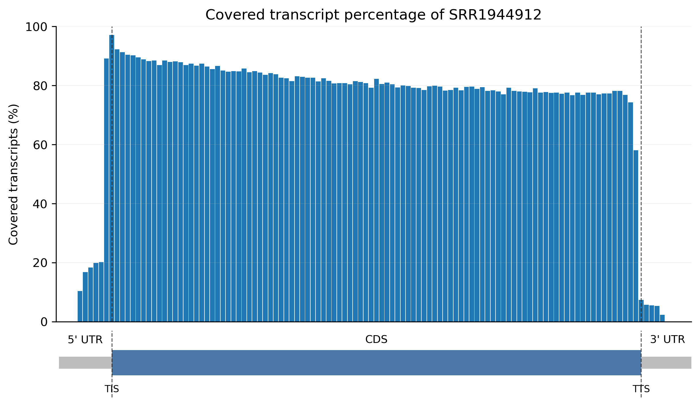
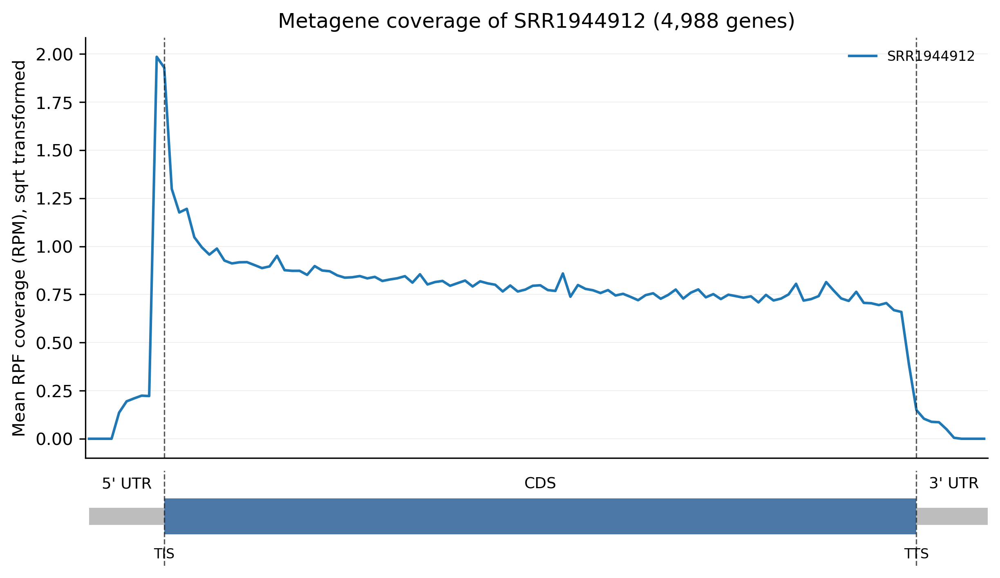
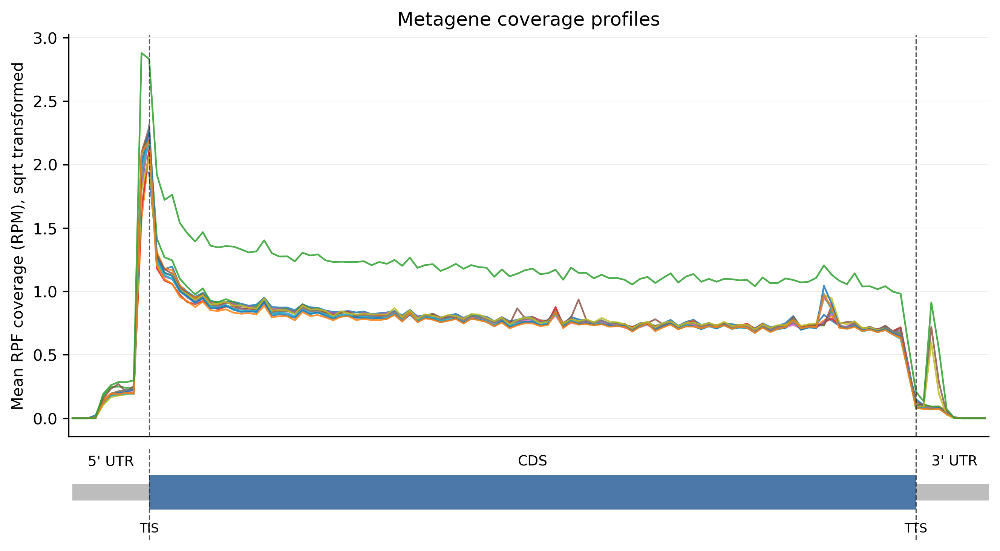
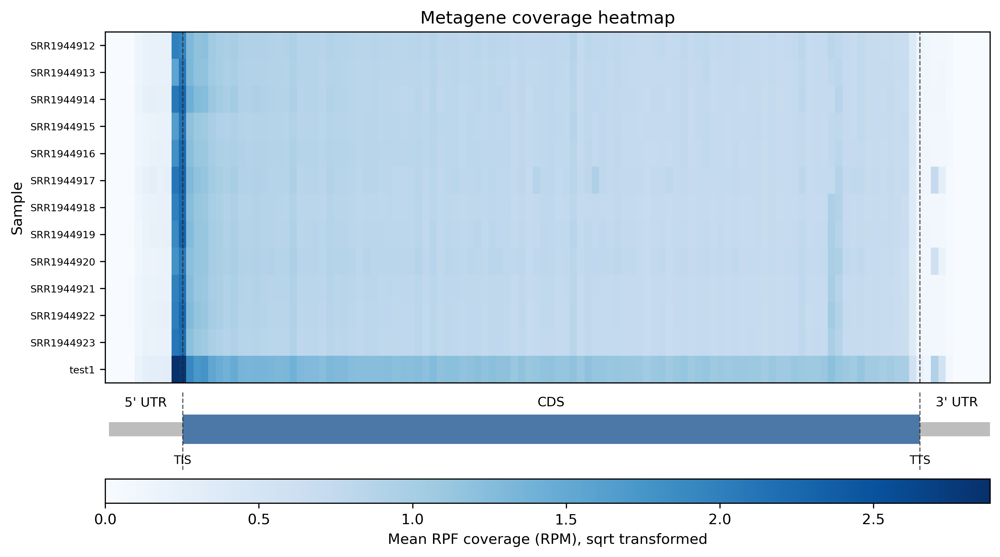
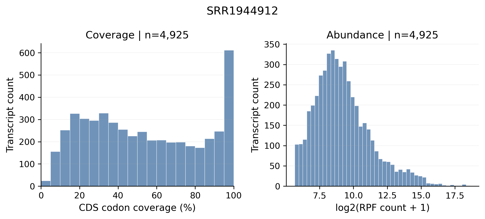
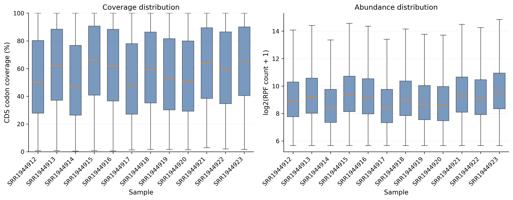

# 4.5.8 Coverage

## Purpose

Analyze how Ribo-seq or RNA-seq density is distributed across normalized 5' UTR, CDS, and 3' UTR regions. Coverage analysis helps evaluate library quality, nuclease bias, mapping artifacts, and whether gene-level quantification can be trusted.

```text
rpf_Coverage     # Normalize transcripts into bins and draw metagene coverage line plots, heatmaps, and barplots
rpf_Percent      # Calculate transcript-level CDS coverage percentages and draw histograms/boxplots
merge_coverage   # Merge mean coverage tables from multiple samples or analyses
```

Both current JSONL density files and the legacy TXT density files are supported. The workflow normalizes 5' UTR, CDS, and 3' UTR into a user-defined number of bins (`-b`), aggregates the binned density per sample, and outputs coverage tables together with line plots, a combined sample heatmap, and optional covered-transcript percentage barplots.

## Step 1: Run `rpf_Coverage`

Normalize transcripts into bins and generate metagene coverage profiles from a merged density file.

### 1.1 Parameters

| Parameter | Required | Description |
|---|---|---|
| `-r`, `--rpf` | Yes | Input RPF density file in JSONL or TXT format, usually the merged density file generated by `rpf_Merge`. |
| `-o`, `--output` | Yes | Output prefix. |
| `-t`, `--transcript` | No | Optional transcript filter table in TXT format. When provided, `transcript_id` is used if available. |
| `-f`, `--frame` | No | Reading frame used for coverage calculation. Choices are `0`, `1`, `2`, and `all`. Default is `all`. |
| `--site` | No | Ribosomal site used for codon-level density shifting. Choices are `E`, `P`, `A`, and `all`. Default is `P`. |
| `-m`, `--min` | No | Retain transcripts with at least this sample-specific CDS RPF count. Default is `50`. |
| `--set` | No | Transcript-region filtering strategy. `union` treats missing region bins as zero; `intersect` keeps only transcripts with all requested regions. Default is `union`. |
| `--thread` | No | Reserved for compatibility; the current coverage aggregation is vectorized. Default is `1`. |
| `-b`, `--bin` | No | Bin numbers for 5' UTR, CDS, and 3' UTR, formatted as `utr5,cds,utr3`. Default is `30,100,30`. |
| `-n`, `--normal` | No | Normalize RPF counts to RPM before coverage aggregation. Disabled by default. |
| `--mode` | No | Coverage plot type. `both` draws line plots and the combined sample heatmap. Choices are `line`, `heatmap`, `both`, and `all`. Default is `both`. |
| `--plot-transform` | No | Transform plotted density values without changing output tables. Choices are `none`, `sqrt`, `log`, `log1p`, `log2`, `log10`. `log` is an alias of `log1p`. Default is `none`. |
| `--scale` | No | Heatmap scaling method. `row` applies row-wise min-max scaling to emphasize each sample profile shape. Choices are `none` and `row`. Default is `none`. |
| `--bar` | No | Draw covered-transcript percentage barplots. Disabled by default. |
| `--remove-outlier`, `--outlier` | No | Remove extreme transcript-bin RPF pileups before aggregation. Useful for rRNA-like or mis-mapped fragments. Disabled by default. |
| `--outlier-iqr` | No | IQR multiplier for extreme pileup detection. Default is `8.0`. |
| `--outlier-window` | No | Number of neighboring bins on each side used to estimate local background. Default is `5`. |
| `--outlier-local-fold` | No | Minimum fold over local background for dynamic isolated-pileup filtering. Default is `10.0`. |
| `--gene-heatmap`, `--heat` | No | Deprecated compatibility option and will be ignored. The combined sample heatmap is controlled by `--mode heatmap/both/all`. |

### 1.2 Example

```bash
cd ./sce/4.ribo-seq/08.coverage/

rpf_Coverage \
    -t /path/to/norm/sce.genepred \
    -r ../05.merge/sce_rpf_merged.jsonl.gz \
    -m 50 \
    --outlier \
    -b 10,100,10 \
    -n \
    --bar \
    --plot-transform sqrt \
    -o sce \
    &> sce.log
```

### 1.3 Output

| Output | Description |
|---|---|
| `<prefix>_metagene_coverage.txt` | Binned metagene coverage table for all samples. |
| `<prefix>_metagene_coverage_percentage.txt` | Covered-transcript percentage table. Written when `--bar` is used. |
| `<prefix>_coverage.sample_summary.txt` | Per-sample summary of the coverage aggregation. |
| `<prefix>_coverage.outliers.txt` | Outlier table listing removed pileup points. Only written when `--remove-outlier` is enabled. |
| `<prefix>_coverage.summary.json` | Machine-readable summary of the run, including the output file list. |
| `<prefix>_coverage_line_plot.pdf` / `.png` | Combined average coverage line plot over all samples. |
| `<prefix>_{sample}_coverage_line_plot.pdf` / `.png` | Per-sample coverage line plot (one file per sample). |
| `<prefix>_coverage_heatmap.pdf` / `.png` | Heatmap of all sample coverage profiles, drawn when `--mode heatmap/both/all`. |
| `<prefix>_{sample}_coverage_bar_plot.pdf` / `.png` | Per-sample covered-transcript percentage barplot (one file per sample). Written when `--bar` is used. |

#### Example output figures

Coverage barplot for a single sample (`sce_SRR1944912_coverage_bar_plot.png`). The x-axis shows the normalized 5' UTR, CDS, and 3' UTR bins; the y-axis shows the average RPF density per bin. In a high-quality library, the CDS should show uniform coverage, while peaks at the translation initiation site (TIS) and translation termination site (TTS) are expected Ribo-seq signals caused by ribosome stalling:

{ width="900" }

Coverage line plot for a single sample (`sce_SRR1944912_coverage_line_plot.png`). It provides the same information as the barplot but with a continuous line, which makes it easier to inspect the shape of the 5' UTR, CDS, and 3' UTR profiles and to compare subtle differences between regions:

{ width="900" }

Combined coverage line plot for all samples (`sce_coverage_line_plot.png`). All sample profiles are overlaid in one figure, which allows a direct cross-sample comparison of the overall coverage shape. Consistent profiles suggest similar library quality, whereas one sample deviating from the others may indicate a library-specific bias:

{ width="900" }

Heatmap of the coverage profiles for all samples (`sce_coverage_heatmap.png`). Each row is a sample and each column is a normalized region bin. Row-wise scaling (`--scale row`) highlights the shape of each profile; bright bands at the TIS/TTS and a uniform CDS block indicate good ribosome footprint enrichment:

{ width="900" }

## Step 2: Run `rpf_Percent`

Calculate the percentage of valid CDS codons covered by RPFs for each transcript and sample.

### 2.1 Parameters

| Parameter | Required | Description |
|---|---|---|
| `-r`, `--rpf` | Yes | Input RPF density file in JSONL, JSONL.GZ, TXT, or TSV format. |
| `-o`, `--output` | No | Output prefix. Default: input RPF filename without the density suffix. |
| `-t`, `--transcript` | No | Optional transcript annotation or ID list. The `transcript_id` column is used when present; otherwise the first column is used. |
| `-f`, `--frame` | No | Reading frame used for coverage calculation. Choices are `0`, `1`, `2`, and `all`. Default is `all`. |
| `-m`, `--min` | No | Minimum sample-specific CDS RPF count required for a transcript. Default is `50`. |
| `--tis` | No | Number of CDS codons removed after TIS. Default is `0`. |
| `--tts` | No | Number of CDS codons removed before TTS. Default is `0`. |
| `-n`, `--normal` | No | Use RPM instead of raw RPF count in abundance plots and summaries. Disabled by default. |
| `--fig-format` | No | Figure output format. Choices are `png`, `pdf`, and `both`. Default is `png`. |
| `--dpi` | No | PNG resolution. Default is `300`. |
| `--font-size` | No | Base figure font size. Default is `11.0`. |

### 2.2 Example

```bash
rpf_Percent \
    -r ../05.merge/sce_rpf_merged.jsonl.gz \
    -m 50 \
    -f all \
    -o sce \
    &> sce.log
```

### 2.3 Output

| Output | Description |
|---|---|
| `<prefix>_gene_coverage_percent.txt` | Transcript-level CDS coverage percentage table. |
| `<prefix>_gene_coverage_summary.txt` | Coverage summary table. |
| `<prefix>_{sample}_coverage_histogram.png` / `.pdf` | Per-sample coverage percentage histogram (one file per sample). |
| `<prefix>_coverage_boxplot.png` / `.pdf` | Coverage percentage boxplot for all samples. |

#### Example output figures

Coverage percentage histogram for a single sample (`sce_SRR1944912_coverage_histogram.png`). The x-axis is the percentage of valid CDS codons covered by RPFs per transcript, and the y-axis is the number of transcripts. A library with a strong right-skewed distribution (most transcripts clustered near high coverage percentages) indicates good CDS coverage and supports reliable gene-level quantification:

{ width="900" }

Coverage percentage boxplot for all samples (`sce_coverage_boxplot.png`). Each box summarizes the distribution of transcript-level coverage percentages in one sample. Samples with a higher median and a narrow box have more uniform coverage; large inter-sample differences suggest batch effects or library quality problems:

{ width="900" }

## Step 3: Run `merge_coverage`

Merge mean coverage files from multiple samples or analyses into a single table.

### 3.1 Parameters

| Parameter | Required | Description |
|---|---|---|
| `-l`, `--list` | Yes | Input coverage files, e.g. `*_mean_coverage.txt`. Multiple files can be provided. |
| `-o`, `--output` | Yes | Output prefix. The merged table is written to `<prefix>_mean_coverage.txt`. |

### 3.2 Example

```bash
merge_coverage \
    -l *_mean_coverage.txt \
    -o sce
```

### 3.3 Output

| Output | Description |
|---|---|
| `<prefix>_mean_coverage.txt` | Merged coverage table, concatenated from all input files, with columns `Sample`, `Region`, `Bins`, `Density`. |

## Notes

- Uniform CDS coverage supports reliable gene-level quantification, while strong 5' or 3' bias may reflect RNA degradation, nuclease bias, mapping artifacts, or library-specific structure.
- `--plot-transform` only changes how density values are displayed in figures; it does not alter the output tables.
- `--gene-heatmap` / `--heat` is deprecated and ignored. Use `--mode heatmap` or `--mode both` to draw the combined sample heatmap.
- Use consistent binning and filtering settings (`-b`, `-m`, `--set`) across samples when comparing coverage profiles.
