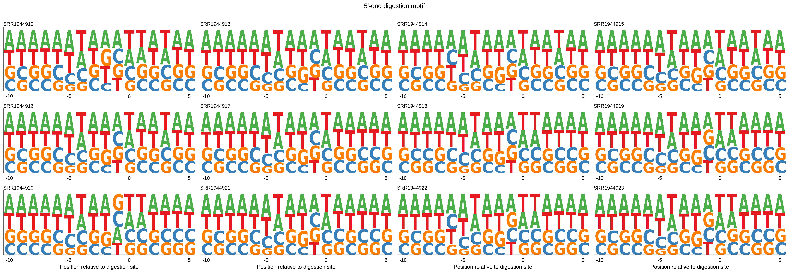
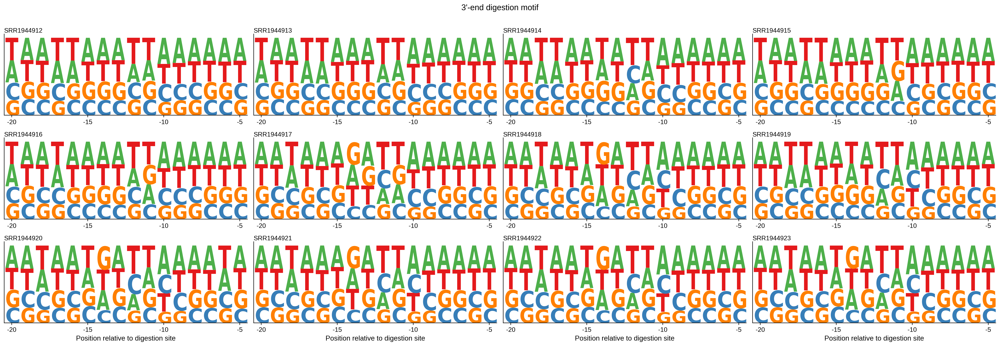

# 4.5.2 Enzymatic bias

## Purpose

`rpf_Digest` detects 5' and 3' end sequence preferences around read ends. These patterns can reflect nuclease digestion, ligation, or library-construction bias.

This step is useful because strong end-sequence bias can affect local RPF density and may mimic codon-level pausing signals.

The digestion-bias workflow is divided into two steps:

```text
Step 1: Run rpf_Digest for each sample
Step 2: Merge digestion results
```

## Input files

| Input | Description |
|---|---|
| BAM file | Filtered BAM file generated by `rpf_Check` (Step 1 of 4.5.1), such as `*.bam` under `01.qc/`. |
| Transcript annotation | Normalized transcript annotation file, usually `gene.norm.txt` generated by `rpf_Reference`. |
| Transcript FASTA | Normalized transcript sequence file, usually `gene.norm.rna.fa` generated by `rpf_Reference`. |
| Read length range | RPF read length range to retain (`-m` / `-M`). For Ribo-seq, this is often around 27--33 nt. |

## Step 1: Run `rpf_Digest`

### 1.1 Parameters

| Parameter | Required | Description |
|---|---|---|
| `-t / --transcript` | Yes | Input transcript annotation file generated by `rpf_Reference`. |
| `-s / --sequence` | Yes | Input transcript sequence file in FASTA format. |
| `-b / --bam` | Yes | Input BAM alignment file. |
| `-o / --output` | Yes | Output file prefix. |
| `-l / --longest` | No | Only retain the transcript with the longest CDS per gene. Disabled by default. |
| `-m / --min` | No | Minimum read length retained. Default is `20` nt. |
| `-M / --max` | No | Maximum read length retained. Default is `100` nt. |
| `--scale` | No | Scale the digestion-site motif matrix and generate the scaled digestion-site plot. Disabled by default. |
| `--thread` | No | Number of worker processes for indexed BAM input. Default is `1`. |

### 1.2 Example

First, move to the working directory:

```bash
cd ./sce/4.ribo-seq/5.riboparser/02.digestion/
```

Then run `rpf_Digest` for each sample on its filtered BAM file under `../01.qc`:

```bash
for bam in ../01.qc/*.bam
do
    prefix_name=$(basename ${bam} .bam)

    rpf_Digest \
        -b ${bam} \
        -t ../../../1.reference/norm/gene.norm.txt \
        -s ../../../1.reference/norm/gene.norm.rna.fa \
        -o ${prefix_name} \
        -m 27 \
        -M 33 \
        --thread 8 \
        --scale \
        &> ${prefix_name}.log
done
```

### 1.3 Output

| Output | Description |
|---|---|
| `<prefix>_digestion_sites.txt` | 5' and 3' end frame counts by RPF length (`5end_frame1-3`, `3end_frame1-3`). |
| `<prefix>_digestion_sites_plot.pdf` | Heatmap of 5' and 3' end frame distribution across RPF lengths. |
| `<prefix>_scaled_digestion_sites_plot.pdf` | Scaled digestion-site plot, generated when `--scale` is used. |
| `<prefix>_5end_counts.txt` | 5' end nucleotide count table. |
| `<prefix>_5end_pwm.txt` | 5' end nucleotide PWM table. |
| `<prefix>_5end_seqlogo2.pdf` | 5' end sequence logo. |
| `<prefix>_3end_counts.txt` | 3' end nucleotide count table. |
| `<prefix>_3end_pwm.txt` | 3' end nucleotide PWM table. |
| `<prefix>_3end_seqlogo2.pdf` | 3' end sequence logo. |
| `<prefix>.log` | Running log if redirected by the user. |

#### Example output figures

The sequence logos show the nucleotide preference around the 5' and 3' read ends:

{ width="900" }

{ width="900" }

## Step 2: Merge digestion results

`merge_digestion` merges the 5' or 3' digestion PWM files from multiple samples into a single table.

### 2.1 Parameters

| Parameter | Required | Description |
|---|---|---|
| `-l / --list` | Yes | Input digestion PWM files. The file names must end with `_5end_pwm.txt` or `_3end_pwm.txt`, otherwise the command exits with an error. Multiple files can be provided. |
| `-o` | Yes | Output prefix. The output table is `<prefix>_reads_digestion.txt`. |

### 2.2 Example

Merge the 5' and 3' digestion PWM files of all samples:

```bash
merge_digestion \
    -l *_5end_pwm.txt *_3end_pwm.txt \
    -o RIBO
```

### 2.3 Output

| File | Description |
|---|---|
| `RIBO_reads_digestion.txt` | Merged digestion motif table across samples. |
| `RIBO_5end_seqlogo.pdf` / `RIBO_5end_seqlogo.png` | Merged 5' end sequence logos across samples (one row per sample). |
| `RIBO_3end_seqlogo.pdf` / `RIBO_3end_seqlogo.png` | Merged 3' end sequence logos across samples (one row per sample). |

#### Example output figures

The merged sequence logos show the nucleotide preference around the 5' and 3' read ends across all samples (one row per sample):

{ width="900" }

{ width="900" }

## Notes

- Strong nucleotide preference around read ends suggests digestion or ligation bias.
- Check both 5' and 3' end patterns before interpreting codon-level pausing signals.
- Use the same read-length range as downstream Ribo-seq density generation whenever possible.
- The `-l` input files of `merge_digestion` must end with `_5end_pwm.txt` or `_3end_pwm.txt`.
