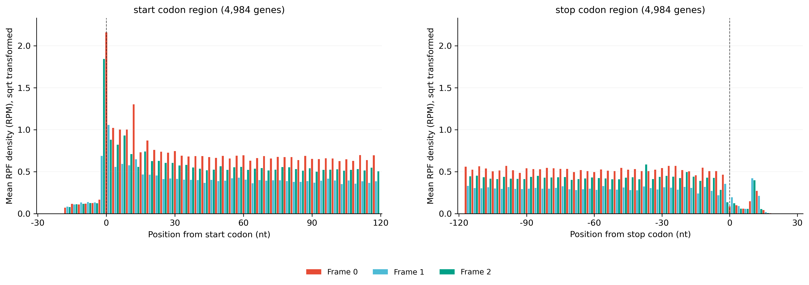
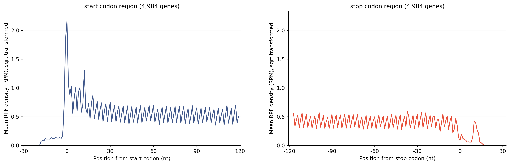
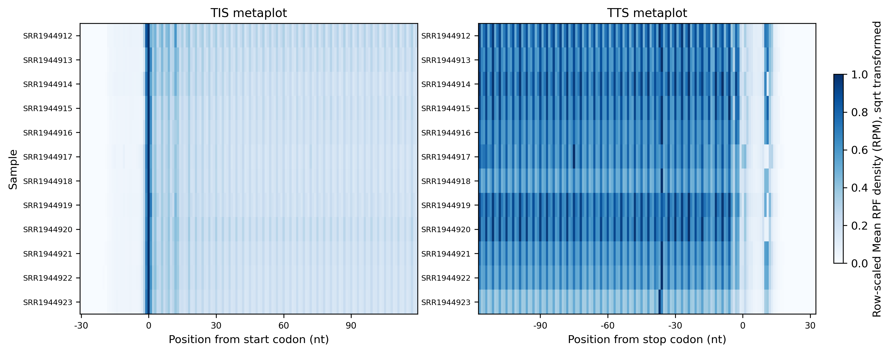

# 4.5.7 Metaplot

## Purpose

Generate metagene profiles around translation initiation sites (TIS) and translation termination sites (TTS) from a merged RPF density file, and optionally merge metaplot tables from multiple samples or analyses. Metaplot analysis helps evaluate positional density patterns, offset quality, initiation/termination enrichment, and possible boundary artifacts.

```text
rpf_Metaplot     # Calculate TIS/TTS metaplot profiles and draw per-sample figures + heatmap
merge_metagene   # Merge *_tis_tts_metaplot.txt tables from multiple samples or analyses
```

Both current JSONL density files and the legacy TXT density files are supported. The workflow aligns reads around start/stop codons, aggregates the density over a user-defined window (`--utr5` / `--cds` / `--utr3`), and outputs per-sample bar or line figures together with a heatmap of all samples.

## Step 1: Run `rpf_Metaplot`

Calculate metaplot profiles around TIS/TTS from a merged density file.

### 1.1 Parameters

| Parameter | Required | Description |
|---|---|---|
| `-r`, `--rpf` | Yes | Input RPF density file in JSONL or TXT format, usually the merged density file generated by `rpf_Merge`. |
| `-o`, `--output` | Yes | Output prefix. |
| `-t`, `--transcript` | No | Optional transcript filter table in TXT format. When provided, `transcript_id` is used if available. |
| `-m`, `--min` | No | Retain transcripts with at least this sample-specific CDS RPF count. Default is `50`. |
| `--utr5` | No | Number of codons upstream of the start codon. Default is `20`. |
| `--cds` | No | Number of CDS codons used around start and stop codons. Default is `50`. |
| `--utr3` | No | Number of codons downstream of the stop codon. Default is `20`. |
| `-n`, `--normal` | No | Normalize RPF counts to RPM before metaplot aggregation. Disabled by default. |
| `--mode` | No | Metaplot style for per-sample figures. Choices are `line`, `bar`, and `both`. Default is `bar`. |
| `--plot-transform` | No | Transform plotted density values without changing output tables. Choices are `none`, `sqrt`, `log`, `log1p`, `log2`, `log10`. `log` is an alias of `log1p`. Default is `none`. |
| `--scale` | No | Heatmap scaling method. `row` applies row-wise min-max scaling to emphasize each sample profile shape. Choices are `none` and `row`. Default is `none`. |
| `--remove-outlier` | No | Remove extreme gene-position RPF pileups before aggregation. Useful for rRNA-like or mis-mapped fragments. Disabled by default. |
| `--outlier-iqr` | No | IQR multiplier for extreme pileup detection. Default is `8.0`. |
| `--outlier-window` | No | Number of neighboring codons on each side used to estimate local background. Default is `5`. |
| `--outlier-local-fold` | No | Minimum fold over local background for dynamic isolated-pileup filtering. Default is `10.0`. |

### 1.2 Example

```bash
rpf_Metaplot \
    -t /path/to/norm/sce.genepred \
    -r ../05.merge/sce_rpf_merged.jsonl.gz \
    -n --scale row --remove-outlier --plot-transform sqrt \
    -m 50 --utr5 20 --cds 40 --utr3 20 --mode bar \
    -o sce \
    &> sce.log
```

### 1.3 Output

| Output | Description |
|---|---|
| `<prefix>_tis_tts_metaplot.txt` | Merged TIS/TTS metaplot table for all samples. |
| `<prefix>_metaplot.sample_summary.txt` | Per-sample summary of the metaplot aggregation. |
| `<prefix>_metaplot.outliers.txt` | Outlier table listing removed pileup points. Only written when `--remove-outlier` is enabled. |
| `<prefix>_{sample}_meta_{mode}_plot.pdf` / `.png` | Per-sample metaplot figure in the chosen mode (`bar` and/or `line`, one file per sample). |
| `<prefix>_metaplot_heatmap.pdf` / `.png` | Heatmap of all sample metaplot profiles. |
| `<prefix>_metaplot.summary.json` | Machine-readable summary of the run, including the output file list. |

#### Example output figures

Barplot of the TIS/TTS metaplot profile for a single sample (`sce_SRR1944912_meta_bar_plot.png`):

{ width="900" }

Lineplot of the TIS/TTS metaplot profile for a single sample (`sce_SRR1944912_meta_line_plot.png`):

{ width="900" }

Heatmap of the metaplot profiles for all samples (`sce_metaplot_heatmap.png`):

{ width="900" }

## Step 2: Run `merge_metagene`

Merge metaplot tables from multiple samples or analyses into a single table.

### 2.1 Parameters

| Parameter | Required | Description |
|---|---|---|
| `-l`, `--list` | Yes | Input metagene files, e.g. `*_tis_tts_metaplot.txt` or `*_metaplot.txt`. Multiple files can be provided. |
| `-o`, `--output` | Yes | Output prefix. The merged table is written to `<prefix>_metagene.txt`. |

### 2.2 Example

```bash
merge_metagene \
    -l *_tis_tts_metaplot.txt \
    -o sce
```

### 2.3 Output

| Output | Description |
|---|---|
| `<prefix>_metagene.txt` | Merged metagene table, concatenated from all input files, with columns `Sample`, `Meta`, `Nucleotide`, `Codon`, `Frame`, `Density`. |

## Notes

- Ribo-seq metaplots should show interpretable signal around TIS/TTS when offset correction is reliable.
- If no transcript covers the requested window, the window is automatically adjusted to the largest available one (the log reports the adjusted `--utr5` / `--cds` / `--utr3` values).
- `--plot-transform` only changes how density values are displayed in figures; it does not alter the output tables.
- Strong boundary artifacts may indicate nuclease bias, offset problems, or transcript-end mapping artifacts.
- Use the same `-m`, `--utr5`, `--cds`, and `--utr3` settings across samples when comparing metaplots.
