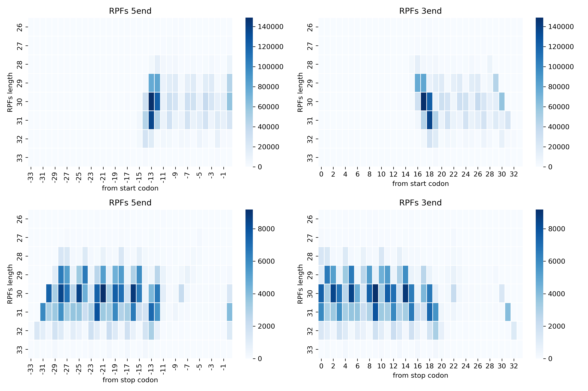
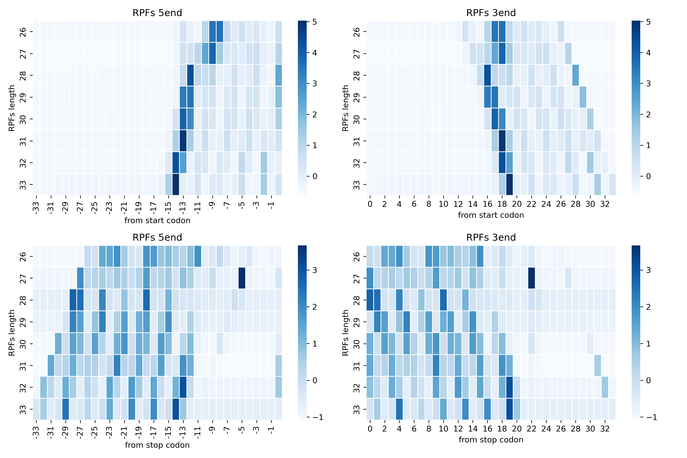
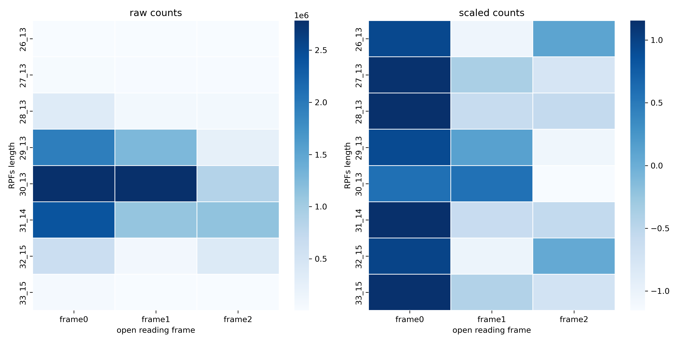

# 4.5.3 Offset table

## Purpose

An offset table maps each RPF read length to its P-site position relative to the read ends. It is required by `rpf_Density` and `rpf_TE` to assign the P-site of every RPF before metagene and periodicity analysis.

RiboParser provides three offset-generation commands plus a merging step:

```text
Step 1: Run rna_Offset (RNA-seq, uniform offset table)
Step 2: Run rpf_Offset (Ribo-seq, SSCBM + RSBM)
Step 3: Run rpf_Offset_RSBM (Ribo-seq, RSBM only)
Step 4: Merge offset tables
```

## Input files

| Input | Description |
|---|---|
| BAM file | Filtered BAM file generated by `rpf_Check` (Step 1 of 4.5.1), such as `*.bam` under `01.qc/`. |
| Transcript annotation | Normalized transcript annotation file, usually `gene.norm.txt` generated by `rpf_Reference`. Required by `rpf_Offset` and `rpf_Offset_RSBM`. |
| Read length range | RPF read length range to retain (`-m` / `-M`). For Ribo-seq, this is often around 27--33 nt. |

## Step 1: Run `rna_Offset`

`rna_Offset` generates a uniform RNA-seq offset table for a given read-length range. It does not need a BAM file or annotation, and simply assigns the same expected offset to every read length.

### 1.1 Parameters

| Parameter | Required | Description |
|---|---|---|
| `-o / --output` | Yes | Output file prefix. |
| `-m / --min` | No | Minimum read length retained. Default is `25` nt. |
| `-M / --max` | No | Maximum read length retained. Default is `151` nt. |
| `-e / --exp_offset` | No | Expected RNA-seq read offset. Default is `12` nt. |

### 1.2 Example

```bash
rna_Offset \
    -m 25 \
    -M 150 \
    -e 12 \
    -o ${prefix_name}
```

### 1.3 Output

| Output | Description |
|---|---|
| `<prefix>_offset.txt` | Uniform RNA-seq offset table (`frame0/1/2`, `rpfs`, `p_site`, `periodicity`, `ribo`). |

## Step 2: Run `rpf_Offset`

`rpf_Offset` detects the P-site offset for each RPF length from the read-end alignment around start and stop codons (SSCBM), then uses these offsets as seeds to refine the frame offset across the CDS (RSBM). It writes both SSCBM and RSBM offset tables and plots.

> **Note**: SSCBM relies on the sharp read-end alignment around start/stop codons, which depends on well-annotated UTRs. For species without UTRs (or with poor UTR annotation), SSCBM may fail to be detected or become highly unstable. In such cases, prefer `rpf_Offset_RSBM` (Step 3).

### 2.1 Parameters

| Parameter | Required | Description |
|---|---|---|
| `-t / --transcript` | Yes | Input transcript annotation file generated by `rpf_Reference`. |
| `-b / --bam` | Yes | Input BAM or SAM alignment file. |
| `-o / --output` | Yes | Output file prefix. |
| `-a / --aligner` | No | Read-end alignment used for SSCBM detection. Choices are `both`, `tis`, and `tts`. Default is `both`. |
| `-l / --longest` | No | Only retain the transcript with the longest CDS per gene. Disabled by default. |
| `-m / --min` | No | Minimum read length retained. Default is `27` nt. |
| `-M / --max` | No | Maximum read length retained. Default is `33` nt. |
| `-p / --exp_peak` | No | Expected RPF peak length. Default is `30` nt. |
| `-s / --shift` | No | P-site offset shift between adjacent read lengths. Default is `2` nt. |
| `--silence` | No | Suppress offset warning messages. Disabled by default. |
| `-d / --detail` | No | Output detailed offset information (TIS/TTS read-end profiles). Disabled by default. |

### 2.2 Example

```bash
for bam in ../01.qc/*.bam
do
    prefix_name=$(basename ${bam} .bam)

    rpf_Offset \
        -b ${bam} \
        -t ../../../1.reference/norm/gene.norm.txt \
        -o ${prefix_name} \
        -m 27 \
        -M 33 \
        -p 30 \
        -d \
        &> ${prefix_name}.log
done
```

### 2.3 Output

| Output | Description |
|---|---|
| `<prefix>_SSCBM_offset.txt` | SSCBM offset table (start/stop codon read-end alignment). |
| `<prefix>_SSCBM_offset.pdf` / `<prefix>_SSCBM_offset.png` | Heatmap of read-end alignment around start/stop codons. |
| `<prefix>_SSCBM_offset_scale.pdf` / `<prefix>_SSCBM_offset_scale.png` | Scaled heatmap of the SSCBM read-end alignment. |
| `<prefix>_RSBM_offset.txt` | RSBM offset table (frame offset across the CDS). |
| `<prefix>_RSBM_offset.pdf` / `<prefix>_RSBM_offset.png` | RSBM offset plot. |
| `<prefix>_tis_5end.txt` | 5' read-end profile around the start codon, generated when `-d` is used. |
| `<prefix>_tis_3end.txt` | 3' read-end profile around the start codon, generated when `-d` is used. |
| `<prefix>_tts_5end.txt` | 5' read-end profile around the stop codon, generated when `-d` is used. |
| `<prefix>_tts_3end.txt` | 3' read-end profile around the stop codon, generated when `-d` is used. |
| `<prefix>.log` | Running log if redirected by the user. |

#### Example output figures

SSCBM offset heatmap of read-end alignment around start/stop codons (raw values):

{ width="900" }

SSCBM offset heatmap after scaling (`_scale`):

{ width="900" }

## Step 3: Run `rpf_Offset_RSBM`

`rpf_Offset_RSBM` skips SSCBM detection and directly computes the RSBM offset table from the expected P-site offset (`-e`) and the expected RPF peak length (`-p`).

> **Note**: This is the recommended choice for species without UTRs (or with poor UTR annotation), where SSCBM cannot be reliably detected and `rpf_Offset` may produce unstable offset tables.

### 3.1 Parameters

| Parameter | Required | Description |
|---|---|---|
| `-t / --transcript` | Yes | Input transcript annotation file generated by `rpf_Reference`. |
| `-b / --bam` | Yes | Input BAM or SAM alignment file. |
| `-o / --output` | Yes | Output file prefix. |
| `-l / --longest` | No | Only retain the transcript with the longest CDS per gene. Disabled by default. |
| `-m / --min` | No | Minimum read length retained. Default is `27` nt. |
| `-M / --max` | No | Maximum read length retained. Default is `33` nt. |
| `-p / --exp_peak` | No | Expected RPF peak length. Default is `29` nt. |
| `-e / --exp_offset` | No | Expected P-site offset. Default is `11` nt. |
| `-s / --shift` | No | P-site offset shift between adjacent read lengths. Default is `2` nt. |
| `--silence` | No | Suppress offset warning messages. Disabled by default. |
| `-d / --detail` | No | Accepted for compatibility; the current RSBM pipeline always writes the merged RSBM table and plot. |

### 3.2 Example

```bash
rpf_Offset_RSBM \
    -b ${bam} \
    -t ../../../1.reference/norm/gene.norm.txt \
    -o ${prefix_name} \
    -p 29 \
    -e 11 \
    &> ${prefix_name}.log
```

### 3.3 Output

| Output | Description |
|---|---|
| `<prefix>_RSBM_offset.txt` | RSBM offset table (frame offset across the CDS). |
| `<prefix>_RSBM_offset.pdf` / `<prefix>_RSBM_offset.png` | RSBM offset plot. |
| `<prefix>.log` | Running log if redirected by the user. |

#### Example output figures

{ width="900" }

## Step 4: Merge offset tables

### 4.1 `merge_offset`

Merges RSBM or SSCBM offset tables from multiple samples into a single table. The input file names must end with `_RSBM_offset.txt` or `_SSCBM_offset.txt`, otherwise the command exits with an error.

| Parameter | Required | Description |
|---|---|---|
| `-l / --list` | Yes | Input offset files, such as `*_RSBM_offset.txt` or `*_SSCBM_offset.txt`. Multiple files can be provided. |
| `-o` | Yes | Output prefix. The output table is `<prefix>_offset.txt`. |

```bash
merge_offset -l *_RSBM_offset.txt -o RIBO_RSBM
merge_offset -l *_SSCBM_offset.txt -o RIBO_SSCBM
```

| File | Description |
|---|---|
| `RIBO_RSBM_offset.txt` | Merged RSBM offset table across samples. |
| `RIBO_SSCBM_offset.txt` | Merged SSCBM offset table across samples. |

### 4.2 `merge_offset_detail`

Merges the detailed TIS/TTS read-end profiles from multiple samples into a single table. Each sample must provide all four end files (`_tis_5end.txt`, `_tis_3end.txt`, `_tts_5end.txt`, `_tts_3end.txt`), which requires `rpf_Offset -d`.

| Parameter | Required | Description |
|---|---|---|
| `-l / --list` | Yes | Input end files, such as `*_tis_5end.txt`, `*_tis_3end.txt`, `*_tts_5end.txt`, and `*_tts_3end.txt`. |
| `-o` | Yes | Output prefix. The output table is `<prefix>_offset_end.txt`. |

```bash
merge_offset_detail -l *end.txt -o RIBO
```

| File | Description |
|---|---|
| `RIBO_offset_end.txt` | Merged read-end profile table across samples. |

## Notes

- `rpf_Offset` computes both SSCBM and RSBM tables: SSCBM offsets are used as seeds for the RSBM search, and the empirical fallback offset is `11 + peak_length - 30` when no SSCBM offset is available.
- `rpf_Offset_RSBM` skips SSCBM detection and relies on the expected P-site offset (`-e`, default 11 nt) and expected peak length (`-p`, default 29 nt). Use it when you want a fast RSBM table without scanning start/stop-codon neighborhoods, and it is the recommended choice for species without UTRs, where SSCBM is unreliable or unstable.
- `rna_Offset` is designed for RNA-seq data: it assigns the same uniform offset to every read length and reports `periodicity = 100`.
- Only `rpf_Offset -d` writes the four TIS/TTS end files; `merge_offset_detail` requires all four files per sample.
- `merge_offset` and `merge_offset_detail` validate input file names strictly and exit with an error if the suffixes do not match.
