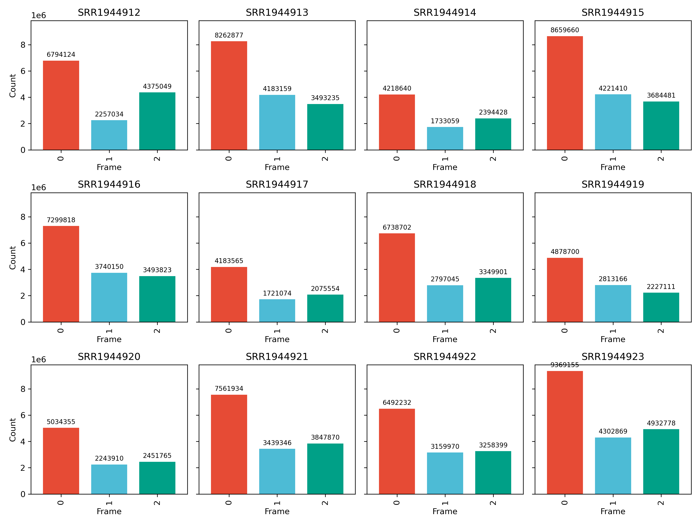
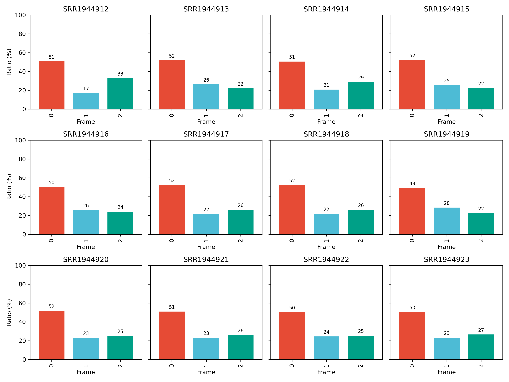
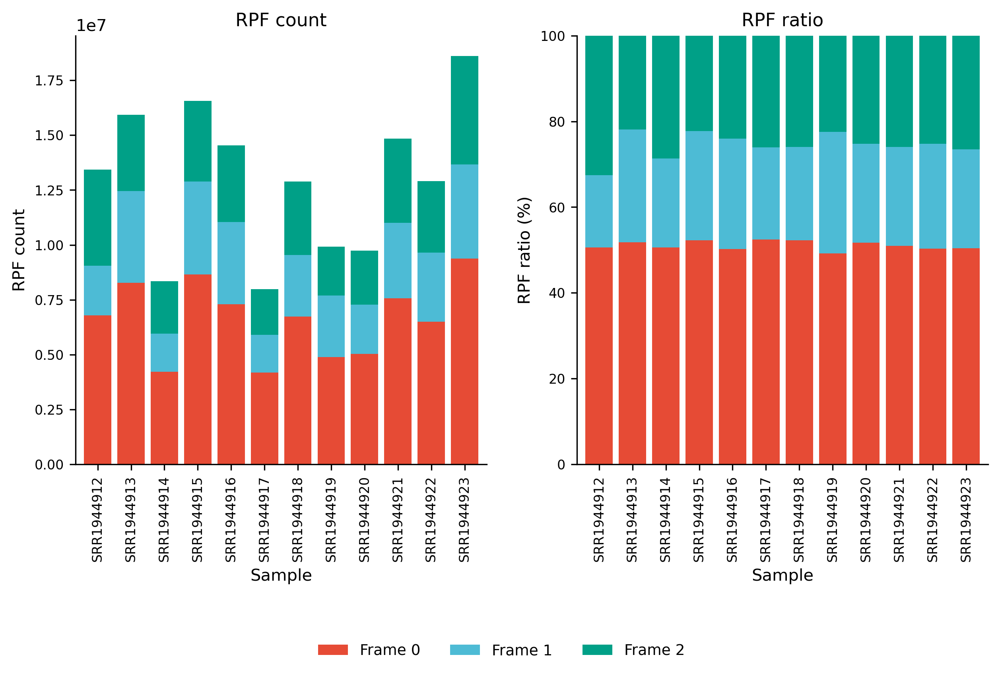

# 4.5.6 Periodicity

## Purpose

Calculate the 3-nt periodicity from a merged RPF density file and optionally merge periodicity tables from multiple samples or analyses. Strong 3-nt periodicity is a key Ribo-seq quality-control signal and should be checked before codon-level analysis.

```text
rpf_Periodicity    # Calculate frame-specific counts/ratios and draw periodicity plots
merge_period       # Merge *_periodicity.txt tables from multiple samples or analyses
```

Both current JSONL density files and the legacy TXT density files are supported. The workflow assigns each RPF read to one of the three reading frames (0/1/2), computes per-sample counts and ratios, draws per-sample barplots plus a stacked summary plot, and can merge the resulting tables across samples.

## Step 1: Run `rpf_Periodicity`

Calculate the frame-specific RPF distribution from a merged density file.

### 1.1 Parameters

| Parameter | Required | Description |
|---|---|---|
| `-r`, `--rpf` | Yes | Input RPF density file in JSONL or TXT format, usually the merged density file generated by `rpf_Merge`. |
| `-o`, `--output` | Yes | Output prefix. Output files are `<prefix>_periodicity.txt` and `<prefix>_*_periodicity_plot.pdf/.png`. |
| `-t`, `--transcript` | No | Optional transcript filter table in TXT format. When provided, only the listed transcripts are retained. |
| `-m`, `--min` | No | Retain transcripts with more than this minimum total RPF count. Default is `50`. |
| `--tis` | No | Number of codons after the translation initiation site (TIS) to discard. Default is `0`. |
| `--tts` | No | Number of codons before the translation termination site (TTS) to discard. Default is `0`. |

### 1.2 Example

First, move to the working directory:

```bash
cd ./sce/4.ribo-seq/5.riboparser/06.periodicity/
```

Then run `rpf_Periodicity` on the merged RPF density file to calculate the frame-specific RPF distribution:

```bash
rpf_Periodicity \
    -r ../05.merge/sce_rpf_merged.jsonl.gz \
    -m 30 \
    --tis 15 \
    --tts 10 \
    -o sce \
    &> sce.log
```

### 1.3 Output

| Output | Description |
|---|---|
| `<prefix>_periodicity.txt` | Tab-delimited table with one row per sample and reading frame: `Sample`, `Frame`, `Count`, `Ratio` (%). |
| `<prefix>_count_periodicity_plot.pdf` / `.png` | Per-sample barplot of frame-specific RPF counts. |
| `<prefix>_ratio_periodicity_plot.pdf` / `.png` | Per-sample barplot of frame-specific RPF ratios (%). |
| `<prefix>_stacked_periodicity_plot.pdf` / `.png` | Two-panel stacked barplot summarizing all samples: RPF count (left) and RPF ratio (right). |

#### Example output figures

Barplot of frame-specific RPF counts for each sample (`sce_count_periodicity_plot.png`):

{ width="900" }

Barplot of frame-specific RPF ratios (%) for each sample (`sce_ratio_periodicity_plot.png`):

{ width="900" }

Stacked barplot summarizing all samples, with RPF count (left panel) and RPF ratio (right panel) (`sce_stacked_periodicity_plot.png`):

{ width="900" }

## Step 2: Run `merge_period`

Merge periodicity tables from multiple samples or analyses into a single table.

### 2.1 Parameters

| Parameter | Required | Description |
|---|---|---|
| `-l`, `--list` | Yes | Input `*_periodicity.txt` files. Multiple files can be provided, e.g. `-l *_periodicity.txt` or explicit file paths. |
| `-o`, `--output` | Yes | Output prefix. The merged table is written to `<prefix>_periodicity.txt`. |

### 2.2 Example

Still in the same working directory, merge the periodicity tables of all samples:

```bash
merge_period \
    -l *_periodicity.txt \
    -o sce
```

### 2.3 Output

| Output | Description |
|---|---|
| `<prefix>_periodicity.txt` | Merged periodicity table, concatenated from all input files, with the same `Sample`, `Frame`, `Count`, `Ratio` columns. |

## Notes

- High-quality Ribo-seq data should show strong enrichment in one reading frame (usually frame 0, the P-site frame).
- The `Ratio` column is the percentage of reads assigned to each frame, calculated as `Count / total count of the sample * 100`.
- Low periodicity suggests that codon-level analyses should be interpreted cautiously.
- Increasing `--tis` or `--tts` can help remove boundary effects around start and stop codons.
- `--tis` / `--tts` trimming is applied when the density file is imported; transcripts with low total counts (below `-m`) are removed before the periodicity is calculated.
