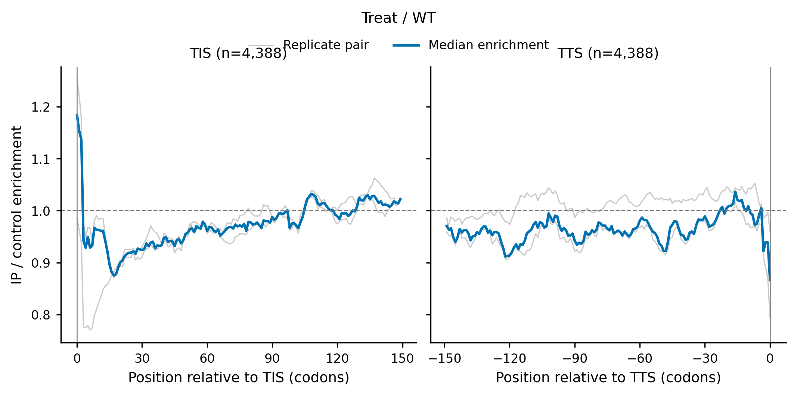

# 4.9.5 SeRP metaplot

## `serp_metaplot`

`serp_metaplot` builds one normalized TIS/TTS metagene profile per sample, calculates matched IP/control enrichment between sample metaprofiles, and summarizes the enrichment across biological replicate pairs.

### Function

Use this command when you want to:

- draw a TIS/TTS metaplot of SeRP enrichment aggregated over a common transcript set;
- inspect the average IP/control enrichment profile around the start codon and the stop codon;
- show matched biological-replicate enrichment curves behind the aggregate curve;
- compare the same transcript set between control and IP samples with equal sample sizes.

### Input

The input is an RPF density file and two comma-separated sample groups:

| Input | Description |
|---|---|
| `-r` | RPF density TXT, JSON, JSONL, or compressed JSON density file. |
| `--ck` | Comma-separated control sample names. Sample order defines biological replicate pairing with `--ip`. |
| `--ip` | Comma-separated IP sample names. Sample order defines biological replicate pairing with `--ck`. |

`--ck` and `--ip` must contain equal numbers of samples so that the k-th control sample is paired with the k-th IP sample as one biological replicate pair.

The workflow first builds one normalized TIS/TTS metagene profile per sample from a common transcript set, then calculates matched IP/control enrichment between the sample metaprofiles, and finally aggregates the enrichment across replicate pairs (`sample_metaplot_then_matched_ratio`). This differs from a transcript-first ratio workflow where IP/control ratios are calculated per transcript before aggregation.

### Parameters

| Parameter | Required | Meaning |
|---|---:|---|
| `-r`, `--rpf` | yes | Input RPF density TXT, JSON, JSONL, or compressed JSON density file. |
| `--ck` | yes | Comma-separated control sample names; order defines replicate pairing with `--ip`. |
| `--ip` | yes | Comma-separated IP sample names; order defines replicate pairing with `--ck`. |
| `-o`, `--output` | yes | Output file prefix. |
| `-n`, `--norm` | no | Optional two-column file containing sample-level total RPF counts. Defaults to the totals read from the RPF density file. |
| `--label` | no | Optional comparison label shown above the metaplot figure. Defaults to `IP / control` sample lists. |
| `-m`, `--min` | no | Minimum gene-level CDS RPF count required in every control/IP sample. Default: `50`. |
| `--scale` | no | Normalization scale used to calculate sample-level RPM-like density. Default: `1000000.0`. |
| `--window` | no | Centered rolling-sum window in codons applied to sample metaprofiles before matched IP/control ratio calculation. Default: `5`. |
| `--pseudocount` | no | Normalized-density pseudocount used for sample-metaprofile ratios. Default: `0.1`. |
| `--aggregate` | no | Statistic used to combine enrichment curves across replicate pairs: `median` or `mean`. Default: `median`. |
| `--tis` | no | Number of CDS codons displayed from the start codon (`0` to `TIS-1`). Default: `150`. |
| `--tts` | no | Number of CDS codons displayed before and including the stop codon. Default: `150`. |
| `--detail` | no | Write the per-transcript normalized sample densities used to build sample metaprofiles as gzip-compressed text. Default: `False`. |
| `--show-replicates` | no | Show matched biological-replicate enrichment curves behind the aggregate curve. Boolean switch; pass `--no-show-replicates` to disable. Default: `True`. |
| `--output-format` | no | Metaplot figure output format: `pdf`, `png`, or `both`. Default: `pdf`. |
| `--font-size` | no | Base figure font size. Default: `9.0`. |
| `--dpi` | no | PNG output resolution. Default: `300`. |

### Output

All output files share the prefix given by `-o`. The aggregate enrichment table and the run summary are always written; the per-transcript detail file is written only when `--detail` is enabled.

| File | Description |
|---|---|
| `<output>.metaplot.txt` | Aggregate TIS/TTS enrichment per position: `meta`, `position`, `gene_number`, `pair_number`, `enrichment`, `mean_enrichment`, `median_enrichment`, `min_enrichment`, `max_enrichment`, `q25_enrichment`, `q75_enrichment`. |
| `<output>.metaplot_pair.txt` | Matched replicate-pair enrichment per position: `meta`, `position`, `pair`, `control_sample`, `ip_sample`, `enrichment`. |
| `<output>.metaplot_sample.txt` | Per-sample metaprofile density per position: `meta`, `position`, `sample`, `gene_number`, `meta_density`. |
| `<output>.metaplot_summary.txt` | Run summary as `metric` / `value` pairs (input file, sample groups, replicate pairs, label, transcript counts, filter and enrichment parameters). |
| `<output>.metaplot_gene.txt.gz` | Per-transcript normalized sample densities (gzip-compressed). Written only when `--detail` is enabled. |
| `<output>.metaplot.<ext>` | Combined TIS/TTS enrichment figure, where `<ext>` is determined by `--output-format`. |

The figure shows two panels. The left panel is the TIS metaplot and the right panel is the TTS metaplot. Each panel contains:

- thin gray curves for the matched biological-replicate pairs (when `--show-replicates` is enabled);
- a blue curve for the aggregate enrichment across replicate pairs;
- a dashed reference line at `1.0` and a vertical guide at position `0` (the start codon for TIS, the stop codon for TTS);
- a title of the form `TIS (n=4,388)` or `TTS (n=4,388)` reporting the retained transcript number;
- the comparison label from `--label` shown above the two panels.

### Examples

Draw TIS/TTS enrichment metaplots from a compressed JSON density file with matched control/IP samples and both PDF and PNG output:

```bash
serp_metaplot \
  -r ../05.merge/sce_rpf_merged.jsonl.gz \
  --ck SRR1944912,SRR1944913,SRR1944914 \
  --ip SRR1944921,SRR1944922,SRR1944923 \
  --tis 150 \
  --tts 150 \
  --label "Treat / WT" \
  --output-format both \
  -o test
```

The figure below was generated by the command above. In this run, 4,388 transcripts passed the sample-level RPF filter and the complete TIS/TTS window requirements:

{ width="900" }

Summarize the enrichment with the mean across replicate pairs and hide the per-pair curves:

```bash
serp_metaplot \
  -r sce_rpf_merged.jsonl.gz \
  --ck SRR1944912,SRR1944913,SRR1944914 \
  --ip SRR1944921,SRR1944922,SRR1944923 \
  --aggregate mean \
  --no-show-replicates \
  --output-format png \
  -o test
```

### Notes

- `--ck` and `--ip` must contain equal numbers of samples and no duplicated names. The k-th control sample is paired with the k-th IP sample.
- All samples use the same retained transcript set: transcripts must pass the sample-level RPF filter in every control/IP sample and cover the complete TIS/TTS windows.
- Enrichment is calculated from sample metaprofiles first, then aggregated across replicate pairs (`sample_metaplot_then_matched_ratio`).
- `--window` is a centered rolling-sum window applied before ratio calculation; use a value compatible with the enrichment window used elsewhere in the SeRP workflow.
- `--label` only affects the figure title; it does not change the calculation.
- When no transcripts pass both the RPF filter and the window requirements, the workflow stops with a suggestion to reduce `--min`, `--tis`, or `--tts`.
