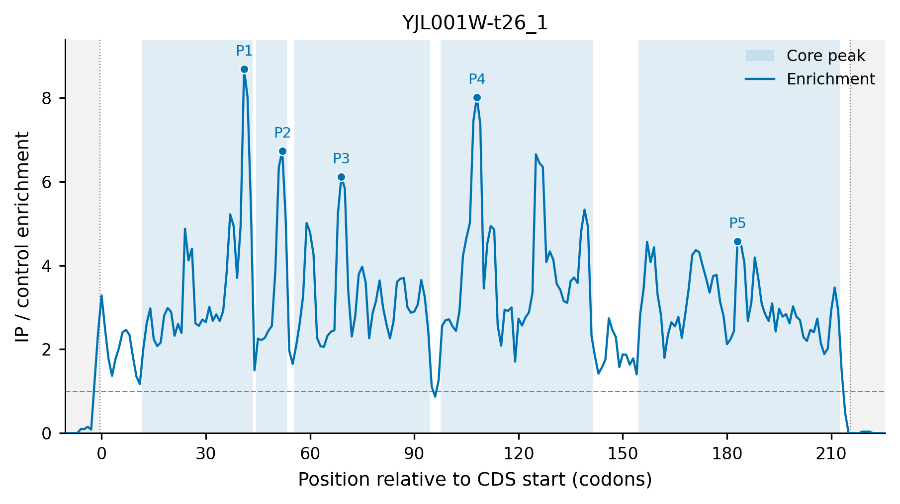

# 4.9.4 SeRP peak plot

## `serp_plot`

`serp_plot` draws compact SeRP enrichment profiles and called core peak regions for selected genes or transcripts after peak calling with `serp_peak`.

### Function

Use this command when you want to:

- draw the enrichment profile (IP/control ratio) of one or a few transcripts;
- overlay the called core peak regions on the enrichment curve;
- mark the reported maximum-enrichment site of each called peak;
- compare the enrichment profiles of a target list with identical figure styling;
- generate publication-ready PDF or PNG figures at a custom resolution.

### Input

The input is the output prefix previously used by `serp_peak`. The command reads two files:

| File | Description |
|---|---|
| `<prefix>_peaks.log` | Peak table written by `serp_peak`, used to resolve transcript IDs and called peak regions. |
| `<prefix>_peaks_ratio.txt` | Smoothed per-codon enrichment-ratio table, used as the plotting profile. |

Targets are given either directly or through a target list:

| Input | Description |
|---|---|
| `-g` | One transcript ID or gene name. |
| `--target-list` | A text table; the first non-empty column is used as the target set. Lines starting with `#` are ignored. |

A gene name is resolved to all matching transcript rows in the peak table; a transcript ID is matched directly. Targets that are neither a transcript ID nor a gene name are still kept and reported as missing profiles if no data is found.

### Parameters

| Parameter | Required | Meaning |
|---|---:|---|
| `-i` | yes | Input prefix previously used by `serp_peak`. The plotter reads `<prefix>_peaks.log` and `<prefix>_peaks_ratio.txt`. |
| `-g`, `--target` | yes\* | One transcript ID or gene name to plot. Mutually exclusive with `--target-list`. |
| `--target-list` | yes\* | Target list file; the first non-empty column is used. Mutually exclusive with `-g`. |
| `-o` | no | Optional output prefix; defaults to the `serp_peak` input prefix. |
| `--output-format` | no | Figure output format: `pdf`, `png`, or `both`. Default: `pdf`. |
| `--threshold` | no | Optional peak-threshold reference line. Set this to the same `--enrich` value used by `serp_peak`; it is not inferred automatically. |
| `--show-max-site` | no | Mark the reported maximum-enrichment site of each called peak. Boolean switch; pass `--no-show-max-site` to disable. Default: `True`. |
| `--shade-utr` | no | Use a subtle background to distinguish 5-prime and 3-prime UTRs. Boolean switch; pass `--no-shade-utr` to disable. Default: `True`. |
| `--y-max` | no | Optional fixed y-axis maximum. Must be `> 0` when provided. |
| `--font-size` | no | Base figure font size. Default: `9.0`. |
| `--dpi` | no | PNG output resolution. Default: `300`. |

### Output

Figures are written to a `<output>_figures` directory. Each resolved target transcript is drawn as one figure named after its transcript ID (`/`, `\`, `:`, and spaces replaced by `_`). The extension is determined by `--output-format`.

Each figure contains:

- a blue enrichment curve (`IP / control enrichment`) across codon positions relative to the CDS start;
- called core peak regions shaded behind the curve;
- the reported maximum-enrichment site of each peak marked with a dot and a `P1`, `P2`, ... label (when `--show-max-site` is enabled);
- a dashed reference line at `1.0` and, when `--threshold` is given, a dotted peak-threshold line;
- dotted CDS start/end guides and, when `--shade-utr` is enabled, a subtle background for 5-prime and 3-prime UTRs;
- a title of `gene_name | transcript` when a gene name is annotated, or the transcript ID otherwise.

### Examples

First, move to the working directory:

```bash
cd ./sce/6.serp/04.peak_plot
```


Draw a single transcript with the default settings:

```bash
serp_plot \
  -i ../24.serp/legacy/test \
  -g YJL001W-t26_1
```

Draw every target in a list with both PDF and PNG output and a custom prefix:

```bash
serp_plot \
  --target-list gene.list \
  -i ../24.serp/legacy/test \
  --output-format both \
  -o gene
```

The figure below is the `YJL001W-t26_1` transcript drawn by the command above. The transcript carries five called core peaks, whose maximum-enrichment sites are labeled `P1` to `P5`:

{ width="900" }

Add the peak-threshold reference line used during peak calling and fix the y-axis scale for comparable figures:

```bash
serp_plot \
  --target-list gene.list \
  -i ../24.serp/legacy/test \
  --threshold 2.0 \
  --y-max 12 \
  --output-format both \
  -o gene
```

### Notes

- Run `serp_peak` first; `serp_plot` only reads the two files written by it.
- `-g` and `--target-list` are mutually exclusive, and one of them is required.
- `--threshold` is a visual reference only. Use the same `--enrich` value as the `serp_peak` run for consistency; it is not inferred automatically.
- A transcript ID is resolved directly; a gene name is resolved to all transcript rows with that gene name in the peak table.
- Targets without profile data are reported in a warning, and the remaining targets are still drawn.
- The output prefix defaults to the `serp_peak` input prefix, so the figure directory is named `<input>_figures` when `-o` is omitted.
