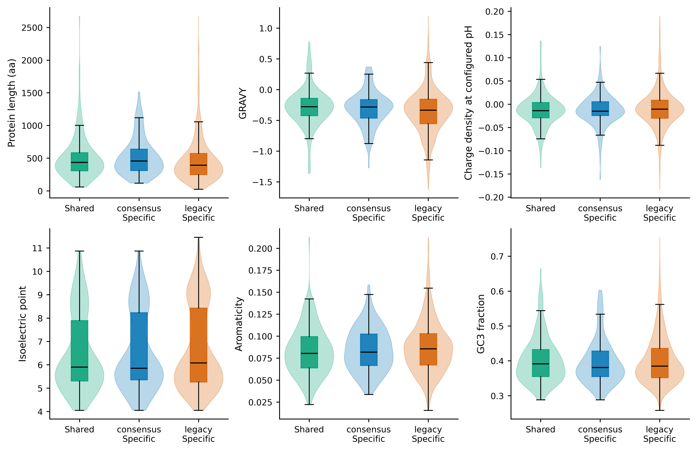
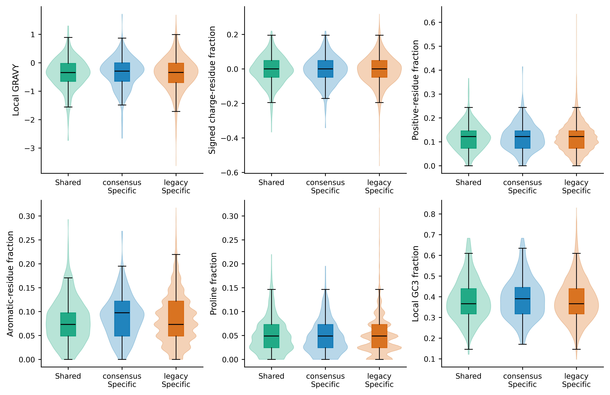
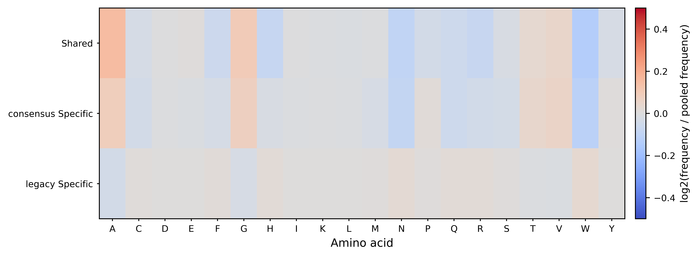
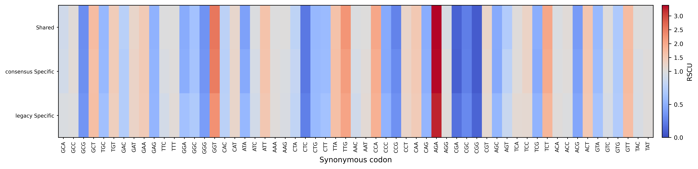
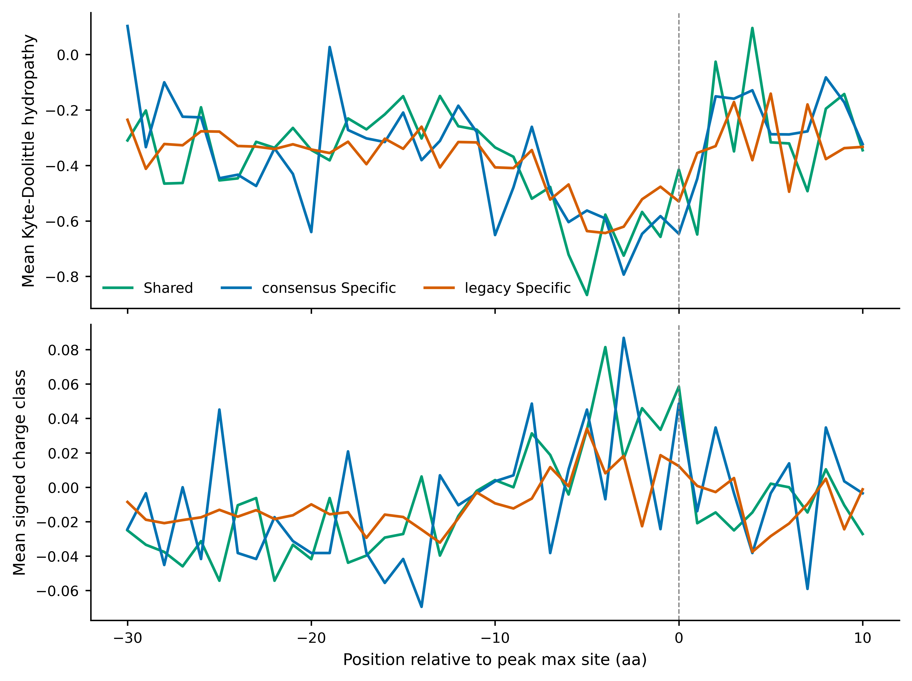
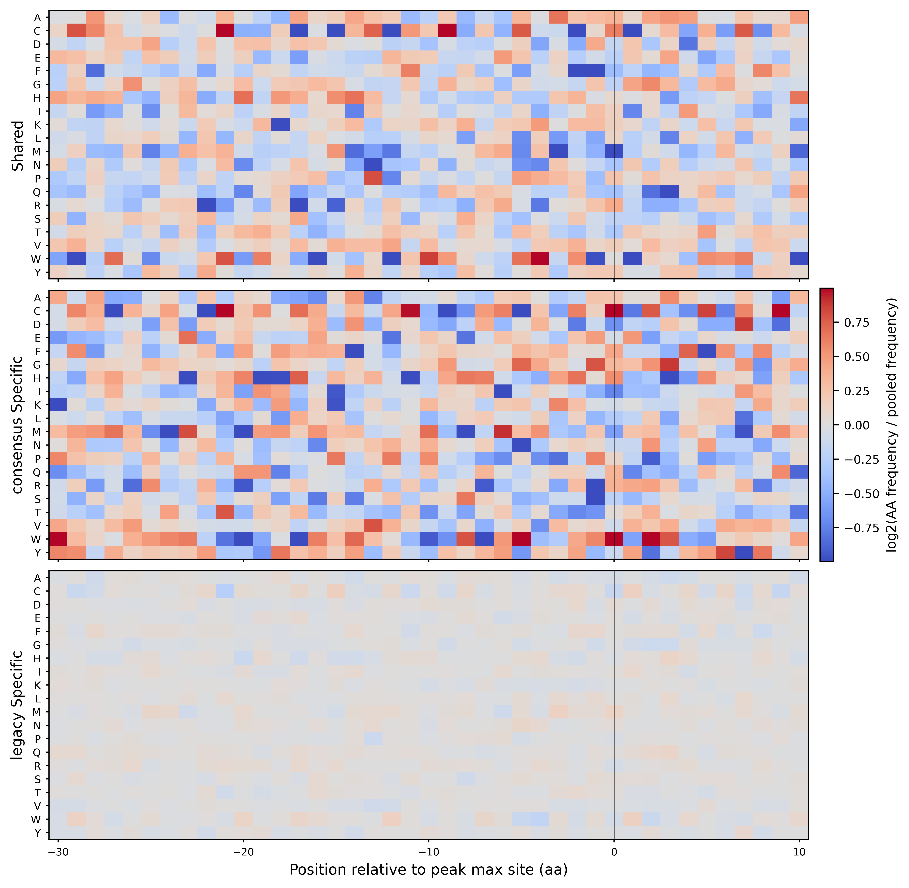

# 4.9.6 SeRP properties

## `serp_properties`

`serp_properties` calculates codon-usage statistics and translated-protein properties from coding-sequence FASTA. When a SeRP peak-classification table is supplied, it additionally compares shared versus condition-specific sequence properties.

### Function

Use this command when you want to:

- validate coding sequences and record sequence-level QC (terminal stop removal, internal stop detection, start-codon status);
- calculate per-sequence codon frequency, RSCU, and whole-input codon usage;
- translate nucleotide sequences and calculate protein properties such as GRAVY, flexibility, instability index, isoelectric point, net charge, and secondary-structure propensity fractions;
- calculate the Sharp-Li CAI when a reference CDS FASTA is provided;
- compare shared and condition-specific sequence properties when a `serp_summary` peak-classification table (`-p`) is provided, including Mann-Whitney U tests with BHFDR correction, local sequence contexts around peak `max_site`, position-resolved amino-acid/property profiles, and group comparison figures.

The command works in two modes:

- **Sequence mode** (no `-p`): only the sequence-level pipeline runs.
- **Peak-group mode** (`-p`): the sequence-level pipeline runs first, then shared/specific peak groups are extracted, annotated, statistically compared, and plotted.

### Input

The primary input is a nucleotide FASTA file containing coding sequences keyed by transcript ID (`-f`).

Requirements:

- each sequence length should be a multiple of 3, otherwise the sequence fails QC;
- sequences are translated in the current reading frame using `--genetic-code` (default NCBI code 1);
- a terminal stop codon is removed before protein-property calculation; alternative start codons recognized by the genetic code are normalized to Met;
- sequences containing internal stop codons, ambiguous/invalid codons, or no sense codons fail QC and are excluded from the property tables;
- a `U` in the input is automatically converted to `T`.

For peak-group mode, `-p` expects a `*.peak_classification.txt` file generated by `serp_summary` (overlap mode). Requirements:

- the table must contain exactly two distinct `comparison_sample` values;
- shared peaks require a `shared_cluster_id` column with non-empty values;
- local contexts are extracted around each peak `max_site` using `--local-up` / `--local-down`, and `--require-complete-local` (default) keeps only peaks whose full upstream/downstream window is available.

### Parameters

| Parameter | Required | Meaning |
|---|---:|---|
| `-f` | yes | Input coding-sequence FASTA file. |
| `-o` | yes | Output file prefix. |
| `-p` | no | `*.peak_classification.txt` generated by `serp_summary`. When provided, shared and condition-specific sequence properties are analyzed. Default: `None`. |
| `--local-up` | no | Amino acids extracted upstream of each peak `max_site`. Default: `30`. |
| `--local-down` | no | Amino acids extracted downstream of each peak `max_site`. Default: `10`. |
| `--require-complete-local` | no | Require every peak-local context to contain the complete requested upstream/downstream window. Pass `--no-require-complete-local` to allow truncated contexts. Default: `True`. |
| `--specific-set` | no | Condition-specific peak set used for statistics and figures: `all` or `significant`. Tables always retain both all-specific and significant-specific groups. Default: `all`. |
| `--min-group-size` | no | Minimum non-overlapping transcript number per group required for a statistical test. Default: `3`. |
| `--genetic-code` | no | NCBI genetic code identifier used for translation and codon annotation. Default: `1`. |
| `--cai-reference` | no | Reference CDS FASTA used to build the Sharp-Li codon adaptiveness index. CAI remains `NA` when this argument is omitted. Default: `None`. |
| `--charge-ph` | no | pH used to calculate full-protein net charge and charge density. Default: `7.0`. |
| `--plot` | no | Generate peak-group sequence-property figures when `-p` is provided. Pass `--no-plot` to write tables only. Default: `True`. |
| `--output-format` | no | Figure output format: `pdf`, `png`, or `both`. Default: `pdf`. |
| `--font-size` | no | Base figure font size. Default: `9.0`. |
| `--dpi` | no | PNG output resolution. Default: `300`. |

### Output

All outputs share the prefix set by `-o`. The sequence-level tables are always written; the `.Peak*`, `_group_*`, `_local_*`, `_position_*`, `_property_statistics*`, and figure outputs appear only in peak-group mode.

#### Sequence-level output

| Output | Description |
|---|---|
| `<prefix>.SequenceQC.txt` | Per-sequence validation record: status (PASS/WARN/FAIL), issues, input/coding length, sense-codon number, protein length, start-codon and start status, terminal stop, internal-stop number, invalid-codon number. |
| `<prefix>_summary.txt` | Metric table with input/valid/pass/warning/failed sequence counts, genetic code, charge pH, and whether CAI was calculated. |
| `<prefix>_frequency.txt` | Per-sequence codon frequency table (one column per sense codon). |
| `<prefix>_rscu.txt` | Per-sequence RSCU table (one column per sense codon). |
| `<prefix>_cai.txt` | Per-sequence CAI table (`Gene`, `Length`, `CAI`, `CAI_Reference`). |
| `<prefix>_whole_codon_usage.txt` | Whole-input codon usage summary: codon, amino acid, count, frequency, RSCU, and relative adaptiveness. |
| `<prefix>_aa_composition.txt` | Per-sequence amino-acid composition (`ID`, `AA`, `AA3`, `Count`, `Fraction`). |
| `<prefix>.Properties.txt` | Translated-protein property table (one row per sequence). |
| `<prefix>_cai_reference_qc.txt` | Reference-sequence QC when `--cai-reference` is provided. |

The `<prefix>.Properties.txt` table contains:

| Column | Description |
|---|---|
| `ID` | FASTA record ID. |
| `Seq` | Translated amino-acid sequence (terminal stop removed). |
| `Length` | Amino-acid sequence length. |
| `CDS_Length_nt` | Coding nucleotide length (terminal stop excluded). |
| `Sense_Codon_Number` | Number of sense codons. |
| `Start_Codon` | Observed start codon. |
| `Terminal_Stop` | Removed terminal stop codon (empty if none). |
| `GC` / `GC1` / `GC2` / `GC3` | Overall and codon-position GC content. |
| `CAI` | Sharp-Li codon adaptation index (`NA` without `--cai-reference`). |
| `Charge_pH` | pH used for charge calculations. |
| `Gravy` | Grand average of hydropathy. |
| `Aromaticity` | Aromatic amino-acid fraction. |
| `Flexibility` | Average predicted flexibility (`NA` for proteins shorter than 9 residues). |
| `Instability` | Instability index. |
| `Isoelectric_Point` | Predicted isoelectric point. |
| `Net_Charge_pH` | Predicted net charge at `Charge_pH`. |
| `Charge_Density` | Net charge divided by protein length. |
| `Positive_Fraction` | Positive-charged residue fraction (K, R, H). |
| `Negative_Fraction` | Negative-charged residue fraction (D, E). |
| `Aromatic_Fraction` | Aromatic residue fraction (F, W, Y). |
| `Proline_Fraction` | Proline residue fraction. |
| `Glycine_Fraction` | Glycine residue fraction. |
| `Helix_Propensity_Fraction` | Predicted helix propensity fraction. |
| `Turn_Propensity_Fraction` | Predicted turn propensity fraction. |
| `Sheet_Propensity_Fraction` | Predicted sheet propensity fraction. |

#### Peak-group output

| Output | Description |
|---|---|
| `<prefix>.PeakSequenceQC.txt` | Per-peak local-context validation: status, issue, requested/extracted context boundaries, and protein length. |
| `<prefix>.PeakProperties.txt` | Per-peak local-context properties (one row per peak). |
| `<prefix>.SignificantSpecificPeakProperties.txt` | Subset of `PeakProperties.txt` restricted to significant condition-specific peaks. |
| `<prefix>_group_membership.txt` | Assignment of sequences/peaks to analysis groups (`shared`, `<sample>_specific`, `<sample>_significant_specific`). |
| `<prefix>_group_protein_properties.txt` | Full-sequence protein properties aggregated by group (columns mirror `Properties.txt` plus a `Group` column). |
| `<prefix>_group_codon_usage.txt` | Codon usage aggregated by group (`Group`, `Codon`, `AA`, `Abbr.`, `Count`, `Frequency`, `RSCU`). |
| `<prefix>_group_aa_composition.txt` | Amino-acid composition aggregated by group. |
| `<prefix>_local_aa_composition.txt` | Amino-acid composition of local contexts by group. |
| `<prefix>_position_aa_profile.txt` | Position-resolved amino-acid enrichment (`Group`, `Relative_Position`, `AA`, `Count`, `Fraction`, background counts, `Log2_Enrichment_vs_All`). |
| `<prefix>_position_property_profile.txt` | Position-resolved property profile (mean hydropathy, mean signed charge class, positive/negative/aromatic fractions). |
| `<prefix>_property_statistics.txt` | Per-feature Mann-Whitney U tests between group pairs with BHFDR correction and rank-biserial effect size; overlapping transcripts are removed before testing. |
| `<prefix>_group_summary.txt` | Group-level summary: peak count, transcript count, local-context count, complete-window requirement, and local window settings. |

The `<prefix>.PeakProperties.txt` local-context columns include:

| Column | Description |
|---|---|
| `Peak_ID` / `transcripts` / `gene_name` | Peak and transcript identifiers. |
| `Analysis_Group` | Group label. |
| `comparison_sample` | Condition label. |
| `peak_category` | `shared` or `specific`. |
| `peak_start` / `peak_end` / `max_site` | Peak coordinates and anchor site. |
| `significance_status` / `is_significant_specific` | Significance annotations. |
| `Shared_Member_Number` | Cluster size for shared peaks. |
| `Context_Start` / `Context_End` | Extracted local-context positions. |
| `Relative_Start` / `Relative_End` | Context positions relative to `max_site`. |
| `Context_AA` / `Context_NT` | Extracted amino-acid and nucleotide sequences. |
| `Local_Length_aa` | Local-context length in amino acids. |
| `GC` / `GC3` | Local-context GC content. |
| `Gravy` | Local-context hydropathy. |
| `Signed_Charge_Fraction` | Signed net-charge fraction of the local context. |
| `Positive_Fraction` / `Negative_Fraction` | Charged residue fractions of the local context. |
| `Aromatic_Fraction` / `Proline_Fraction` / `Glycine_Fraction` | Local-context residue fractions. |

#### Figures

With `-p` and `--plot`, six figures are produced (extension controlled by `--output-format`):

| Figure | Description |
|---|---|
| `<prefix>.protein_properties.<ext>` | Violin + box grid of full-sequence protein properties by group. |
| `<prefix>.local_properties.<ext>` | Violin + box grid of local-context properties by group. |
| `<prefix>.aa_composition_heatmap.<ext>` | Amino-acid composition heatmap across groups. |
| `<prefix>.rscu_heatmap.<ext>` | RSCU heatmap across groups. |
| `<prefix>.local_position_profiles.<ext>` | Position-resolved local property profiles around `max_site`. |
| `<prefix>.position_aa_enrichment.<ext>` | Position-resolved amino-acid enrichment (log2 vs. all sequences). |

Example figures:

{ width="900" }

{ width="900" }

{ width="900" }

{ width="900" }

{ width="900" }

{ width="900" }

### Examples

Calculate sequence properties for CDS sequences:

```bash
serp_properties \
  -f sce.norm.cds.fa \
  -o sce_properties
```

Calculate properties with Sharp-Li CAI against a reference:

```bash
serp_properties \
  -f sce.norm.cds.fa \
  --cai-reference high_expression_cds.fa \
  -o sce_properties_cai
```

Compare shared and condition-specific sequence properties using a `serp_summary` peak-classification table, with local contexts and PNG+PDF figures:

```bash
serp_properties \
  -f sce.norm.cds.fa \
  -p legacy_vs_consensus.peak_classification.txt \
  --local-up 30 \
  --local-down 10 \
  --specific-set all \
  -o legacy_vs_consensus \
  --output-format both \
  --dpi 600
```

### Notes

- The command expects nucleotide sequences, not amino-acid FASTA input.
- Sequence QC is recorded in `<prefix>.SequenceQC.txt`; `FAIL` sequences are excluded from the property tables, and `WARN` sequences are kept.
- CAI requires `--cai-reference`; without it, the `CAI` column is `NA` and `cai_calculated` is `False` in the summary.
- `Flexibility` is reported as `NA` for proteins shorter than 9 residues.
- In peak-group mode, transcripts shared between compared groups are removed before statistical testing, and tests require at least `--min-group-size` non-overlapping transcripts per group.
- The generated `<prefix>.Properties.txt`, `<prefix>.PeakProperties.txt`, and `<prefix>.SequenceQC.txt` use a dot before the suffix, while the remaining outputs use underscores.
