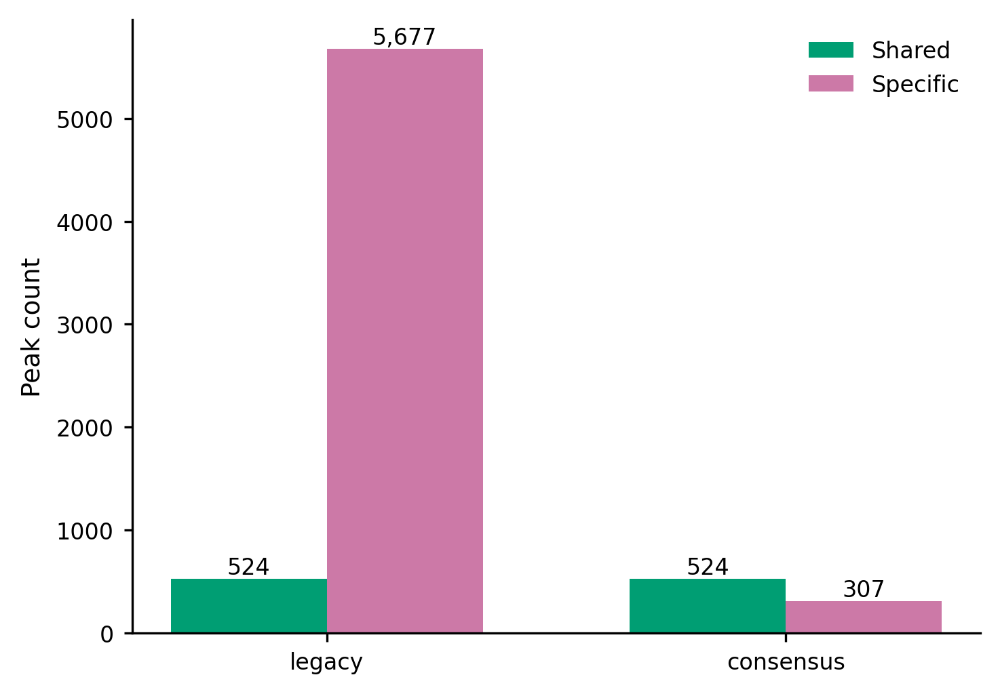
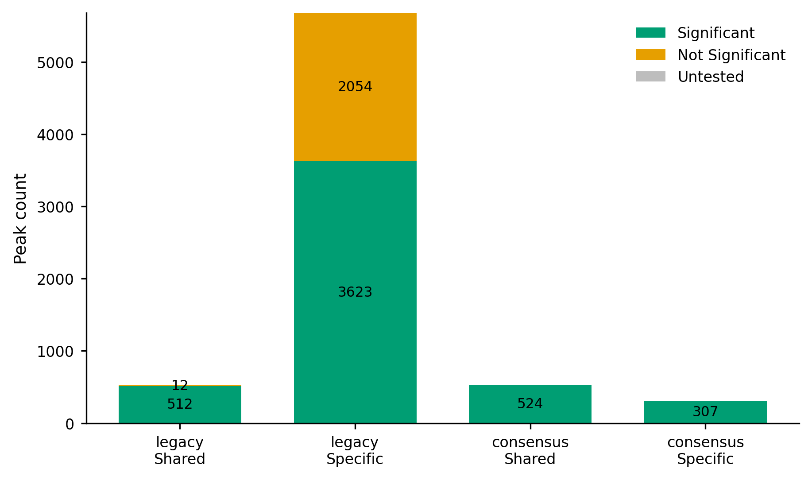
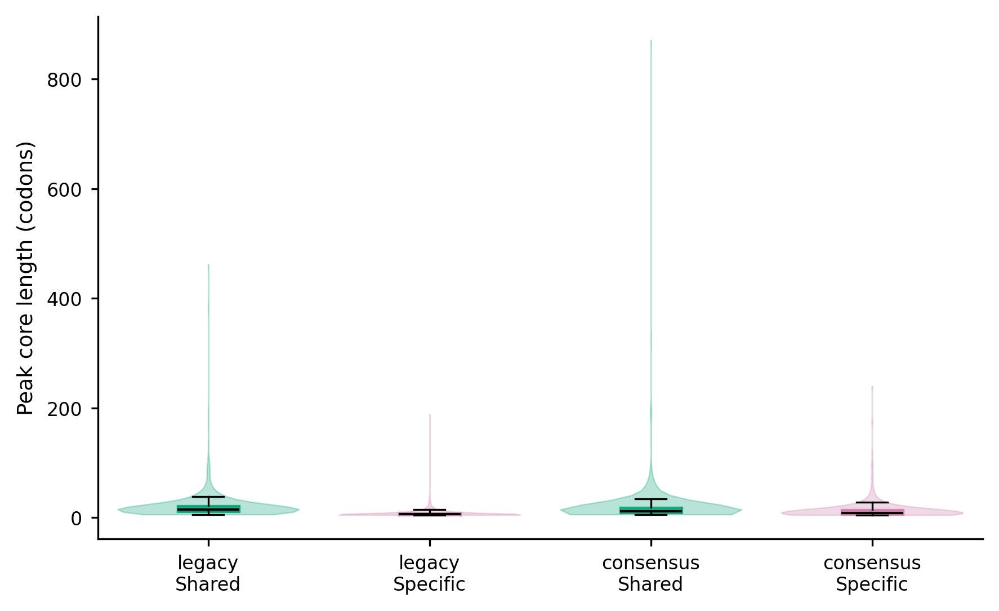
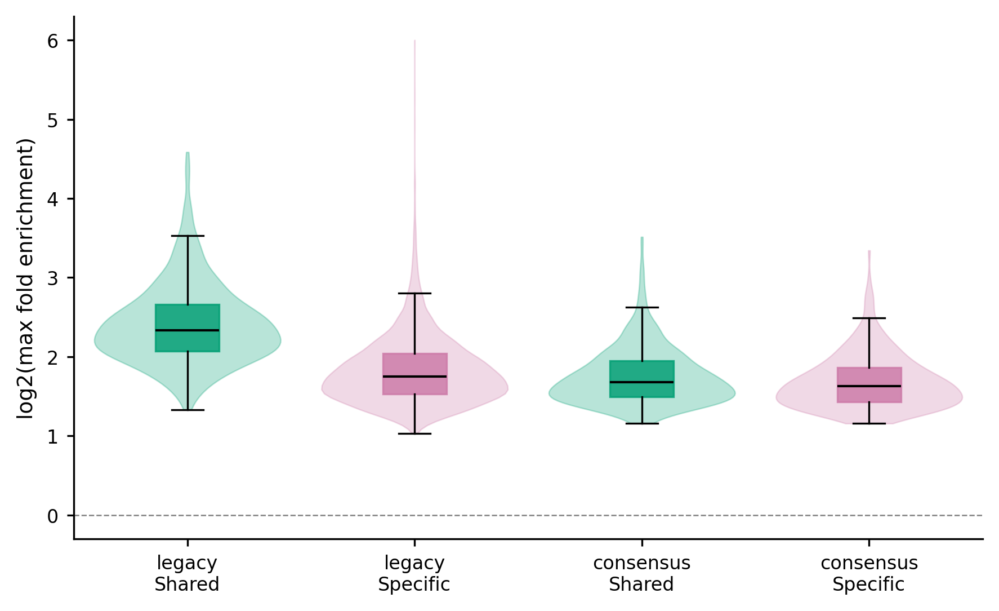
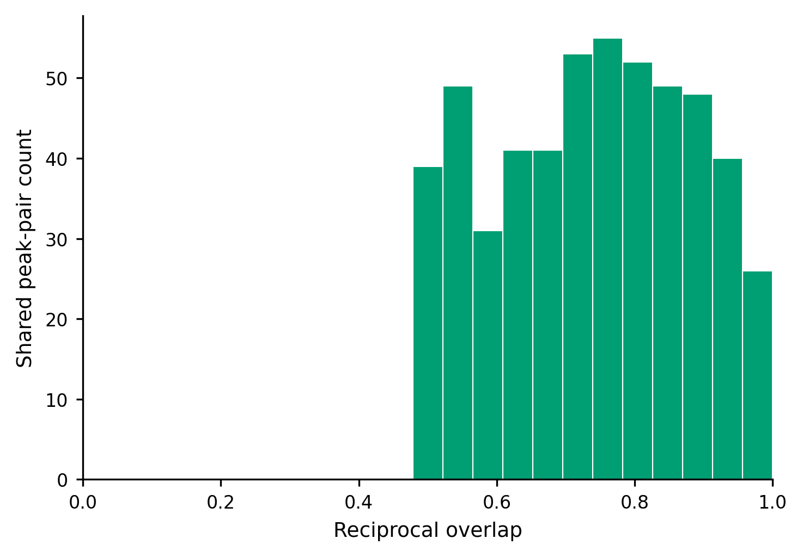

# 4.9.3 SeRP summary

## `serp_summary`

`serp_summary` summarizes the results of one `serp_peak` run or one pairwise `serp_overlap` comparison. It automatically detects the result type from the input prefix and writes summary tables and figures.

### Function

Use this command when you want to:

- summarize one `serp_peak` result (peak mode): peak statistics, normalized peak matrices, distribution tables, and summary figures;
- summarize one pairwise `serp_overlap` comparison (overlap mode): shared/specific peak classification, significance counts, transcript/gene summaries, shared clusters, and summary figures;
- leave the mode unspecified and let `serp_summary` detect whether the input prefix belongs to `serp_peak` or `serp_overlap`.

### Input

The command takes the output prefix previously used by `serp_peak` or `serp_overlap` (`-i`).

Peak mode requires:

```text
<input>_peaks.txt        <input>_peaks_ratio.txt
```

Overlap mode requires:

```text
<input>.summary.txt           <input>.shared.peaks.txt
<input>.shared.clusters.txt   <input>.relationships.txt
```

If the input prefix matches both peak and overlap outputs, `--mode` must be set explicitly.

### Parameters

| Parameter | Required | Meaning |
|---|---:|---|
| `-i` | yes | Input prefix previously used by `serp_peak` or `serp_overlap`. |
| `--mode` | no | Summary mode. `auto` detects `serp_peak` versus `serp_overlap` outputs. Default: `auto`. |
| `--significance-metric` | no | Metric used only to annotate statistical significance in overlap mode: `bhfdr`, `pvalue`, or `none`. Missing values are classified as untested. Default: `bhfdr`. |
| `--significance-cutoff` | no | Maximum BHFDR/P-value annotated as significant in overlap mode. Default: `0.05`. |
| `--top-specific-genes` | no | Maximum genes shown in the condition-specific peak-burden figure. Default: `20`. |
| `-o` | no | Output prefix. Default: `<input>_summary`. |
| `--output-format` | no | Summary figure output format: `pdf`, `png`, or `both`. Default: `pdf`. |
| `--plot` | no | Generate summary figures in addition to summary tables. Pass `--no-plot` to write tables only. Default: `True`. |
| `--bins` | no | Peak-mode only. Number of normalized transcript bins. Default: `100`. |
| `--max-heatmap-cells` | no | Peak-mode only. Maximum dense full-length heatmap cells. Default: `100000000`. |
| `--chunksize` | no | Peak-mode only. Rows read per chunk from `*_peaks_ratio.txt`. Default: `500000`. |
| `--font-size` | no | Base figure font size. Default: `9.0`. |
| `--dpi` | no | PNG output resolution. Default: `300`. |

### Output

The output prefix is controlled by `-o` (default `<input>_summary`).

#### Peak mode

| Output | Description |
|---|---|
| `<prefix>.summary.txt` | Metric table summarizing the peak calling result. |
| `<prefix>.peaks.txt` | Peak-level summary table. |
| `<prefix>.transcripts.txt` | Transcript-level summary table. |
| `<prefix>.normalized_peak_matrix.txt` | Normalized peak matrix used for the heatmap. |
| `<prefix>.full_length_heatmap_order.txt` | Row order used for the full-length heatmap. |
| `<prefix>.peak_length_distribution.txt` | Peak-length distribution. |
| `<prefix>.peak_count_distribution.txt` | Distribution of peak counts. |
| `<prefix>.peak_region_distribution.txt` | Distribution of peak positions within transcripts. |
| `<prefix>.inter_peak_distance.txt` | Distances between adjacent peaks. Written only when non-empty. |

Peak-mode figures (`--plot`):

| Figure | Description |
|---|---|
| `<prefix>.summary_counts.<ext>` | Peak/transcript summary counts. |
| `<prefix>.peak_fold_distribution.<ext>` | Peak fold-enrichment distribution. |
| `<prefix>.peak_length_distribution.<ext>` | Peak-length distribution. |
| `<prefix>.peaks_per_transcript.<ext>` | Number of peaks per transcript. |
| `<prefix>.peak_region_distribution.<ext>` | Peak position distribution. |
| `<prefix>.peak_center_distribution.<ext>` | Peak-center distribution. |
| `<prefix>.peak_burden.<ext>` | Peak burden by transcript length. |
| `<prefix>.inter_peak_distance.<ext>` | Inter-peak distance distribution. |
| `<prefix>.normalized_peak_heatmap.<ext>` | Normalized peak matrix heatmap. |
| `<prefix>.full_length_peak_heatmap.<ext>` | Full-length peak heatmap. |

#### Overlap mode

| Output | Description |
|---|---|
| `<prefix>.summary.txt` | Comparison-level summary counts. |
| `<prefix>.peak_classification.txt` | Per-peak classification with shared/specific labels and significance annotations. |
| `<prefix>.category_summary.txt` | Counts of shared/specific peaks by condition. |
| `<prefix>.transcripts.txt` | Transcript-level summary of shared/specific peaks. |
| `<prefix>.genes.txt` | Gene-level summary of shared/specific peaks. |
| `<prefix>.shared.clusters.txt` | Shared peak clusters. |
| `<prefix>.region_summary.txt` | Peak-region summaries. |
| `<prefix>.overlap_quality_summary.txt` | Overlap-quality metrics between the two conditions. |
| `<prefix>.significant_specific.peaks.txt` | Combined significant condition-specific peaks. |
| `<prefix>.<label_a>.significant_specific.peaks.txt` | Significant peaks specific to condition A. |
| `<prefix>.<label_b>.significant_specific.peaks.txt` | Significant peaks specific to condition B. |

Overlap-mode figures (`--plot`):

| Figure | Description |
|---|---|
| `<prefix>.peak_category_counts.<ext>` | Shared/specific peak counts by category. |
| `<prefix>.significance_counts.<ext>` | Significant versus non-significant counts. |
| `<prefix>.peak_length_by_category.<ext>` | Peak-length distributions by category. |
| `<prefix>.max_fold_by_category.<ext>` | Maximum fold enrichment by category. |
| `<prefix>.reciprocal_overlap_distribution.<ext>` | Reciprocal-overlap distribution. |
| `<prefix>.top_specific_genes.<ext>` | Top condition-specific genes by peak burden. Written only when genes carry condition-specific peaks. |

`<ext>` is the figure extension determined by `--output-format` (`pdf`, `png`, or both).

### Examples

First, move to the working directory:

```bash
cd ./sce/6.serp/03.summary
```


Summarize an overlap comparison with both PDF and PNG figures:

```bash
serp_summary \
  -i legacy_vs_consensus \
  -o legacy_vs_consensus.summary \
  --output-format both
```

The figures below are the overlap-mode output of the command above:

{ width="900" }

{ width="900" }

{ width="900" }

{ width="900" }

{ width="900" }

Summarize a single `serp_peak` result with default settings:

```bash
serp_summary \
  -i SeRP_consensus \
  -o SeRP_consensus.summary
```

Write tables only, without figures:

```bash
serp_summary \
  -i legacy_vs_consensus \
  --no-plot \
  -o legacy_vs_consensus.summary
```

### Notes

- `-i` must be the exact prefix previously used by `serp_peak` or `serp_overlap`; the required input files are detected from it.
- When the prefix matches both peak and overlap outputs, `--mode peak` or `--mode overlap` must be given explicitly.
- The overlap-mode significance columns are annotation-only: they never filter peaks, and peaks with missing significance values are classified as untested.
- Peak mode reads `*_peaks_ratio.txt` in chunks (`--chunksize`) and caps dense heatmap memory with `--max-heatmap-cells`.
- The output directory of `-o` must already exist.
